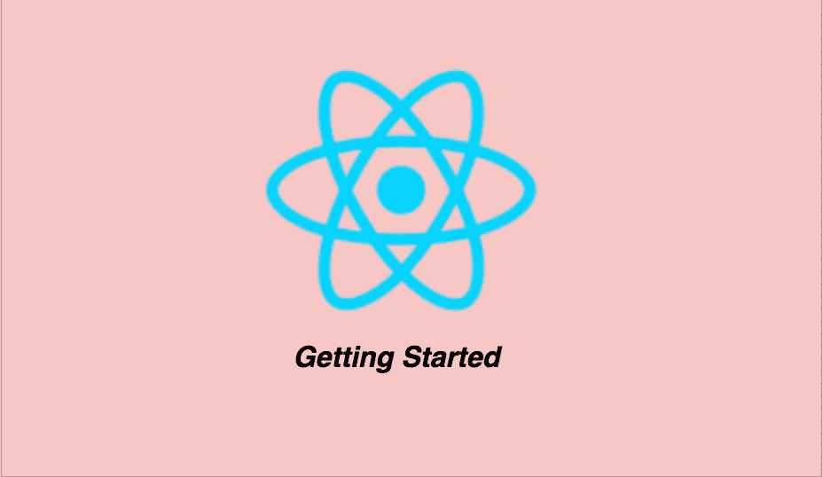

# 如何开始使用 React

> 原文：<https://medium.com/bb-tutorials-and-thoughts/how-to-get-started-with-react-ba61895a8f0c?source=collection_archive---------0----------------------->

## 带有示例项目的初学者指南

React 是一个用于 web 应用程序的 javascript 库。您可以使用简单的声明性模板快速构建功能。您可以使用 React 构建应用程序，并重用您的代码和能力来为任何开发目标构建应用程序。在开始使用 React 之前，您需要了解很多事情。