# React.js 入门

> 原文：<https://medium.easyread.co/how-to-get-started-with-react-js-805bf57826ad?source=collection_archive---------0----------------------->


[Ben Neil At Unsplash.com](https://unsplash.com/photos/zpxKdH_xNSI)

## 流行前端库简介

您在开发 web 应用程序的后端部分方面做得非常出色。但是很多人评论你的应用需要更好看，就是觉得一个好的前端能让你的应用更上一层楼。经过研究，您发现一个流行的解决方案是一个名为 **React** 的库。

在本文中，我们将开始 React.js 库的学习之旅。

# 介绍

## 什么是反应？

React.js 通过将 UI 分成可组合的元素，为单页 web 应用构建用户界面。做出反应。Js 是一个 UI 库，最初是作为脸书的内部库开发的，后来在 2013 年开源。它很有名，主要用于多种原因

## 为什么要用 React.js？

*   **简单易学**:由于它要求对 JavaScript 和 HTML 有最低限度的了解，所以学习曲线相当低。在某些情况下，我们甚至会使用‘香草 DOM JavaScript API’(你稍后会明白我的意思)，这意味着程序员在开始之前不需要学习任何新东西。
*   **可重用组件**:如果你已经用 HTML 开发了简单的网站，你可能会想把一堆 HTML 元素组合起来，然后把它们保存到某种“变量”中，以便以后可以重用。对于一个开发者来说，这是一个救命稻草。React 有能力实现这样的功能。

还有更多原因在这篇[写得很好的文章](https://stories.jotform.com/7-reasons-why-you-should-use-react-ad420c634247)中深入探讨。

既然我们已经解决了这个问题，现在终于是我们尝试的时候了！

# 入门:安装 React

首先，到终端然后输入，

```
**npx create-react-app app-name**
```

这条指令创建一个名为`**app-name**`的 React 应用程序模板。

*注:* `***npx***` *不是错别字。这是一个包含在* `***npm***` *内的包跑垒员命令。*

现在，您需要导航到该应用程序的目录，然后在浏览器中查看它，如下所示:

```
**cd app-name
npm start**
```

如果上述操作成功，您的浏览器将打开一个 URL`**localhost:3000**`。这是浏览器中的输出

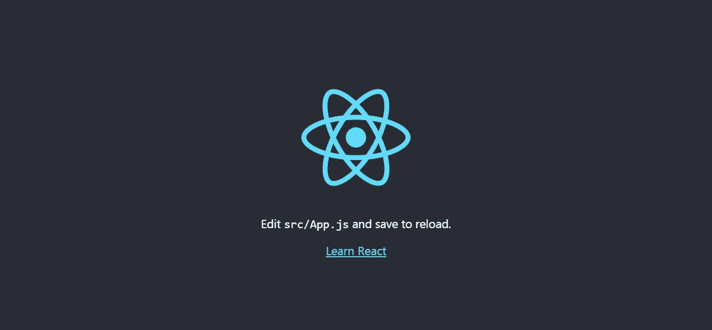

Output in the browser

现在让我们创建一个简单的 Hello World！此项目的应用程序。

# 你好世界！—使用 React

在您的项目目录中，转到`**src/index.js**`并替换文件`**index.js**`的内容，如下所示:

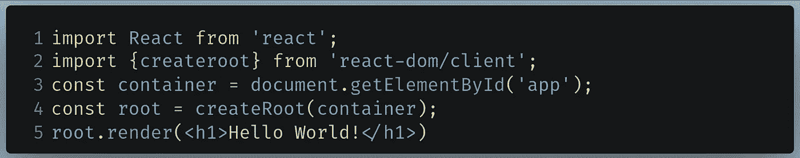

Code to write in index.js

*   `**Lines 1 and 2**`:导入`**react**`和`**react-dom**`库。`**react**`模块用于在 JavaScript(也称为 JSX)中编写 HTML 代码，而`**react-app**`用于执行将内容显示到页面上的`**render**`函数。
*   `**Line 5**`:在一个有根元素`**id**`的容器中呈现一个`**h1**`元素。这种方法的解释在下一部分完成。

代码的输出如下所示:


The output of the code

注意:你可能想知道 JavaScript 中的 HTML 标签是不正确的语法。你完全正确，但是 React 库使用自己的语言，类似于 JavaScript，但是可以在语言中使用 JSX。

# 该渲染方法

`**root.render**`方法可以解释如下:

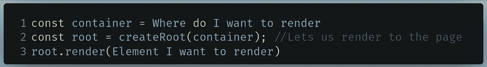

Syntax

正如语法所暗示的那样

*   `container`对象指定您想要显示元素的位置。在通常的约定中，它是一个 id 为`root`的`div`元素。我们使用 JavaScript DOM API 来识别这种元素。
*   `root.render`函数指定**你想要显示的**元素。在上面的例子中，我们用文本`Hello World`呈现了一个`h1`元素。

*问题:在哪里可以找到这个* `***div***` *元素有* `***id***` *的* `***'root’***` *？*

查看 HTML 文件的代码，`**public/index.html**`。`**line 31**`处的通知:

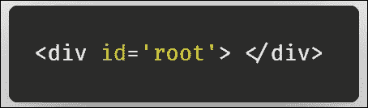

Line 31 in index.html

我们在`**element**`参数中指定的所有元素都将显示在具有指定的`**root**`的`**id**`的`**div**`元素中。

因此，编译器告诉浏览器:*`***element***`*将显示在* `***container***` *内。**

*但是使用这种方法时，有几件事你应该知道:*

## *关于 root.render()要知道的事情*

*`**root.render**`方法**在第一个参数**中不能包含双亲元素。下面的例子是错误的，会给你一个错误:*

*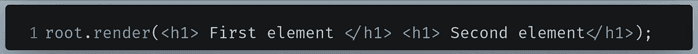*

*Wrong code*

*相反，您可以这样做:*

*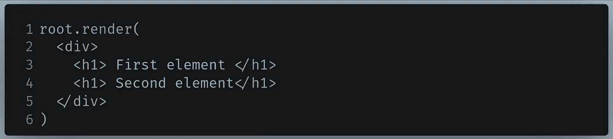*

*我们可以指定一个父元素在页面上显示 2 个子`**h1**`元素。*

*我们甚至可以显示一个小的无序列表，如下所示:*

*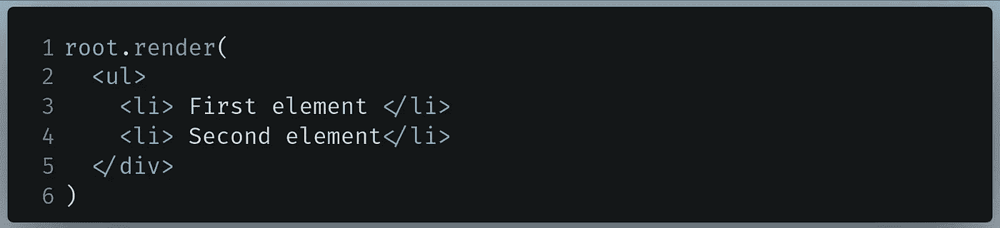*

*Ordered list in React*

*然而在实际情况中，在`**render**`方法中插入 40 多行 HTML 是不可行的。这就是**功能组件**发挥作用的地方。*

# *功能组件*

*让我们看看这段 HTML 代码:*

*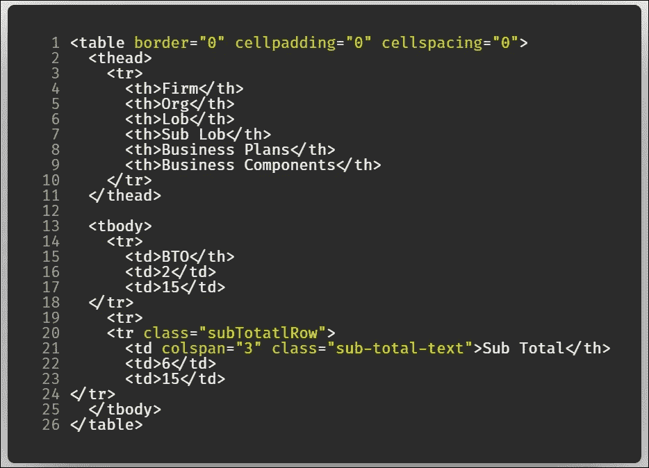*

*Can this code be made modular?*

*作为 React 开发人员，在`**render**`方法中放这么多元素是不可行的。实现模块化是一个很好的实践。*

*您可以将想要呈现的元素放在单独的函数中。*

## *核心理念*

```
***function ComponentName() {
     return( 
      <component> </component>
   )
}****root.render(<ComponentName/> , document.getElementById('root'))***
```

*`**component**`是你要渲染的 HTML 元素，像`**h1**`或者`**p**`。*

## *基本示例*

*举个例子，让我们重写 Hello World 的函数！app。*

*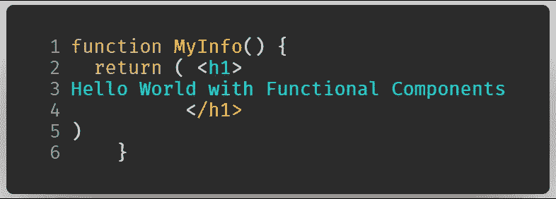*

*Basic Functional Components example*

**注意:永远记住在你的元素上使用* `***return***` *，否则，它会抛出一个错误**

*来渲染它，*

*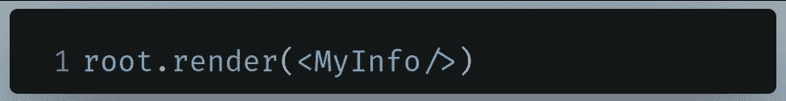*

*Rendering a component*

*正如你所注意到的，我们可以把函数写成一个 JSX 标签。*

*请记住，您应该*

*   *使用**自闭标签。***
*   *你的函数应该以大写字母开始。*

*该代码给出了以下输出*

**

*Code output*

*在这里，我们也不能有多个父元素。像以前一样，我们将使用一个父元素和两个子元素。*

*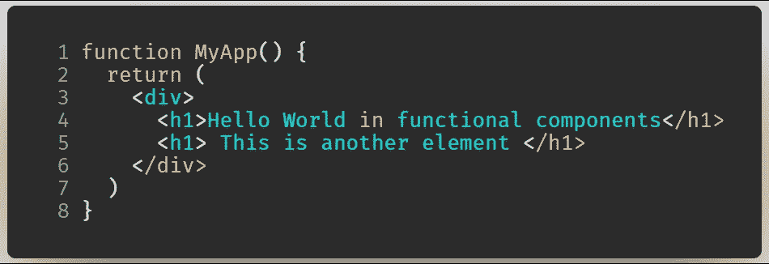*

*Multiple elements in a functional component*

## *锻炼*

*作为一个小任务，我要你呈现一个有你名字的`**h1**`元素，然后写一个包含 3 个关于你的事实的列表。使用功能组件执行此活动。*

***解决方案**:我们不能有两个父元素。让我们使用一个`**div**`，然后插入一个`**h1**`元素，后跟一个列表(`**ul**`)。*

*然后会被渲染。*

*代码的输出如下所示:*

*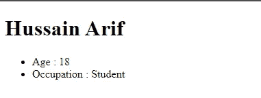*

*The output of the code*

*在实际项目中，通常的做法是将功能组件放在单独的文件中，因为这样可以使程序更加模块化。*

# *将功能组件移动到单独的模块中*

*假设你的功能组件太复杂了。作为开发人员，您希望将组件移动到另一个文件中，以便它可以在您的主文件中使用。因此，这使得你的程序模块化。此外，模块化也让你的代码看起来更整洁。*

## *核心理念*

*首先，在一个单独的文件中创建一个功能组件。然后，我们将按如下方式导出它:*

```
***export default ComponentName***
```

*`**ComponentName**`是您的功能组件的名称。*

## *基本示例*

*让我们重写上面的练习。*

*创建一个名为`**MyApp.js**`的新文件，并编写如下代码:*

*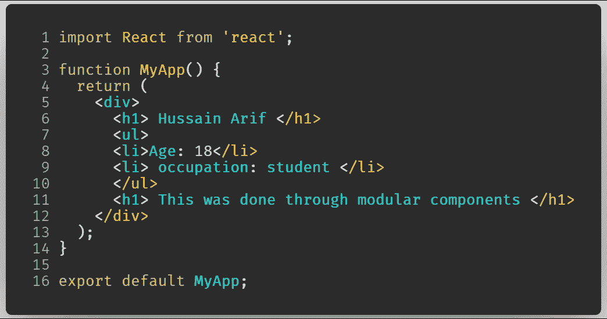*

*Functional Component in a separate file*

*   *`**Line 1**`:导入`**react**`模块，在我们的代码中使用 JSX 标签*
*   *`**Lines 2–12**`:我们的功能组件*
*   *`**Line 13**` :导出我们的`**MyApp**`函数，以便它可以在我们的`**index.js**`文件中使用。*

*现在我们可以像这样在我们的`**index.js**`文件中使用它:*

*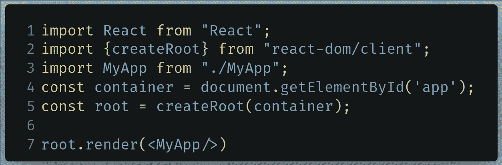*

*   *`Line 3`:我们将使用`**import**`关键字来使用`**MyApp**`组件。**永远记住使用相对路径来指定你的模块。像`**react**`这样的第一方模块不需要相对路径。***
*   *`Line 7`:渲染`**MyApp**`组件。*

*代码的输出如下所示:*

**

*The output of the code*

# *父/子组件*

*有时，即使在函数中编写 HTML 标签变得过于复杂。你不能在一个函数中写这么多行代码，因为它看起来不可读。*

*您可以随心所欲地嵌套您的功能组件*

## *核心理念*

*定义基本功能组件*

```
***function MyFirstComponent() {
    return( 
     <component> </component>
   )
 }***
```

*在第二功能组件中使用它*

```
***function MySecondComponent() {
  return (
    <div>
      <MyFirstComponent/>
      <!--further code here -->
    </div>
  )
}***
```

*然后渲染它*

```
***root.render(<MySecondComponent/>);*** 
```

## *基本示例*

*例如，让我们在一个单独的文件中定义一个页脚元素，然后使用它。*

*在文件`**Footer.js**`中*

*然后在`**App.js**`中使用它:*

*注意我们的`**Footer**`元素被用在了`**Line 13**`中*

*现在让我们渲染`**index.js**`内的`App`元素*

```
*root.render(<App/>);*
```

# *概述*

## *Hello World 应用程序*

```
*import React from "react"
import ReactDOM from "react-dom"**root.render(<h1> Hello World </h1>);***
```

## *功能组件*

```
*function MyComponent() {
  return(
    <component> 
    </component>
    )
}*
```

## *另一个文件中的功能组件*

*   *定义一个组件，`**MyComponent.js**`并导出*

```
*function MyComponent() {
  return(
    <component> </component>
    )
}
**export default MyComponent***
```

*   *在另一个文件中使用`**index.js**`，*

```
*import React from "react"
import ReactDOM from "react-dom"
import MyComponent from "./MyComponent"*
```

## *嵌套组件*

*   *定义第一个组件，`**MyComponent.js**`并导出*

```
*function MyComponent() {
  return(
   <component> </component>
    )
}**export default MyComponent***
```

*   *定义第二个组件，`**App.js**`并导出*

*然后在`**index.js**`中使用*

```
*import React from "react"
import ReactDOM from "react-dom"
import App from "./App";*
```

## *外部资源:*

*   *[创建一个新的 React 应用](https://reactjs.org/docs/create-a-new-react-app.html)*
*   *[Hello World — React](https://reactjs.org/docs/hello-world.html)*
*   *[React 渲染 HTML- W3 学校](https://www.w3schools.com/react/react_render.asp)*

# *结论*

*需要记住的一点是，React 中的语法肯定不同于普通的 JavaScript 语法。对我有用的一件事是玩代码来恰当地抓住主题。我给你的建议是也这样做——不要放弃！*

*呆在家里，注意安全。*

*上篇:[用 Node 搭建一个简单的 Notes App。Js 和 mongose](https://medium.com/better-programming/simple-notes-app-with-node-js-and-mongoosejs-6595cd5d15b)
下一篇:[React 中 CSS 样式和编写的基础知识](https://medium.com/better-programming/the-basics-of-styling-and-writing-css-in-react-ff936ac98ffc)*