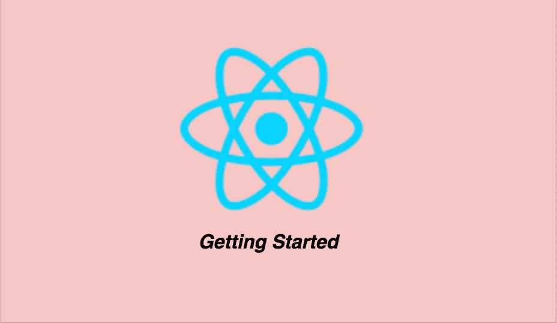

# 如何开始使用 React — Typescript 版本

> 原文：<https://medium.com/bb-tutorials-and-thoughts/how-to-get-started-with-react-typescript-version-749e7b3b16ab?source=collection_archive---------0----------------------->

## 带有示例项目的初学者指南

React 是一个用于 web 应用程序的 javascript 库。您可以使用简单的声明性模板快速构建功能。您可以使用 React 构建应用程序，并重用您的代码和能力来为任何开发目标构建应用程序。有太多的事情需要你去了解，在你得到…