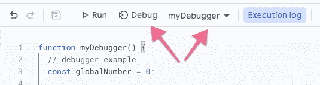
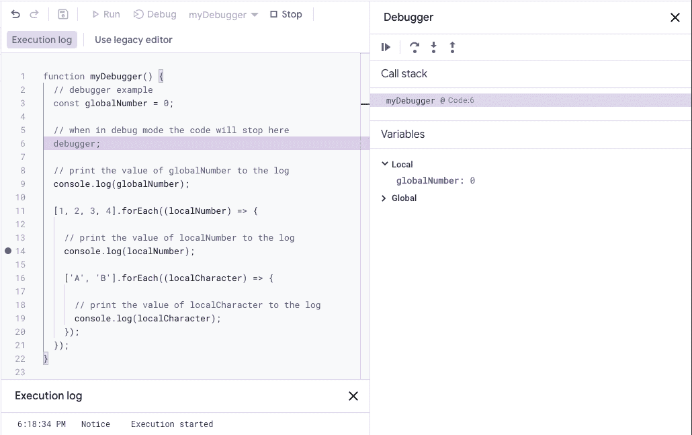
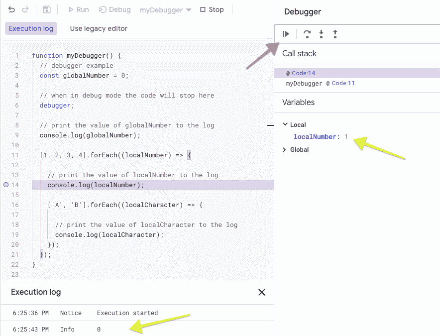
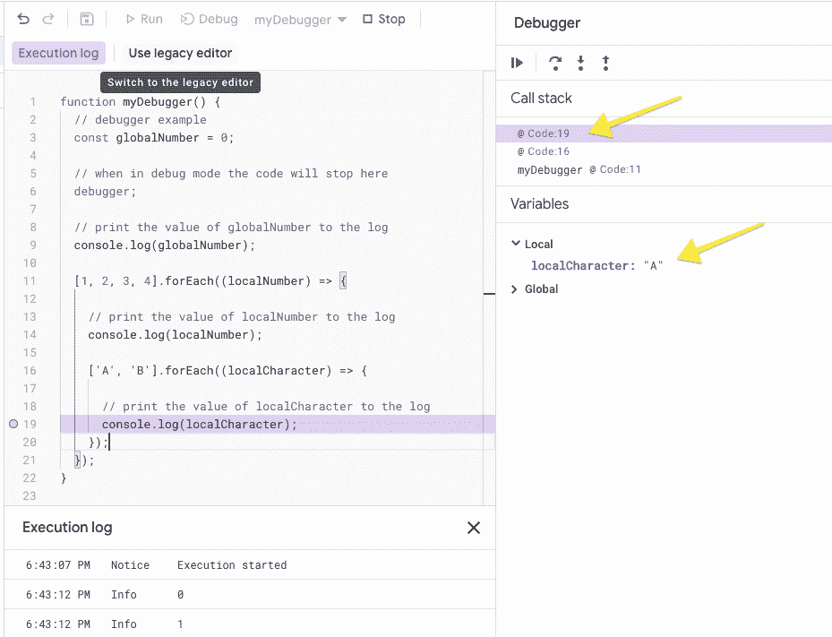
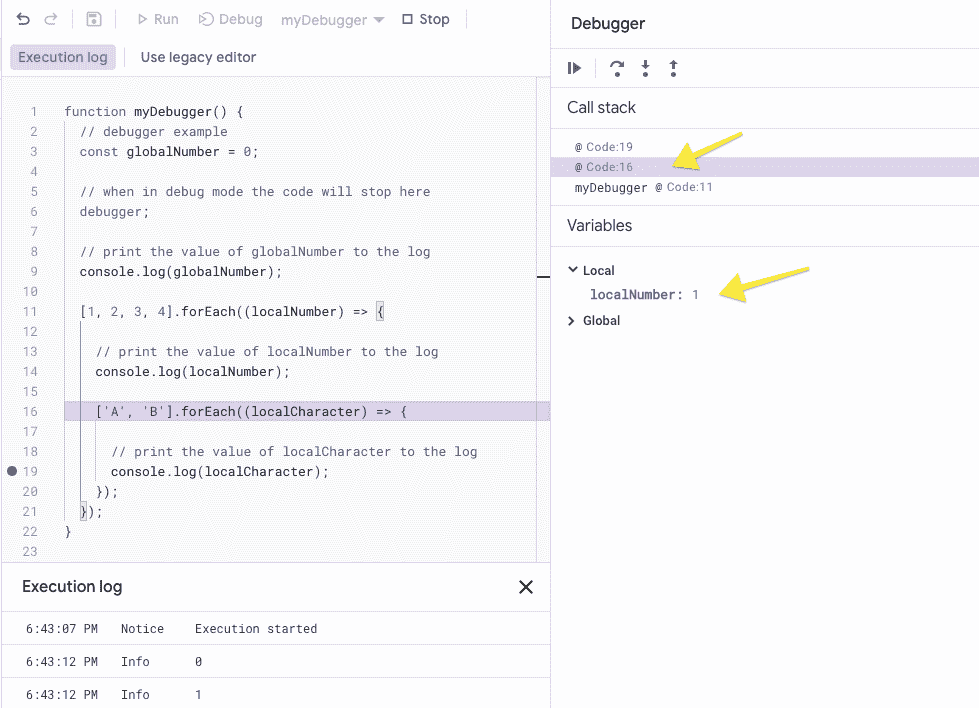
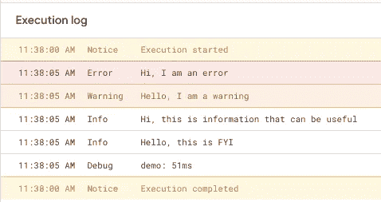
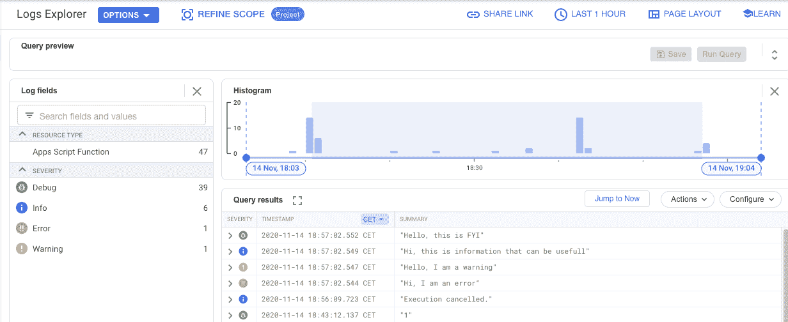
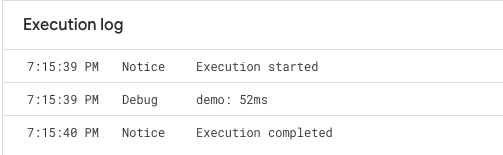

# 如何充分利用新的 Google Apps 脚本调试器和日志记录

> 原文：<https://medium.com/google-developer-experts/how-to-get-the-most-out-of-the-new-google-apps-script-debugger-logging-8996b6a06cc6?source=collection_archive---------1----------------------->

构建和维护代码可能很难。代码的生命周期有多个阶段，每个阶段都有自己的挑战。能够在每个阶段轻松地检索关于代码执行的信息是关键。这就是新的 Google Apps 脚本 IDE 调试和日志记录功能可以提供帮助的地方。在本文中，我将向您展示如何使用新的调试和日志功能。

Photo by [Timothy Dykes](https://unsplash.com/@timothycdykes?utm_source=medium&utm_medium=referral) on [Unsplash](https://unsplash.com?utm_source=medium&utm_medium=referral)

一个简单的 Google Apps 脚本用于演示调试器和日志记录的强大功能。在本文的最后部分，我们将更进一步，实现 Google Cloud logging 模块。读完这篇文章后，你会对调试和监控你的应用程序脚本的选项有一个很好的理解。

# 调试器

调试器使您能够逐步遍历代码。在调试代码中，该函数将一直运行，直到出现调试器语句或断点。调试器语句仅在代码以调试模式运行时有效。

我将使用以下代码展示调试器的功能:

可以通过单击 debug 按钮来启动代码。确保选择正确的函数进行调试。

在下面的截图中，你可以看到调试器在运行。该函数在第 6 行的“debugger”关键字处开始和停止。

为了继续执行代码，我单击了 play 按钮。此操作将恢复函数，直到遇到调试器语句或断点。在这种情况下，它在第 14 行遇到一个断点并停止。play 按钮旁边的三个按钮提供了对调试器更细粒度的控制。当你将鼠标悬停在按钮上时，它们会显示一些关于其功能的信息。

在第 14 行，我放置了一个断点。通过单击您希望调试器停止的行号左侧，可以放置断点。注意 variables 部分和绿色箭头所指的 localNumber 变量。变量部分将显示所有变量的值。

黄色箭头所指的执行日志包含日志信息。如果调试器处于非活动状态，也会显示此信息。

# 调用堆栈

如果您稍微使用一下示例代码，您会发现调试器既简单又容易。我设计了示例代码来突出新调试器中的一个有用特性，即调用堆栈。

示例代码定义了一个全局变量，并在两个数组中循环。外部循环遍历由四个数字组成的数组，内部循环遍历由两个字符组成的数组。

在下面的截图中，我在第 19 行放置了一个断点并运行调试器:

在调用堆栈中，我选择了第一行，localCharacter 变量显示为“A”。然而，当您选择第 16 行时，如下一个截图所示，这就变得有趣了。

现在局部变量是 localNumber，值为 1。这是两个字符的内部循环开始时 localNumber 的值。这样，您可以看到与代码当前状态相关的所有变量。

# 记录

日志记录是一种工具，它使您能够在代码运行时收集有关代码的信息。考虑以下代码:

这里没有什么特别的，但是当我们运行它时，我们会看到以下内容:

我们现在有两个额外的日志级别，错误和警告。这些级别对于区分消息的严重性非常有用。

# 堆叠驱动测井

如果使用 stackdriver 日志记录，日志记录可以更上一层楼。这只是一个引子，使用 stackdriver 确实需要对 Google 云平台和链接到脚本的项目有更深入的理解。我在这里只显示一些高层次的信息。

下面的截图是谷歌云平台上的日志浏览器:

除了探索日志的好方法之外，还可以将多个脚本的日志定向到一个位置。另一个很棒的特性是警报，根据指标，当应用程序出现问题时，您可以触发电子邮件或其他警报来通知利益相关者。

# 时机

最后但同样重要的是，时机。一旦您调试了代码，并且日志记录提供了运行时信息，您可能需要性能指标。

在下面的代码中，我们可以测量一段代码执行的时间。

简单，但功能强大。这段代码运行了 52 毫秒。

# 包扎

在本文中，我展示了如何使用调试器、记录信息和测量时间。这些特性将为您提供有关代码内部工作的信息。做到这一点的最佳方法是，使用示例并实现日志记录语句。

在可靠性变得更加重要的专业环境中，Stackdriver 日志记录非常有用。这需要更多的时间来设置，但是当你在接到脚本用户的电话之前收到一封错误邮件时，这是值得的。