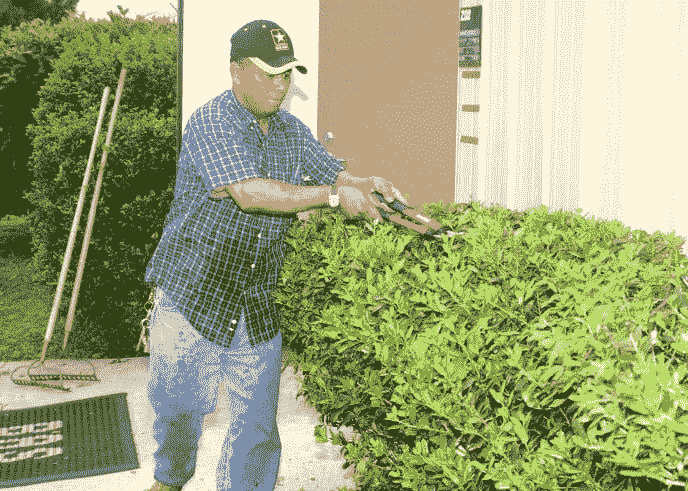

# 如何进入美丽的汤的下一页

> 原文：<https://medium.com/quick-code/how-to-get-the-next-page-on-beautiful-soup-85b743750df4?source=collection_archive---------0----------------------->

刮一个简单的页面很容易，但是我们如何在美丽的汤上得到下一页呢？我们能做什么来爬行所有的页面直到我们到达结尾？

今天，我们将学习如何在抓取网页时通过进入下一页来获取所有项目。

Video version of this tutorial

# 入门指南

由于这篇文章的主题是如何抓取下一页，我们将采用之前编写的脚本，而不是重新编写一个漂亮的 Soup 脚本。

如果你是初学者，请先用 Python 和美汤教程做好你的第一个[网页抓取脚本。](https://letslearnabout.net/python/beautiful-soup/your-first-web-scraping-script-with-python-beautiful-soup/)

如果你知道如何使用美丽的汤，请使用 [repl.it.](https://repl.it/@DavidMM1707/Best-CD-Price) 中的起始代码

这段代码从用户请求的乐队中获取专辑。全部吗？不，只是第一页上显示的前 10 个。到现在为止。

打开一个新的 repl.it 文件或在代码编辑器中复制粘贴代码:现在是时候编码了！

# 重构——摆脱混乱

在添加功能之前，我们需要通过重构来清理混乱。

我们将把代码块放到它们自己的函数中，然后在代码所在的地方调用这些函数。

转到代码的末尾，从我们创建表的地方开始:

剪切它们并创建一个函数，例如，export_table_and_print，并将其放在 base_url 和 search_url 之后:

我们还添加了一个“clean_band_name ”,这样我们存储数据的文件名就不会有空格，而且全部是小写字母，所以“ThE BeAtLES”搜索会存储一个“the_beatles_albums.csv”文件。

现在，在旧代码所在的地方，调用函数，就在文件的末尾:

第一部分完成了。运行代码并检查它是否还在工作。另外，如果你是 Python 初学者，[最佳 Python 教程](https://blog.coursesity.com/pep8-python-code-writing-guide/)可以帮助你学习。

转到第 45 行左右的“for 循环”。提取值并将它们添加到“数据”(即整个代码)中所涉及的一切，并用“get_cd_attributes(cd)”替换它。

在最后一个函数之后，创建该函数并粘贴代码:

再次运行代码并检查它是否还在工作。如果不是，请将您的代码与我的代码进行比较:

t 在工作？酷毙了。是时候去拿所有的专辑了！

# 递归函数——获取下一页的技巧

好了，这里是完成工作的诀窍:递归。

我们将创建一个“parse_page”函数。该函数将获取该页面将拥有的 10 个相册。

在这个函数完成后，它会再次调用自己，用下一个页面来解析它，一遍又一遍，直到我们得到所有的东西。

让我为你简化一下:

我希望这一点很清楚:由于我们一直有一个“下一页”要解析，我们将一次又一次地调用同一个函数来获取所有数据。当没有更多的时候，我们停止。就这么简单。

## 步骤 1:创建函数

获取这段代码，创建另一个名为‘parse _ page(URL)’的函数，并在最后一行调用该函数。

数据对象要用到不同的地方，拿出来放在 search_url 后面。

我们获取主代码并创建了一个 parse_page 函数，使用“search_url”作为参数调用它，并取出“data”对象，这样我们就可以在全局范围内使用它。

如果你感到头晕，你的代码应该是这样的:

请检查这一行:

现在我们不是获取“search_url”(第一个)，而是获取作为参数传递的 url。这一点非常重要。

## 步骤 2:添加递归

再次运行代码。它应该一如既往地获取前 10 张专辑。

这就是为什么，因为我们没有使用递归。让我们编写这样的代码:

*   获取所有分页链接
*   从所有链接中，抓取最后一个
*   检查最后一个是否有“下一个”文本
*   如果有，获取相对(部分)url
*   通过添加 base_url 和 relative_url 来构建下一个页面 url
*   用下一个页面 url 再次调用 parse_page
*   如果没有“下一个”文本，只需导出表格并打印出来

一旦我们获取了所有的 cd 属性(就是这样，在' for cd in list_all_cd '循环之后)，添加这一行:

我们用“SearchBreadcrumbs”类获取“无序列表”中的所有“列表项”(或“li”)元素。那是页码列表。

然后，我们去最后一个并得到文本。在最后一个代码后添加以下内容:

现在，我们检查“next_page_text”是否将“next”作为文本。如果是的话，我们取部分 url，我们把它添加到基础中来构建 next_page_url。如果没有，就没有更多的页面，所以我们可以创建文件并打印它。

这就是我们所需要的。运行代码，现在您将获得几十个甚至几百个项目！

## 第三步:修复一个小错误

但是我们仍然可以改进代码。解析页面后添加这 4 行漂亮的汤:

当专辑数量是 10 的倍数(10、20、30、40 等等)时，有时会出现“下一页”,但那里没有专辑。这使得代码在不创建文件的情况下结束。

有了这个代码，就搞定了。

你的编码完成了！恭喜你！

# 结论

让我总结一下我们所做的工作:

*   我们将具有相同功能的代码块移到了函数中
*   我们将抓取代码放在一个函数中，我们称之为传递初始 search_url
*   在函数内部，我们删除了代码
*   完成后，我们检查下一个 URL
*   如果有一个“下一个 url ”,我们用下一个页面的 URL 来调用这个函数
*   如果没有，我们结束抓取并创建。csv 文件

现在看起来简单多了吧？

我想继续做这样的教程，但是我想问你你想看什么:

*   你想要更多的网刮与美丽的汤或刺痒？
*   你想让我教你如何制作 Flask web 应用程序还是 Django 应用程序？
*   还是想学更多 Vue.js 之类的前端的东西？

请给我留言，告诉我你想在以后的帖子里看到什么。

如果这个教程对你有用，在推特、脸书或者你能帮助别人的地方与你的朋友分享。

[repl . it 上的最终代码](https://repl.it/@DavidMM1707/Best-CD-Price-Next-Page)

[在推特上联系我](https://twitter.com/DavidMM1707)

[我的 Youtube 教程视频](https://www.youtube.com/channel/UC9OLm6YFRzr4yjlw4xNWYvg?sub_confirmation=1)

[我的 Github](https://github.com/david1707)

联系我:DavidMM1707@gmail.com

继续阅读[更多教程](https://letslearnabout.net/category/tutorial/)