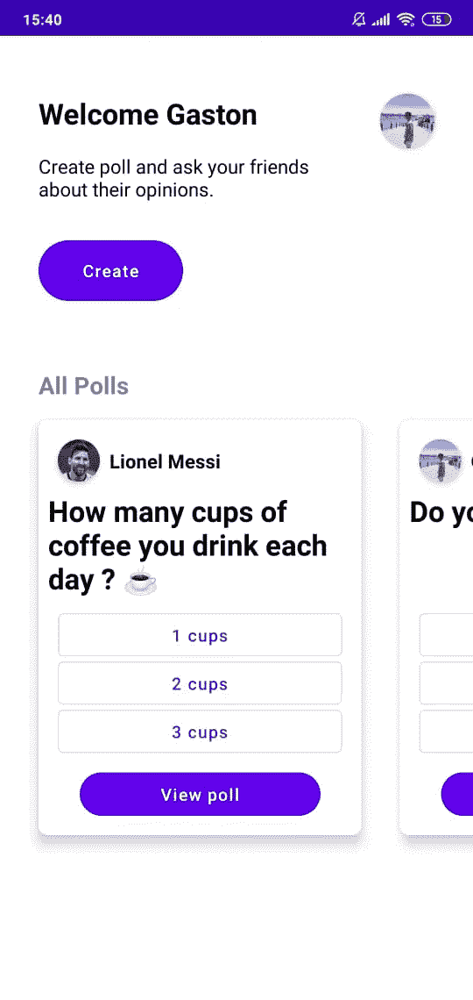

# 如何在 Jetpack Compose 中处理导航

> 原文：<https://medium.com/google-developer-experts/how-to-handle-navigation-in-jetpack-compose-a9ac47f7f975?source=collection_archive---------1----------------------->

自从我开始使用 Jetpack Compose 以来，我就爱上了它，有这么多新的方法来创建交互式 UI，只需几行代码，不需要样板文件，绑定视图时不需要 NullPointers，以及任何像我们以前使用的东西。

在花了一些时间理解 compose 的整个概念来创建声明性 UI 之后，我开始问自己如何使用它来处理导航，然后我开始阅读示例应用程序并理解它是如何完成的，在这篇文章中，我将向您展示如何在正式方法出现之前使用导航。

我们将使用的所有代码都是从官方的 jetpack compose 示例中提取的，更多关于 **jetSnack** 和 **Owl** 应用程序，因为它们提供的导航器处理多个 backstacks。

# 我们过去如何处理导航

在 Jetpack Compose 之前，我们使用导航组件库、简单堆栈库、intents 或 FragmentManager 本身来处理导航。

使用 jetpack 导航的导航看起来像这样

这就是我们实际上如何使用多个目的地进行导航，概念是一个活动和多个片段，导航组件库处理弹出片段并将它们推入堆栈的所有 backstack 逻辑，这是当今处理导航的一个非常有用和简单的 API，但随着 Jetpack Compose 的出现，事情变得有些不同。

# 碎片呢？

这里描述了 Jetpack Compose 中片段的概念，基本上，在片段中我们没有扩展 **setContent { }** ，当我们创建一个新的 Jetpack Compose 示例时，我们通常在活动组件中有这个扩展，相反，我们需要向我们的片段添加一个 **ComposeView** ，它用于将 **setContent { }** 捆绑到片段中，并开始处理它。

在此之后，我们可以开始在我们的片段中编写我们的 **@Composable** 函数，但是请记住，如果我们在片段中编写可组合函数，我们还需要用我们的可组合函数来处理片段生命周期，这将使我们很难不容易出现问题。

# Jetpack Compose 怎么样？

在 Jetpack Compose 中，composable 不依赖于生命周期(它们只存在到合成结束，因此，任何连接到这些 composable 的观察者也会死亡)，这很好，因为我们只在 MainActivity 中托管 composable，并且我们只关心编写我们的视图。

## 快速笔记

以一种干净的方式编写可组合体的重要性是非常重要的，因为我们想要用可组合体函数实现的是移除我们可以移除的许多可组合体的状态(状态提升)，这样做我们可以在可组合体树中只拥有一些或一个依赖于状态的可组合体，使其余的可组合体无状态，这对于避免可组合体需要重新组合时出现任何问题非常重要。

当我们讨论 Jetpack Compose 中的导航时，我们不会讨论片段或活动，我们会讨论将视图弹出并推送到当前屏幕，这是我们接下来要做的。

没有任何片段，只有 1 个活动，我们将建立一个 2 屏幕的应用程序，处理导航，backstack 和没有片段。

## 重要的

由于现在提供的所有这些示例都运行在 1.0.0-alpha03 版本的 Jetpack Compose 上，这可能会有利于新的 Compose 版本，同时请记住，Jetpack 导航团队将在未来开发一个易于使用的 API 来将其与 Jetpack Compose 集成，使所有导航比我们现在看到的更简单。

> 下面提供的示例从官方的 jetpack compose 示例报告中提取了导航代码。

# 如何处理导航

让我们开始编写我们的应用程序，这个应用程序是一个民意调查应用程序，我目前正在我的公共回购中工作，你可以在这里查看

 [## gast sail/jet 示例

### 这是一个存储库，展示了如何通过例子创建 UI 的不同部分。了解如何创建不同的…

github.com](https://github.com/gastsail/JetExample) 

该应用程序被称为 JetPoll，是一个交互式投票应用程序，用户可以创建投票，其他人可以投票，它使用 Firebase 来存储投票并注册所有的互动，目前，这个应用程序是 **WIP** ，所以应用程序的任何变化都将在回购上更新。

我们要做的是添加导航到**创建**投票按钮，导航到另一个屏幕，让用户创建一个投票

由于本文不会讨论如何创建组件，而是讨论如何处理导航，所以我将讨论导航本身，而不是如何创建这个 UI。

# 定义导航器

首先，我们需要做的是定义我们的 Navigator 类，这个类将处理我们当前导航的 backstack，并将

我们将要使用的导航器可以在官方 Jetpack Compose 示例 repo 的 OWL 示例中找到。

 [## Android/compose-示例

### 官方喷气背包组成样本。在 GitHub 上创建一个帐户，为 android/compose-samples 开发做贡献。

github.com](https://github.com/android/compose-samples/blob/master/Owl/app/src/main/java/com/example/owl/ui/utils/Navigation.kt) 

首先，这个导航器有两个参数，第一个是初始目的地，我们将这个目的地称为 Home 目的地，这是我们应用程序的第一个屏幕，然后它有一个 backDispatcher，这个负责处理 back 按钮按下和处理 backstack 视图的弹出。

说了这么多，关于这个类就没有更多的了，它所做的是用 **navigate()** 方法获取导航并将其添加到 backstack，然后在 backButton 按下或调用 **back()** 方法时弹出 backstack。

在我们定义了这个之后，我们需要做的是创建一个 NavGraph，类似于我们使用 Jetpack 导航所做的事情，但是没有 XML。

# 导航图

**导航图**负责知道我们想去哪里，在这个例子中，我们只定义了一个名为 Destination 的密封类，这个类将包含我们当前的目的地，在这个例子中，我有 2 个，Home 目的地和 CreatePoll 目的地(在主屏幕上按下 **Create** poll 按钮后我需要去的那个)

在那之后，有一个 **Actions** 类，它使用我们之前编写的 **Navigator** 和 **Destinations** 初始化，这个 Actions 类将负责定义我们在应用程序中导航到某个屏幕的操作。

这实际上已经完成了 80%的工作，接下来我们需要添加的是另一个东西，它将帮助我们测量屏幕的插入内容，以填充将被称为另一个屏幕的新的可组合内容。

# 显示插图

作为它提供的文档

> 将任何[WindowInsetsCompat]值应用于[InsetsAmbient]，然后这些值在[content]中*可用。*@param consumeWindowInsets 设置是否使用分派给*主机视图的任何[windowinsets compat]。默认为“真”。

关于这个类没有太多要说的，它将只测量我们正在导航的当前组件，并且只接受**ProvideDisplayInsets**Composable 中的组件

# 让我们创建导航

现在我们已经在 **NavGraph** 文件中拥有了导航和定义目的地所需的所有类，我们准备开始在当前代码中实现它

首先，在我们的 MainActivity 中，我们需要使用 on*onBackPressedDispatcher*来启动我们的 Composable，它会知道我们何时进行 backPress，传递这个 Dispatcher 可以让我们处理 backPress 按钮并在其中应用逻辑。

## 主要活动

既然我们已经通过了*onBackPressedDispatcher*，现在我们需要创建到 PollMain 可组合件中的导航。

## 波尔曼

这是最重要的一步，这里我们将定义我们的**导航器**，正如你可以看到的，第一行代码用我们在**导航图**上提供的**目的地**定义了**导航器**，然后我们使用**rememberSavedInstanceState**，这真的很棒，因为它在进程死亡后仍然存在！！

然后导航器定义保护程序，这就是我之前说过的，我们传递 *onBackPressedDispatcher* ，它将被配置为处理 backstack 的弹出。

现在，我们需要初始化我们的**导航器**，我们将用 Home 目的地初始化它，所以弹出的第一个屏幕是 Home 屏幕

然后，我们创建一个动作变量，它将记住我们的动作(当前导航屏幕),并负责将我们的新目的地推入我们的屏幕。

最后，我们提供了**BackStackDispatcherAmbient**来处理 backstack，然后是我们之前讨论过的 ProvideDisplayInsets，这个函数只是将 Composables 作为它的子对象。

这里， **CrossFade** 将在 **navigator.current** 上播放一个更好的 CrossFade 动画，它代表了我们将要进行的新导航

最后，我们已经有了目的地！！我们使用 when()表达式来膨胀一个或另一个，这种膨胀将由我们之前创建的操作引起，现在，例如，我的主屏幕有 Create 按钮，我只需要当我按下该按钮来执行我们在**导航图**中定义的**操作. createPoll** 即可。

## 波尔霍姆

最后，我们只是将点击传播到持有创建按钮的 **CreatePollComponent** ,我们需要处理与它的交互

## CreatePollComponent

仅此而已！，当我们按下 Create 时，我们将导航到我们的 **CreatePollScreen()** ，它现在只显示一个文本

## 创建 PollScreen

# 输出

所有这些代码都可以在我的资源库中找到，我会保持它的最新状态，你也可以在那里找到许多 Jetpack Compose 示例组件，repo 在这里

 [## gast sail/jet 示例

### 这是一个存储库，展示了如何通过例子创建 UI 的不同部分。了解如何创建不同的…

github.com](https://github.com/gastsail/JetExample)