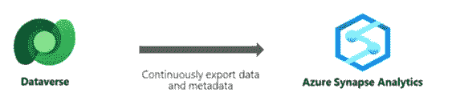

# 如何处理动态 365 数据导出服务(DES)的弃用和终止？

> 原文：<https://medium.com/version-1/how-to-handle-the-dynamic-365-data-export-service-des-deprecation-and-end-of-life-88343e732e7e?source=collection_archive---------1----------------------->

# 问题陈述

Microsoft Dynamics 365 数据导出服务(DES)用于将数据从 Dataverse 导出到 Azure SQL 存储。组织使用 DES 在 Dynamics 365 / Dataverse 数据的基础上构建报告功能。该服务已被弃用，将于 2022 年 11 月停止支持并停止使用。这将给任何使用此服务从 Dataverse 导出数据的现有客户带来问题。

# 解决方案

Azure Synapse Link for Dataverse 是从 Dataverse 导出数据的 DES 的一个很好的替代方案。它还支持运行人工智能和机器学习，与外部数据集集成，以及切片和切割大量数据。我们可以使用 Azure Synapse link for Dataverse 加快洞察速度，因为它是内置的，开箱即可使用。它可以用于将数据从 Dataverse 持续导出到 Azure Synapse Analytics 和 Azure Data Lake Storage Gen2。

Azure Synapse Link for Dataverse 服务为表数据和元数据提供初始和增量写入。Dataverse 中的任何数据或元数据更改都会自动推送到 Azure Synapse 元存储和 Azure 数据湖存储，具体取决于配置，无需额外步骤。这是一个推送操作。无需任何手动干预，即可将更改推送到目标位置。

Azure Synapse Link for Dataverse 有助于实现以下功能

将表连续导出到 Azure Synapse Analytics 和/或 Azure Data Lake Storage Gen2。这包括具有创建/更新/删除操作的标准表和自定义表。

无服务器数据湖探索、与外部源的集成以及 Azure Synapse Analytics 中的处理

Dataverse 与 Azure Synapse Analytics 和 Azure Data Lake Storage Gen2 的链接/分离

使用 Azure Synapse Analytics 内置 AI 集成对导出的 Dataverse 数据进行自定义预测。

使用 Azure Synapse Analytics 中的 T-SQL 等熟悉工具分析导出的 Dataverse 数据。此外，还可以使用 Apache Spark 进行分析。

使用 Power BI 仪表盘和报告从导出的 Dataverse 数据中获得洞察力

> 在版本 1 中，我们有 Azure 专家可以帮助从 Dynamics 365 数据导出服务(DES)迁移到 Azure Synapse Link for Dataverse。

**关于作者** Pankaj Singh 是 Version 1 的高级数据架构师。