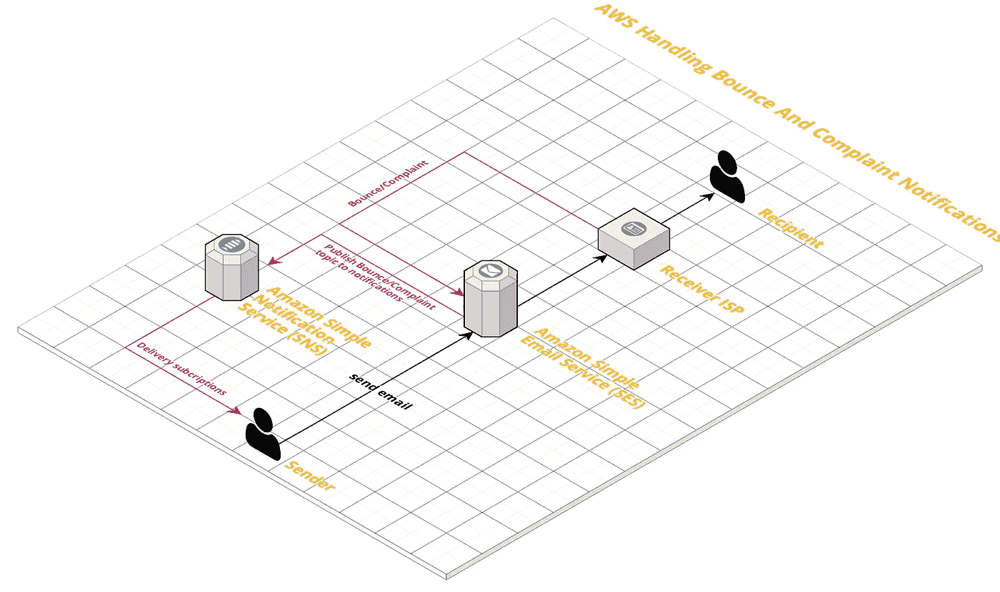
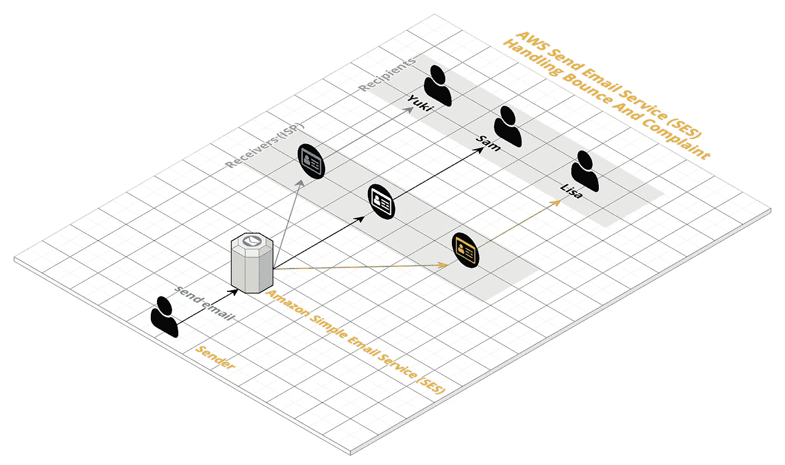
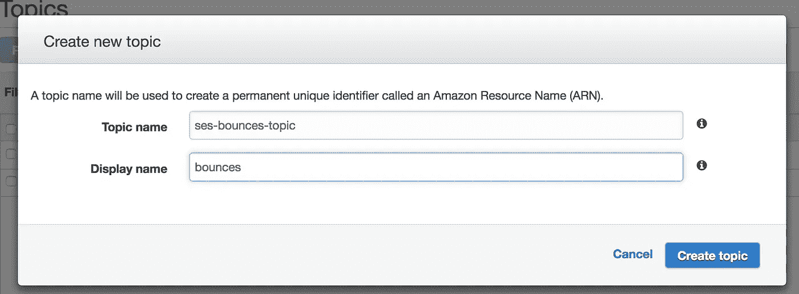
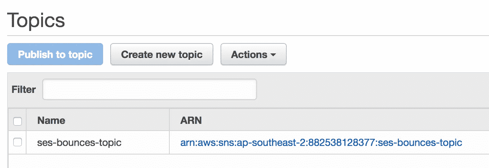
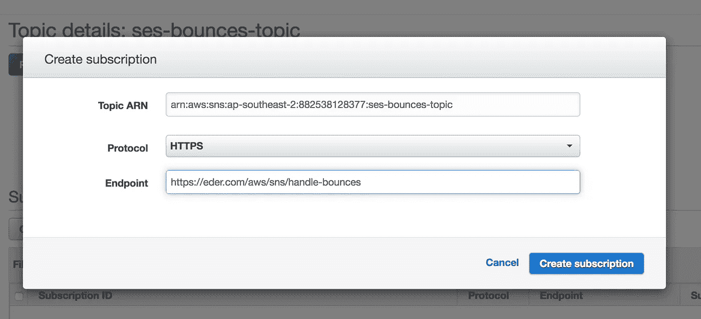
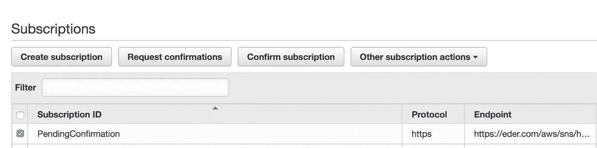
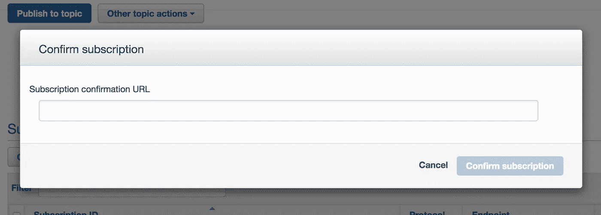
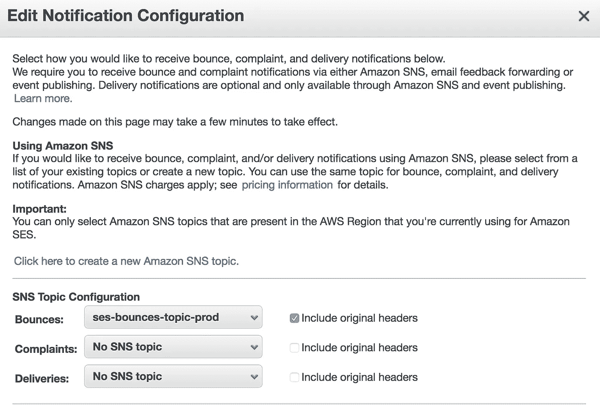

# 如何在 15 分钟内处理 AWS 中的退回和投诉通知

> 原文：<https://medium.com/quick-code/how-to-handling-bounced-and-complaint-notification-in-aws-within-15-minutes-827972207484?source=collection_archive---------0----------------------->



# 介绍

**电子邮件营销**对于与客户建立关系非常重要。我一直在做一个邀请项目，用户和我们的营销部门可以跟踪退回的电子邮件。

让我们开始基于 AWS 构建一个生产就绪的**电子邮件退回跟踪**系统。

# 在本文中，您将了解以下内容:

*   在 AWS 上使用简单通知服务(SNS)设置简单电子邮件服务(SES)
*   AWS 电子邮件发送流程
*   …或者超出您的预期？

# 发送过程概述

下图描述了当你用[亚马逊 SES](https://docs.aws.amazon.com/ses/latest/DeveloperGuide/sending-email-with-ses.html) 发邮件时会发生什么。



如果发件人对 SES 的请求成功，则 SES 会发送电子邮件，并出现以下结果之一:

*   **弹跳**
*   **投诉**
*   **成功**

## ***SNS 提供了一种*** 处理退信和投诉通知的方式

要接收发布到主题的通知，您必须为该主题订阅一个端点。端点是一个**移动应用程序、网络服务器、电子邮件**或**亚马逊 SQS 队列**，可以接收来自亚马逊社交网络的通知消息。

一旦您为端点订阅了某个主题并确认了订阅，端点将会收到发布到该主题的所有消息。通过[最佳 AWS 课程&认证](https://blog.coursesity.com/best-aws-certifications/)学习 AWS。

## 配置退回通知

1.  [创建一个名为*ses-bounds-topic*](https://docs.aws.amazon.com/ses/latest/DeveloperGuide/dashboardcreateSNStopic.html)的亚马逊 SNS 话题。



然后你得到一个名为 **ARN 的身份 id，**你以后会需要它。



2.[配置亚马逊 SNS 主题发布到端点。](http://To subscribe to an SNS topic)

2.1:使用刚刚创建的 ARN 创建订阅



当然，还没有完成…你必须**从 AWS SNS** 确认该端点。



**AWS SNS** 会向您的端点发送一个**订阅确认 URL** ，然后您必须验证它。



3.[使用*SES-bouncies-topic*配置 Amazon SES 发布退回通知。](https://docs.aws.amazon.com/ses/latest/DeveloperGuide/dashboardconfigureSESnotifications.html)



# 使用邮箱模拟器进行测试

[使用电子邮件模拟器**:【bounce@simulator.amazonses.com **](https://medium.com/p/827972207484/edit)

发送退回邮件后，您会收到以下消息

```
{
   "notificationType":"Bounce",
   "bounce":{
      "bounceType":"Permanent",
      "bounceSubType":"General",
      "bouncedRecipients":[
         {
            "emailAddress":"[bounce@simulator.amazonses.com](mailto:bounce@simulator.amazonses.com)",
            "action":"failed",
            "status":"5.1.1",
            "diagnosticCode":"smtp; 550 5.1.1 user unknown"
         }
      ],
      "timestamp":"2017-09-05T02:30:25.645Z",
      "feedbackId":"0101015e4fdfe031-818e3e45-3db7-4546-8bbf-6da232afc8e9-000000",
      "remoteMtaIp":"207.171.163.188",
      "reportingMTA":"dsn; a27-24.smtp-out.us-west-2.amazonses.com"
   },
   "mail":{
      "timestamp":"2017-09-05T02:30:24.000Z",
      "source":"[bounce111@eder.com.au](mailto:bounce111@bookmarc.com.au)",
      "sourceArn":"arn:aws:ses:us-west-2:154131996403:identity/eder.com",
      "sourceIp":"54.240.230.242",
      "sendingAccountId":"154131996403",
      "messageId":"0101015e4fdfdb7f-a3dcaf07-8fb3-459f-9343-7859c0398c3f-000000",
      "destination":[
         "[bounce@simulator.amazonses.com](mailto:bounce@simulator.amazonses.com)"
      ],
      "headersTruncated":false,
      "headers":[
         {
            "name":"From",
            "value":"[bounce111@eder.com.au](mailto:bounce111@bookmarc.com.au)"
         },
         {
            "name":"To",
            "value":"[bounce@simulator.amazonses.com](mailto:bounce@simulator.amazonses.com)"
         },
         {
            "name":"Subject",
            "value":"[bounce@simulator.amazonses.com](mailto:bounce@simulator.amazonses.com)"
         },
         {
            "name":"MIME-Version",
            "value":"1.0"
         },
         {
            "name":"Content-Type",
            "value":"text/plain; charset=UTF-8"
         },
         {
            "name":"Content-Transfer-Encoding",
            "value":"7bit"
         }
      ],
      "commonHeaders":{
         "from":[
            "[bounce111@eder.com.au](mailto:bounce111@bookmarc.com.au)"
         ],
         "to":[
            "[bounce@simulator.amazonses.com](mailto:bounce@simulator.amazonses.com)"
         ],
         "subject":"[bounce@simulator.amazonses.com](mailto:bounce@simulator.amazonses.com)"
      }
   }
}
```

# 收场白

仅此而已！很简单，对吧？

我已经研究了一段时间，以了解如何实现它们。

我想和你分享我从真实项目中学到的东西。希望可以节省你的时间。

感谢您的阅读:)

**未完待续下一篇:** [**用户使用 Laravel**](/@fanedercode/how-to-track-bounced-email-messages-after-user-sending-a-mail-4c79e96e8bf0) 发送邮件后如何跟踪被退回的邮件