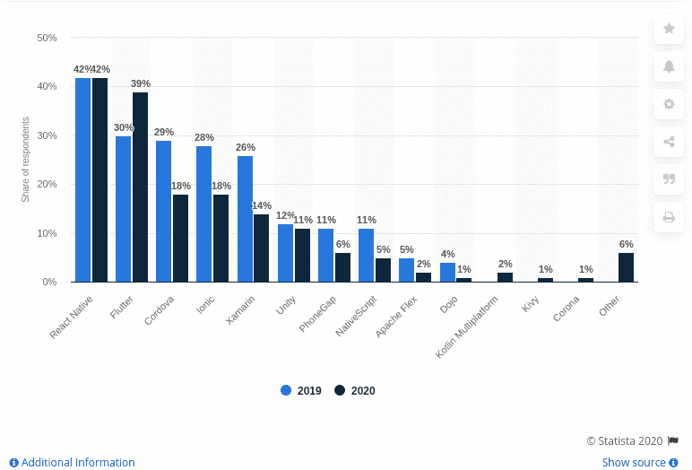
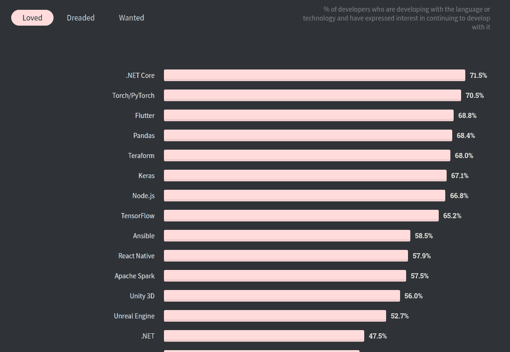
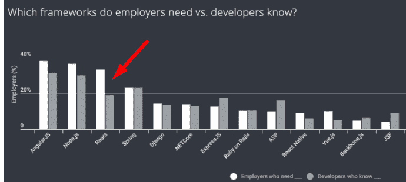
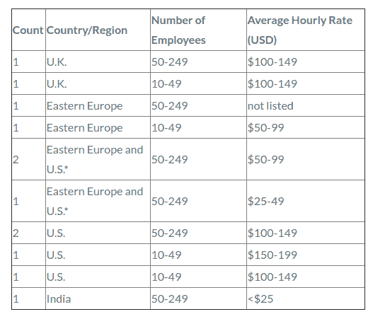

# 如何雇佣一个 React 原生 App 开发者？成本、清单和雇佣模式

> 原文：<https://medium.com/quick-code/how-to-hire-a-react-native-app-developer-cost-checklist-and-hiring-models-2cf86eb7a180?source=collection_archive---------0----------------------->

移动应用商店中有 650 万个可用应用，您是否正在寻找制胜的应用开发解决方案？如果是，那么 React 原生跨平台应用程序开发解决方案将开始发挥作用。由于 React Native 已经成为 42%的全球开发人员的选择，并被认为高效、快速，足以开发出经济高效的解决方案，因此许多公司都在提供 React Native 应用程序开发服务。

[Image Source](https://www.statista.com/statistics/869224/worldwide-software-developer-working-hours/)

***但是核心问题，2020-21 年雇佣 React 原生 App 编码员要花多少钱？***

这个问题没有简单的答案，因为有很多因素会影响雇佣 React 本地开发人员的成本。

然而，在跳过这些关键因素之前，是时候了解全球雇佣 React 本地开发人员的需求不断增长背后的原因了…

# **是什么增加了对 React 原生应用开发者的需求？**

React Native 是脸书推出并支持的最强大、最灵活的开源框架之一。尽管它很年轻，于 2015 年推出，但它已经成为开发跨平台应用程序的最苛刻、最受欢迎和首选的框架。

> ***根据研究，*** [***57.9%的开发者***](https://insights.stackoverflow.com/survey/2020#technology-most-loved-dreaded-and-wanted-other-frameworks-libraries-and-tools-loved3) ***选择 React Native 进行应用开发，并表示有兴趣继续使用它进行开发。***

[Image Source](https://insights.stackoverflow.com/survey/2020#technology-most-loved-dreaded-and-wanted-other-frameworks-libraries-and-tools-loved3)

你一定想知道，到底是什么让 React Native 如此苛刻，并让开发者参与到应用开发中来？

**先说原因:**

*   React Native apps 几乎可以为您提供基于特定 iOS 和 Android 平台的本机应用程序类型的性能。
*   使用 React Native 开发的应用程序高效而快速，因为它主要使用图形处理单元(GPU)，与其他使用 CPU 的跨平台混合技术相比，这使它们运行得更快。
*   开发人员可以使用 React Native 节省时间和金钱，因为 95%的时间都用于编码，但 React Native 是基于“编写一次，在任何地方运行”的编码。因此，有了 React，本地企业可以以单个应用程序开发的价格拥有这两个应用程序。
*   借助热重装或实时重装功能，开发人员可以立即查看他们在编码中所做的更改，从而节省大量开发时间。
*   React Native 带来了自动更新代码的机会，这有助于开发人员快速发布新的应用功能。
*   React 原生应用可以提供更好的用户体验，并且易于导航。

毫无疑问，所有这些功能都使 React Native 成为一个强大而领先的移动应用开发框架，React Native 开发者不断增长的需求凸显了为您的下一个项目找到最佳框架的稀缺。

***据*** [***Newstack 调查报告***](https://thenewstack.io/week-numbers-industry-demand-react-developers/) ***显示，33%的雇主都在寻找 React 的原生开发者，但只有 19%的开发者拥有这方面的知识。***

[Image Source](https://thenewstack.io/week-numbers-industry-demand-react-developers/)

> **现在的问题是，“你将如何选择最好的应用开发者？”。**

好吧，许多专家会指导你考虑应用程序开发人员的经验和专业知识，但如果市场上具有适当专业知识的 React 本地开发人员非常少怎么办？万一，如果你能找到一个，你如何确定他们是否适合你的预算？

> 我们在这个帖子里有所有的答案！

# **React 原生 App 开发者的三大参与模式**

在招聘应用程序开发人员时，移动应用程序开发公司通常会提供三种主要的招聘模式，让专门的开发团队安心入职。由于每个组织都有自己的开发需求，因此，模式的选择完全取决于具体的招聘需求、项目的复杂性和项目所需开发人员的技能组合。

## **-部分接合**

在这种参与模式下，企业可以选择雇佣一个开发团队工作一定的时间，这取决于他们的项目需求。你可以咨询[应用程序开发公司](https://www.xicom.biz/offerings/mobile-app-development/)的项目需求，在分析需求后，应用程序开发公司会建议你合理的项目编译时间。

通常，开发人员的成本从 12 美元到 15 美元不等，这取决于开发人员的技能、经验和专业知识。

如果您非常清楚自己的需求和资源，部分参与模式是理想的。例如，如果您想要将应用从一种技术迁移到另一种技术，或者想要升级应用中的功能等等。

## **-每月约定**

无论你的应用程序开发需求有多复杂，你都可以按月租用资源。根据项目需求，你可以雇佣开发团队几个月。在这种合作模式下，将按月计费。

对于有长期项目开发需求的企业来说，月度项目是一个理想的选择。从开发、设计到部署，你可以雇佣整个开发周期的团队。但如果你清楚自己的应用程序开发想法，这可能会很棒，否则，你也将被收取规划和研究工作的费用。

## **-专门约定**

对于寻求开发团队帮助他们从头开始开发应用程序的企业来说，专用参与模式是理想的选择。通常，一个专门的开发团队由项目经理、后端/前端开发人员、UX/UI 开发人员、质量保证测试人员和营销专家组成。通常，根据不同的因素，雇佣成本从 50 美元到 100 美元不等。

无论您选择哪种雇佣模式来雇佣移动应用程序开发人员，应用程序开发公司都将为您提供最佳支持，以弥合您的成功与目标之间的差距。但同样，有一些因素可以帮助你评估雇佣一个移动应用开发者的总成本。

# **主要影响雇佣成本的因素反作用于本地应用开发者**

市场上有成千上万名 React 原生程序员，他们拥有不同水平的技能、专长、知识和经验。每个企业都有不同的需求，所以用不同的参数评估开发人员的档案是很重要的。因此，我们在这里提到了各种主要因素，帮助您确定为您的下一个项目雇佣专门的 React 本地团队的确切成本。

*   **自由职业者 Vs 全职应用开发者**

说到 [**雇佣移动 app 开发者**](https://www.xicom.biz/offerings/hire-mobile-developers/) ，总会有第一个问题，是想自由职业还是需要雇佣 React 原生移动开发公司。您的最终选择将有助于您确定雇佣开发人员的成本。

毫无疑问，相比移动应用开发公司，雇佣一个自由职业者要便宜得多。如果你手头有一个完成期限灵活的简单项目，那么自由职业是值得的，但是项目质量有点低。

因为移动应用程序开发公司已经存在了很多年，并且非常在意自己品牌的声誉。因此，他们由在开发应用程序方面拥有多年经验和专业知识的精选员工提供支持。移动应用程序开发公司始终致力于交付质量，确保 100%的质量，并遵守 NDAs 以确保您的应用程序开发安全。

在印度，每小时的平均成本可能在 12-25 美元之间，这取决于开发人员的技能、经验和专业知识。价格合理的应用程序开发人员使印度成为租用资源的最佳地点。而在美国，开发人员的平均年薪约为 94000 美元，也就是每小时 30-45 美元。

*   **应用开发者的地理位置**

雇佣应用程序开发人员的成本因地理位置而异，全球公认的事实是，印度是雇佣[最便宜的应用程序开发资源的最佳地点。因此，大多数企业正在考虑在印度雇佣资源，因为雇佣开发人员的平均成本从 12 美元到 25 美元以上不等。](https://clutch.co/app-developers/resources/cost-build-mobile-app-survey-2015)

其余的你可以查看一下在包括美国、英国和欧洲在内的热门地区雇佣开发人员的平均成本。

[Image Source](https://clutch.co/app-developers/resources/cost-build-mobile-app-survey-2015)

*   **开发人员的专长**

你一定想知道为什么不同地方的开发商的价格会有这么大的差异。原因在于它的专业知识、技能和生活成本。在市场上更容易找到经验较少的 React 原生应用开发者，他们的服务将以更低的成本提供。但是随着开发人员经验的增加，他们倾向于提供更熟练的 [**应用程序开发解决方案**](https://www.xicom.biz/offerings/mobile-app-development/) 并且可能会让你付出更高的代价。

技能是推动成本的最重要因素之一，但你不能因为要节省一笔钱而牺牲专业技能。这样的开发人员会使用不同的开发工具，并在开发应用程序中获得丰富的经验，以确保 100%的准确性。

> **确保你雇佣的 React 本地开发人员必须具备这些技能，以满足你对应用程序开发的预期要求:**

*   优秀的 HTML，CSS 和 JavaScript 的命令。
*   因为它是基于 JavaScript 的，所以开发人员必须了解像 jQuery 或 Backbone.js 这样的 JavaScript 库。
*   Bootstrap 和 Foundation 等前端 CSS 框架的专业知识和技能。
*   了解使用 React 测试工具进行单元测试，包括 Karma 或 Jest。
*   熟悉预处理器，如 Sass 和 LESS。

在印度，雇佣具有 5 年经验的开发人员的估计成本通常从 30 美元到 50 美元不等。而在美国和英国，起价分别为 100 美元、150 美元或 200 美元。

*   **项目的复杂程度**

不同的企业有不同的需求，所以雇佣 React 原生应用开发者的成本取决于应用开发项目的复杂程度。项目交付、开发阶段和完成项目所需的时间完全取决于应用程序开发项目的复杂性。

通常，一个成熟的应用程序开发项目需要 4 个月才能完成。一个具有基本功能的应用程序将在更短的时间内完成，成本高达 7000 美元以上。而具有高级特性和功能的复杂应用程序将需要很长时间才能完成，并且预算会更高。

> 要计算项目的确切开发成本，可以用这个公式“总开发小时数 React 原生开发者每小时开发成本=项目最终开发成本”。

## **招聘 React 原生应用开发团队时需要掌握的常见技能**

尽管在 2015 年推出，但与业务需求相比，拥有合适技能的开发人员数量非常少。因此，我们记下了一些快速提示，帮助您筛选出满足项目需求的最佳人才:

*   **寻找行业经验**

雇佣最便宜的应用程序开发团队总是很诱人，但很快这种诱惑就会变成大错。所以这个行业真的很重要，把正确的专业知识放在桌面上会帮助你满足你的需求。 [**聘请了解市场需求和客户要求经验丰富的开发人员**](https://www.xicom.biz/solutions/hire-developers/) 。

*   **平台专业知识**

无论您是在开发原生应用还是跨平台应用，开发人员拥有平台专业知识和不同开发工具的知识是非常重要的，这样他们就可以毫无麻烦地启动应用。

*   **项目按时交付的跟踪记录**

当涉及到移动应用程序开发时，事情就像被子一样旋转。因此，雇佣一个在快速周转下有交付项目记录的开发人员，并且能够用快速敏捷的开发来支持变化的计划。

*   **技术知识和专业技能**

在雇用应用程序开发人员时，确保开发人员对 CSS3、HTML5、jQuery、JavaScript、Sencha 或 PhoneGap 等技术有足够的了解。这将确保开发人员能够了解您的需求，并能够利用最好的技术和功能来构建定制的移动应用程序。

所以现在你有了所有流行的参数来帮助你为你的项目雇佣最好的程序员。

# **结论**

毫无疑问，在很短的时间内，React Native 已经成为开发跨平台应用程序的蓬勃发展的技术，但雇佣 React Native 应用程序开发人员的成本仍然是企业最迫切的问题之一。

在本帖中，我们试图向你解释影响 [**招聘 React 原生应用开发者**](https://www.xicom.biz/offerings/hire-mobile-developers/) 开发成本的所有主要因素。

希望这篇文章能解答你所有的疑问，并能与最好的服务提供商合作。