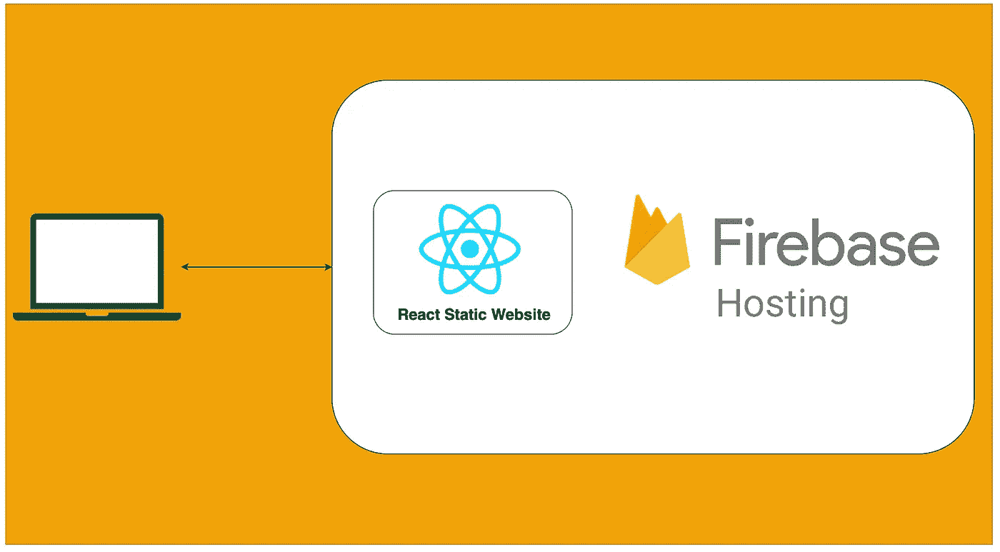

# 如何在 Firebase 托管上托管一个 React 静态网站

> 原文：<https://medium.com/bb-tutorials-and-thoughts/how-to-host-a-react-static-website-on-firebase-hosting-1d79c1e0e56a?source=collection_archive---------3----------------------->

## 包含示例项目的分步指南

有很多方法可以用 React 建立一个网站，比如 Java 和 React，NodeJS 和 React，NGINX serving React 等等。对于单页应用程序，你需要做的就是加载初始的**index.html。一旦你加载了 index.html，React 库就会启动并完成剩下的工作…**