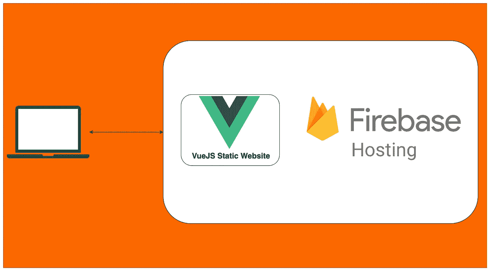

# 如何在 Firebase 主机上托管 VueJS 静态网站

> 原文：<https://medium.com/bb-tutorials-and-thoughts/how-to-host-a-vuejs-static-website-on-firebase-hosting-5a6ea0ea6fe8?source=collection_archive---------7----------------------->

## 包含示例项目的分步指南

有很多方法可以用 Vue.js 建立一个网站，比如 Java 用 Vue，NodeJS 用 Vue，NGINX serving Vue 等等。对于单页应用程序，你需要做的就是加载初始的**index.html。**一旦你加载了 index.html，Vue 库就会启动并完成剩下的工作，就像…