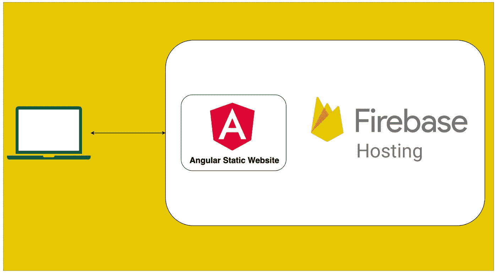

# 如何在 Firebase 托管上托管一个有角度的静态网站

> 原文：<https://medium.com/bb-tutorials-and-thoughts/how-to-host-an-angular-static-website-on-firebase-hosting-2f540be314aa?source=collection_archive---------2----------------------->

## 包含示例项目的分步指南

有很多方法可以用 Angular 建立一个网站，比如 Java with Angular，NodeJS with Angular，NGINX serving Angular 等等。对于单页应用程序，你需要做的就是加载初始的**index.html。**一旦您加载了 index.html，角形框架就会启动并执行…