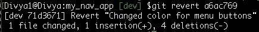

# Git 二等分:如何识别代码中的 bug？

> 原文：<https://medium.com/edureka/how-to-identify-a-bug-in-your-code-9b14285699a2?source=collection_archive---------4----------------------->


直到昨天，我的代码还工作得很好，但是直到最近从远程存储库的一次拉取破坏了代码！！！

如果你也是类似的情况，不知道**什么变化**破解了代码或者**在众多贡献者**中谁**拥有**这个**bug/特性**，那么 git 平分就是你的出路。因此，在这篇关于 git 二分的文章中，您将了解到'`git bisect`'命令是如何帮助[开发人员](https://www.edureka.co/devops)使用二分搜索法算法检测引入错误的第一个错误提交的。

本文涵盖的主题如下:

*   为什么要用 git 平分？
*   ' git '如何将搜索一分为二？
*   句法
*   初始项目设置
*   测试应用程序
*   错误提交的标识
*   发现错误提交
*   了解哪个文件有缺陷
*   停止平分
*   如何修复/调试代码？

# 为什么要用 git 平分？

毫无疑问，您倾向于为 [Git](https://www.edureka.co/blog/what-is-git/) 中的每一个微小变化创建许多提交。在这种情况下，调试代码变成了一项单调乏味的任务，因为您必须手动及时返回到项目快照的每一个版本，以便测试工作代码并检测 bug。现在，这变得更加复杂，当你有其他人的工作要检查而没有一个领导时，要求每个人清理自己的错误听起来也不太可行。
在此过程中，您可能还会创建和丢弃流程中的许多“特性”(或热修复)分支，最终会浪费时间和精力，同时偏离开发的主线。

因此，为了避免这样的场景，您可以使用`git bisect`命令来找到错误的项目修订(或快照),并最终使用`git revert`命令来修复它。

# ' git '如何将搜索一分为二？

这个命令**将你的历史分为**好**和**坏**提交**范围。**它将您的**当前**项目**状态**指向一个**中期**提交**快照。git 等分命令然后在这个范围内的每个提交 id 中移动**，同时**在每个快照暂停**以允许**测试代码**。如果 bug 存在，你声明提交为**坏，**如果不是**好**，除非搜索结束。**

## 句法

```
git bisect <subcommand><options>
```

为了更好地理解 git 等分，让我们创建一个项目，为一个简单的导航应用程序开发代码，该应用程序将在汽车中使用。您可以遵循以下步骤:

# 初始项目设置

要创建一个项目，为汽车上使用的简单导航应用程序开发代码，您可以遵循以下步骤:

**步骤 1:** 在您的$HOME 文件夹中创建一个新目录:

```
cd $HOME mkdir my_nav_app
```

**步骤 2:** 导航至新目录:

```
cd $my_nav_app
```

**第三步:**克隆从我的 GitHub 页面下载项目:

```
git clone [https://github.com/divyabhushan/my_nav_app.git](https://github.com/divyabhushan/my_nav_app.git)
```

现在，让我们了解项目目录和文件的布局，如命令:`ls -lTR`所示


***接下来，让我们查看项目历史日志，查看我为了生成代码所做的提交-***

例如，一个简单的 git log 命令打印详细的历史记录，但是，我喜欢格式化和定制历史记录。因此，让我们使用如下所示的 [git alias](https://git-scm.com/book/en/v2/Git-Basics-Git-Aliases) 命令**设置一个别名—‘hist’**:

`git alias.hist 'log --pretty=format:"%C(yellow)%h%Creset %ad | %C(green)%s%Creset%C(red)%d%Creset %C(blue)[%an]" --graph --decorate --date=short'`

现在，我将在一个单独的分支中执行这个 bug 修复特性，以便不干扰“主”分支上的主要开发。为此，请遵循下面的一组命令:

*   **创建分支‘dev’:**【大师】$ `git branch dev`
*   **切换到分支“开发”:** $ `git checkout dev`
*   **列出历史日志:**【dev】$`git hist`【注意:这里使用了‘alias’命令】


此外，我已经突出显示了我所知道的最后一个已知的良好提交，其中我的脚本与预期的测试用例结果配合良好，这个提交快照被[标记为](https://git-scm.com/docs/git-tag)v 1.0。

所以，现在我们知道了最后一个好的提交，让我们在这篇文章中继续讨论“git 等分”并测试应用程序。

# 测试应用程序

以— $ `./scripts/myApplication.sh` [首次测试]的身份运行脚本


很明显，我现在的项目状态是在 ***错误*** 中，我不确定我在哪个提交中做了什么改变，引入了这个改变。因此，在这篇关于 git 二等分的文章中，让我们看看如何识别错误的提交。

# 错误提交的标识

要开始检查错误提交，您需要遵循以下步骤:

*   **启动等分指令** : `git bisect start`
*   **提及错误提交 id:** `git bisect bad HEAD`或`git bisect c5b3ca8`
*   **提及最后一次正确提交的 id:** `git bisect good v1.0`或`git bisect 93859d8`


这将提交历史范围一分为二，大致位于好的和坏的提交之间，这将我们带到提交 id: **f61a7e8**


因此，该命令签出了该提交 id 中的项目版本。现在，让我们继续测试我们的应用程序。

**运行应用程序的命令** : $ `./scripts/myApplication.sh`【第二次测试】


因为应用程序**在这个提交中通过了**，所以这个提交肯定不是坏的提交。因此，接下来，您必须向等分命令通知相同的内容，如— $ `git bisect good`


现在，这会将搜索结果进一步缩小到范围的前半部分，如下所示


再次测试您的应用程序—命令:$ `./scripts/myApplication.sh` [第三次测试]


因此，由于我们看到了上面的错误，这是一个错误的提交。

让等分命令知道，运行$ `git bisect bad`


这进一步缩小了搜索范围，将您带到最后一个蓝色圆圈中间的版本: **a6ac769**


因此，我使用相同的命令最后一次测试我的应用程序:$ `./scripts/myApplication.sh` [第四次测试]


现在，由于应用程序再次失败，它仍然是一个错误的提交。因此，让我们运行以下命令:

**运行命令:** `git bisect bad`

# 发现错误的提交

这就结束了剩下的最后一个错误的提交-


所以你知道这是密码破解的地方。下一步是什么？

# 了解哪个文件有缺陷

在这种情况下，输出为您提供了关于*提交 id* 、*作者姓名*和*作者日期*以及*提交消息*和被修改的*路径*的最少信息。

如果你想进一步调试，你需要*读取*提交 id 对象。

**命令:**

这将读取提交对象并打印日志消息和文本差异。


您还可以使用“git blame”命令来分析每一行是如何以及在哪个提交中被哪个作者修改的，运行命令如下:`git blame code/develop_nav.sh`

# 停止搜索

要停止搜索，请使用以下命令:

**命令:**


因此，二分法过程停止，您又回到了开始搜索的分支。现在，下一步是修复或调试代码。

# 如何修复/调试代码？

好吧，既然您已经确定了最初导致 bug 的提交，那么您可以采取一些变通方法来修复项目的当前状态。
但是，如果您正在修改一个 ***共享存储库*** 上的提交，最好使用“ [git revert](https://git-scm.com/docs/git-revert) ”命令 ***revert*** 该更改。

任务:恢复由提到的错误提交所做的更改

**命令:**



***结果，恢复这个提交所做的更改做了两件事:***

*   它删除了最后添加的 3 行(用绿色表示)并将删除的行(用红色表示)添加回来。(与 a6ac769 相反)
*   使用恢复消息信息创建了额外的提交

***"Revert 命令还可以更容易地跟踪您从原始提交恢复的更改"***

再次使用**‘show’**命令读取对象 id，就像这样-

**命令:**


现在，继续测试应用程序。它将正确执行。

**命令:** $ `./scripts/myApplication.sh`


***相反，如果你想从历史中删除坏的提交:***

*   您可以使用带有“`--hard`”选项的“”命令(尽管不建议在共享存储库中使用)。
*   使用带有'`-- <path/filename>`'选项的'`git checkout`'命令检查单个文件的早期版本。

应该注意的是，这只会在您的本地存储库中进行更改，直到您将更改推送到远程存储库。因为一些改变创建了新的提交对象 id，如在我们上面的例子中，在这种情况下，对远程存储库的正常推送被拒绝，因为历史将会偏离。您必须将''命令与'`--force`'选项一起使用。

# 更新“主”分支

虽然我修复了“开发”分支上的错误，但我现在可以将这一更改与“主”分支合并在一起

*   切换到‘主’，命令:`git checkout master`
*   将最近的更新从“原点/主”拉至“主”，命令:`git pull origin`
*   合并“开发”变更，命令:`git merge dev`

但是，如果有更多来自远程存储库的提交，您的合并可能会产生冲突。解决冲突并继续合并。
最后，只将稳定的‘主’分支提交到远程存储库，而你只在特性分支上做脏活(bug，特性，增强)，比如这个例子中的‘开发’。
此外，最好采用逻辑分支策略来简化和保护您的 git 工作流程。

总之，“git 二等分”是一个方便而有用的命令，它通过在逻辑上**划分**好的**和**坏的**提交**范围**之间的提交日志，快速**识别**在运行代码中引入**一个**错误**的**提交 id** 最后，你学会了*检测*错误的提交并*恢复*它所做的更改。

此外，对于子命令“好的”和“坏的”,您还可以使用新的和旧的等术语来描述修订状态。您可以多次运行该命令，传递不同的子命令和修订/提交 id 来标识不同的提交(she-1)id。或者，也可以运行一个自动化的测试脚本来使用这个命令构建代码片断。另外，通过在终端上运行`git bisect --help`可以找到这个命令的详细描述。所以，朋友们，我们结束了这篇关于 Git 平分的文章。

这就把我们带到了这篇 Git 二等分文章的结尾。我希望你对它的工作原理有更好的理解。敬请关注 DevOps 上最热门博客的更多博客。如果你想查看更多关于市场最流行的文章，你可以参考 Edureka 的官方网站。

请留意本系列中的其他文章，它们将解释 DevOps 的各个方面。

> *1。* [*DevOps 教程*](/edureka/devops-tutorial-89363dac9d3f)
> 
> *2。* [*Git 教程*](/edureka/git-tutorial-da652b566ece)
> 
> *3。* [*詹金斯教程*](/edureka/jenkins-tutorial-68110a2b4bb3)
> 
> *4。* [*Docker 教程*](/edureka/docker-tutorial-9a6a6140d917)
> 
> *5。* [*Ansible 教程*](/edureka/ansible-tutorial-9a6794a49b23)
> 
> *6。* [*傀儡教程*](/edureka/puppet-tutorial-848861e45cc2)
> 
> *7。* [*厨师教程*](/edureka/chef-tutorial-8205607f4564)
> 
> *8。* [*Nagios 教程*](/edureka/nagios-tutorial-e63e2a744cc8)
> 
> 9。 [*如何编排 DevOps 工具？*](/edureka/devops-tools-56e7d68994af)
> 
> *10。* [*连续交货*](/edureka/continuous-delivery-5ca2358aedd8)
> 
> *11。* [*持续集成*](/edureka/continuous-integration-615325cfeeac)
> 
> *12。* [*连续部署*](/edureka/continuous-deployment-b03df3e3c44c)
> 
> *13。* [*连续交付 vs 连续部署*](/edureka/continuous-delivery-vs-continuous-deployment-5375642865a)
> 
> *14。* [*CI CD 管道*](/edureka/ci-cd-pipeline-5508227b19ca)
> 
> *15。* [*Docker 作曲*](/edureka/docker-compose-containerizing-mean-stack-application-e4516a3c8c89)
> 
> *16。* [*码头工人群*](/edureka/docker-swarm-cluster-of-docker-engines-for-high-availability-40d9662a8df1)
> 
> *17。* [*Docker 联网*](/edureka/docker-networking-1a7d65e89013)
> 
> *18。* [*天穹*](/edureka/ansible-vault-secure-secrets-f5c322779c77)
> 
> *19。* [*可担任的角色*](/edureka/ansible-roles-78d48578aca1)
> 
> *20。* [*适用于 AWS*](/edureka/ansible-for-aws-provision-ec2-instance-9308b49daed9)
> 
> *21。* [*詹金斯管道*](/edureka/jenkins-pipeline-tutorial-continuous-delivery-75a86936bc92)
> 
> *22。* [*顶级 Docker 命令*](/edureka/docker-commands-29f7551498a8)
> 
> *23。*[*Git vs GitHub*](/edureka/git-vs-github-67c511d09d3e)
> 
> *24。* [*顶级吉特命令*](/edureka/git-commands-with-example-7c5a555d14c)
> 
> *25。* [*德文面试问题*](/edureka/devops-interview-questions-e91a4e6ecbf3)
> 
> *26。* [*谁是 DevOps 工程师？*](/edureka/devops-engineer-role-481567822e06)
> 
> *27。* [*德文斯生命周期*](/edureka/devops-lifecycle-8412a213a654)
> 
> *28。*[*Git ref log*](/edureka/git-reflog-dc05158c1217)
> 
> *29。* [*组织寻求的顶级开发技能*](/edureka/devops-skills-f6a7614ac1c7)
> 
> *30。* [*瀑布 vs 敏捷*](/edureka/waterfall-vs-agile-991b14509fe8)
> 
> *31。*[*Maven For Building Java Applications*](/edureka/maven-tutorial-2e87a4669faf)
> 
> *32。* [*詹金斯备忘单*](/edureka/jenkins-cheat-sheet-e0f7e25558a3)
> 
> *33。* [*可修改备忘单*](/edureka/ansible-cheat-sheet-guide-5fe615ad65c0)
> 
> *34。* [*可回答的面试问题及答案*](/edureka/ansible-interview-questions-adf8750be54)
> 
> *35。* [*50 名码头工人面试问题*](/edureka/docker-interview-questions-da0010bedb75)
> 
> *36。* [*敏捷方法论*](/edureka/what-is-agile-methodology-fe8ad9f0da2f)
> 
> *37。* [*詹金斯访谈题*](/edureka/jenkins-interview-questions-7bb54bc8c679)
> 
> *38。* [*Git 面试问题*](/edureka/git-interview-questions-32fb0f618565)
> 
> *39。* [*码头工人建筑*](/edureka/docker-architecture-be79628e076e)
> 
> *40。* [*在 DevOps 中使用的 Linux 命令*](/edureka/linux-commands-in-devops-73b5a2bcd007)
> 
> *41。* [*詹金斯对竹子*](/edureka/jenkins-vs-bamboo-782c6b775cd5)
> 
> *42。* [*Nagios 面试问题*](/edureka/nagios-interview-questions-f3719926cc67)
> 
> *43。* [*DevOps 实时场景*](/edureka/jenkins-x-d87c0271af57)
> 
> 44。 [*詹金斯和詹金斯 X 的区别*](/edureka/jenkins-vs-bamboo-782c6b775cd5)
> 
> *45。*[*Windows Docker*](/edureka/docker-for-windows-ed971362c1ec)
> 
> *46。*[*Git vs Github*](http://git%20vs%20github/)

*原载于 2019 年 9 月 19 日*[*https://www.edureka.co*](https://www.edureka.co/blog/git-bisect/)*。*