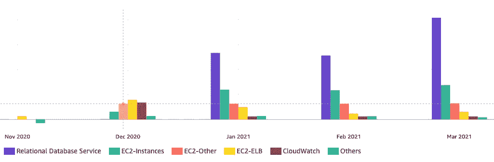
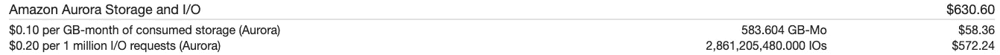
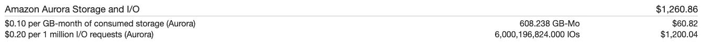
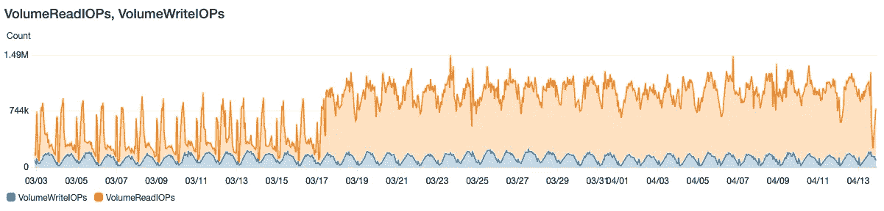
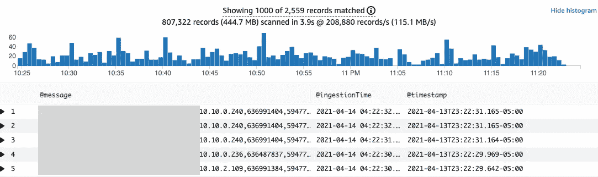

# 如何识别由于 I/O 消耗导致的 Amazon Aurora 成本增加以及降低成本的策略。

> 原文：<https://medium.com/globant/how-to-identify-cost-increases-in-amazon-aurora-due-to-i-o-consumption-and-strategies-to-reduce-fb1eed06ee60?source=collection_archive---------0----------------------->

# 介绍

我们很多人每天都在用亚马逊 Aurora 做不同的项目；毫无疑问，它是目前市场上最好的关系数据库。然而，理解数据库的定价通常有点复杂，更困难的是确定节省成本的策略。

在本文中，我将向您展示如何确定和优化 Aurora 数据库的成本，该数据库的成本在 1 个月内由于 I/O 消耗而翻倍。

以下几点在 **:** 一文中有所涉及

1.  当前工作量
2.  数据库成本增加
3.  确定根本原因
4.  降低 I/O 消耗成本的策略
5.  经验教训

# 1.当前工作量

该数据库在生产中运行，支持拉丁美洲成千上万用户的操作；该数据库具有以下特征:

*   **实例类型** : db.r5.xlarge
*   **每秒写入查询数** : 510
*   **每秒读取查询数** : 6
*   **到数据库的平均连接数** : 100
*   **类型:**极光置备 MySQL。

工作负载从多个来源(如 web 服务器)接收大量查询。

# 2.数据库成本增加

数据库的成本开始突然增加，一个月内上涨了大约 800 美元；当我查看细节时，我意识到成本是由于 I/O 请求，在一个月内从**2811123309 个**io 增加到**6000196824 个**io。



AWS Cost Explorer report.

在查看 AWS Cost Explorer 并确定 RDS 成本增加后，我检查了每月账单以了解这一增加。

## **2021 年 2 月**



## 2021 年 3 月



# 3.确定根本原因

当我们的服务成本增加时，最重要的是能够找出根本原因，为此，我们必须开始问自己一些关于工作负载的问题:

*   我们最近对工作负载做了哪些更改？
*   我们的业务 KPI 是否有变化，例如，我们的应用程序有更多的用户？

在此之后，我们必须依靠 AWS 为我们提供的所有工具来确定原因。

## 云观察指标

1-检查 VolumeReadIOPs 和 VolumeWriteIOPs 的 CloudWatch 指标，我们可以看到读取操作的增加



## 性能洞察

2-它目前不支持我们正在运行的亚马逊 Aurora 版本。但是如果你有同样的问题，你应该使用它。

## 审计日志+ CloudWatch 洞察

3-为了识别导致高消耗的查询，我们必须在数据库中启用审计日志；一旦启用，我们必须转到 CloudWatch Insights 并查询日志，以找到这些在数据库中更频繁出现的查询。

```
fields [@message](http://twitter.com/message),[@ingestionTime](http://twitter.com/ingestionTime),[@timestamp](http://twitter.com/timestamp)
| filter [@message](http://twitter.com/message) like /QUERY/ 
| limit 1000
```



在那里，我们已经可以识别数据库上运行的查询，并努力纠正问题。

# 4.降低 I/O 消耗成本的策略

降低 de I/O 消耗成本的最佳策略是:

1-与您的数据库管理员密切合作，确定是否有可以优化的查询。
2-像 ElastiCache Redis 一样在数据库前面添加一个缓存层。但是要考虑 ElastiCache 集群的成本，并考虑到您必须读取 RDS 来更新缓存数据库。
3-将该报告层带到 S3，使用 Athena 进行查询，将其连接到可视化工具。

# 5.经验教训

1-当需要做更详细的故障排除时，临时启用数据库中的日志；在这种情况下，我们使用审计日志；此外，我们还可以启用慢速查询、错误和常规日志。请注意，永久启用这些日志将导致 CloudWatch 日志的成本增加。

2-当我们的 IO 数据库成本较高时，了解您的工作负载的执行情况，调查消耗情况，并在应用程序级别进行纠正。

3-当成本更多用于读取操作时，寻找替代方案；例如，评估您是否可以将 S3 +雅典娜架构用于您的报告。

4-为了控制数据库模式的变化，使用不同的工具，比如 Liquibase + Jenkins，它允许控制数据库中的变化。

— [卡洛斯·桑布拉诺](https://www.czam.dev/)