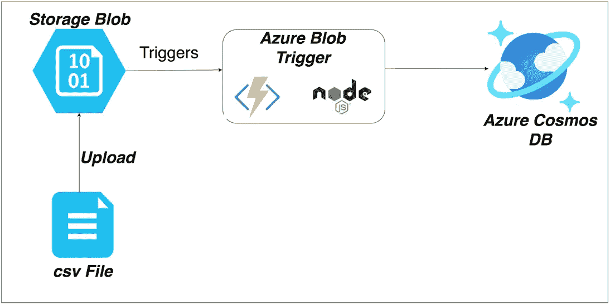

# 如何在 NodeJS 中实现 Azure BlobTrigger

> 原文：<https://medium.com/bb-tutorials-and-thoughts/how-to-implement-azure-blobtrigger-in-nodejs-ca1b5a9777b8?source=collection_archive---------2----------------------->

## 包含示例项目的分步指南

Azure 函数是一种在云中运行小段代码的简单方式。您不必担心托管这些代码所需的基础设施。您可以用 C#、Java、JavaScript、PowerShell、Python 或 Azure 中的[支持的语言中列出的任何一种语言来编写函数](https://docs.microsoft.com/en-us/azure/azure-functions/supported-languages)