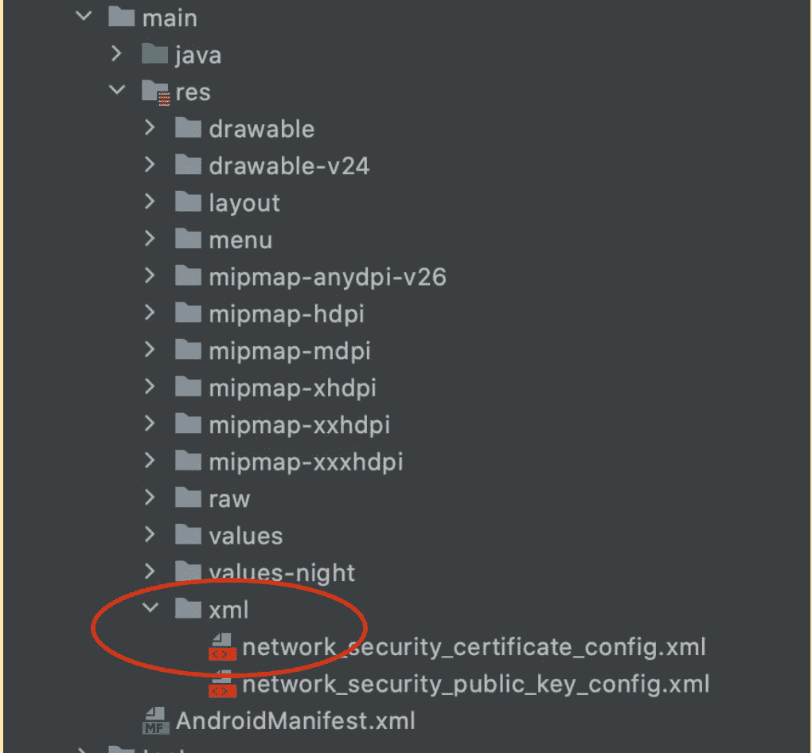
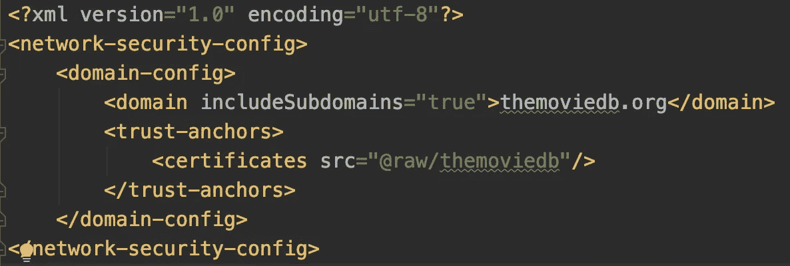
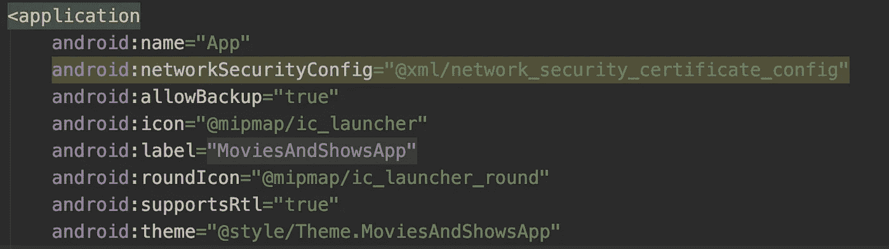

# 如何在 Android 中实现证书钉住

> 原文：<https://medium.com/globant/how-to-implement-certificate-pinning-in-android-398b4b6cb5d?source=collection_archive---------0----------------------->

有关什么是 SSL 锁定、其类型、其工作原理以及如何为服务器或公钥生成证书的详细信息，请参考此[文章](/@joshinikunj008/ssl-pinning-increase-server-identity-trust-656a2fc7e22b)。

现在我们已经了解了什么是证书锁定，为什么它对应用程序是必要的，以及不同类型的证书根、中间和叶。

让我们进一步了解如何在 Android 应用程序中实现证书锁定。

**现在我们有了公钥和证书，如何在一个 app 中 pin？**

> **Android 7.0(API 24)之前的改造方式**

OkHTTP 正在提供证书提供者来简化这个任务。

实现如下所示:

正如我们看到的，在 Android 7.0 之前，使用 retrofit 和 OkHTTP 很容易就能获得证书

> 【Android 7.0 以后呢？

**Network_security_config.xml 方式:**

使用 xml 文件夹中的 network_security_config.xml 文件，我们可以实现锁定。

1.  转到项目的 res 目录，创建一个 xml 文件夹，并在 XML 文件夹中创建文件**network _ security _ config . XML**。

2.使用<trust-anchors>标签将证书固定在 network_config.xml 文件中。</trust-anchors>

3.为了锁定公钥，我们使用带有 SHA 256 的<pin-set>标签，如下所示。</pin-set>

4.在配置了 network_security_confing.xml 文件之后，不要忘记将这个文件添加到 Android manifest . XML network security config 标记中。

> **结论**

现在我们了解了什么是证书锁定，不同类型的证书，以及如何在 API 24 之前和之后使用证书锁定器和网络配置来锁定证书。

> **阅读更多关于 SSL 固定的信息**

[SSL 锁定—增加服务器身份信任](/@joshinikunj008/ssl-pinning-increase-server-identity-trust-656a2fc7e22b)

> 团队积分

达尔山·米斯特里 | [阿克沙塔·谢拉尔](https://medium.com/u/bb9487b17334?source=post_page-----398b4b6cb5d--------------------------------)