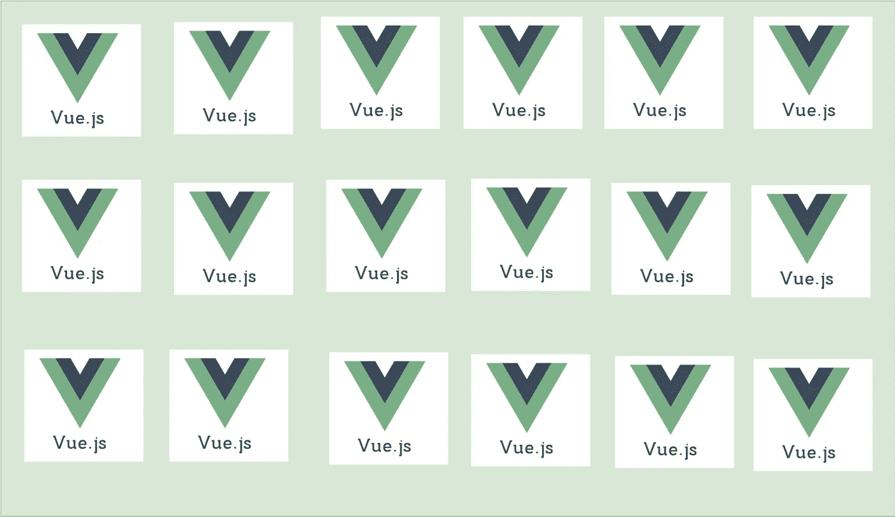

# 如何用 Vue.js 实现微前端架构

> 原文：<https://medium.com/bb-tutorials-and-thoughts/how-to-implement-micro-frontend-architecture-with-vue-js-da295ff2ce66?source=collection_archive---------0----------------------->

## 从初级到高级，您需要了解的关于面向微服务的前端架构的一切

现代 web 应用程序变得越来越大、越来越复杂，有时由不同的团队管理。您的应用程序可能具有由不同团队开发的特性，并且您希望…