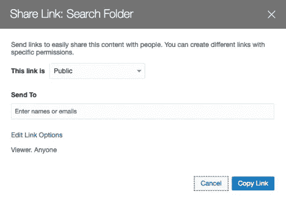

# 如何在 Oracle 内容和体验网站中实现页面和文档搜索

> 原文：<https://medium.com/oracledevs/how-to-implement-page-and-document-search-in-an-oracle-content-and-experience-site-fd90bb06aade?source=collection_archive---------0----------------------->


网站搜索帮助人们找到相关内容并浏览你的网站。对于站点搜索，搜索是由站点自己的搜索实现来执行的，而不是像 Google 这样的外部搜索引擎。与外部搜索引擎的 sitemap 不同，网站自己的搜索实现有更精细的控制。但是每个站点都必须从框架组件中实现站点搜索——而不是在交钥匙解决方案中。这个博客展示了一个使用 Oracle Content and Experience (OCE)构建的站点的站点搜索实现。

搜索站点页面上的内容是通过页面索引完成的，如果站点发生变化，应该刷新页面索引。在文档中搜索内容是通过文档索引完成的，文档索引会在文档上传时更新。

我们将展示如何实现页面内容搜索，然后是文档内容搜索。

# **页面搜索所需的设置**

在可以执行页面上的站点搜索之前，我们必须设置所需的构件。为简单起见，站点工具包中提供了一个站点模板包 search_template.zip。它拥有为用例预先配置的所有部分。提供了用于搜索的页面。这是设置的基本轮廓:

1.  安装和设置站点工具包
2.  导入模板包
3.  创建具有指定内容类型的存储库
4.  创建具有指定存储库的企业网站
5.  索引网站
6.  搜索网站

# 安装和设置网站 Toolki **t**

Sites 工具包可以直接从 GitHub 获得。前往 https://github.com/oracle/content-and-experience-toolkit[点击**克隆下载**。选择**下载 ZIP** ，content-and-experience-toolkit-master . ZIP 将被下载。解压文件，输入***CD content-and-experience-toolkit-master/sites***进入目录。](https://github.com/oracle/content-and-experience-toolkit)


要设置站点工具包，要执行的第一步是[通过 npm](https://docs.oracle.com/en/cloud/paas/content-cloud/developer/install-dependencies-npm.html) 安装依赖项。然后[进行一次梯度设置](https://docs.oracle.com/en/cloud/paas/content-cloud/developer/do-one-time-gradle-setup.html)将完成安装和配置。

# **导入模板包**

我们将首先导入模板包。将模板包从 Sites Toolkit:***content-and-experience-Toolkit-master/Sites/CEC-components/data/templates/search _ template . zip***上传到 OCE。


从模板中，导入模板包 **search_template.zip** 。


您可能会看到一个冲突解决对话框，这取决于是否安装了现成的 StarterTemplate。如果是，请选择“创建新组件”选项。或者，您可能会收到一条关于用户无权覆盖组件的消息。如果是这种情况，选择创建新组件的选项。


导入操作完成后，您将获得模板 search_template。


# 创建具有指定内容类型的存储库

现在为企业站点创建一个存储库。在创建存储库屏幕中，为名称字段指定***search _ Repository***，为内容类型字段指定***search _ Content _ Type***。内容类型 search_content_type 作为 search_template 的一部分捆绑在一起。在存储库屏幕上单击保存，然后单击关闭以创建 search_repository。


# 创建具有指定存储库的企业网站

现在创建企业站点。在创建站点屏幕中，单击创建以调用创建站点向导。选择搜索模板，然后单击下一步。


输入 *search_site* 作为名称。输入 ***搜索 _ 存储库*** 进行资产存储。对于本地化策略，将自动选择 search_localization_policy，并将其捆绑为 search_template 的一部分。单击“创建”创建企业网站 search_site。


# 索引网站

现在为页面搜索播种页面索引。播种将通过网站工具包来完成。运行以下命令来播种页面索引。

```
$ cd content-and-experience-toolkit-master/sites/cec-components
$ cec index-site search_site -c search_content_type
```

*cec index-site* 将对 search_site 的页面进行索引。控制台输出示例如下:

```
$ **cec index-site search_site -c search_content_type**
- Logged in to remote server: [http://swebcli-oracle.wc.released.1915ec.shared.osn.oraclecorp.com:8080](http://swebcli-oracle.wc.released.1915ec.shared.osn.oraclecorp.com:8080)
- establish user session
- get CSRF token
- query site search_site, token: 3b8d4591387f5b04c28ffe7bdaefc24f
- query site repository
- query content type search_content_type
- query site structure
- query page data
- no content on the pages
- will create 9 PageIndex items
- will update 1 PageIndex items
- update page index item for page Search
- create page index item for Page Content
- create page index item for Pages
- create page index item for Components
- create page index item for Home
- create page index item for Privacy Policy
- create page index item for Detail Page
- create page index item for Navigation
- create page index item for Developing Templates
- create page index item for Themes
- add page index item search_sitePages120 to site channel
- add page index item search_siteComponents150 to site channel
- add page index item search_siteDeveloping Templates100 to site channel
- add page index item search_siteNavigation130 to site channel
- add page index item search_sitePrivacy Policy200 to site channel
- add page index item search_siteHome10 to site channel
- add page index item search_siteThemes110 to site channel
- add page index item search_sitePage Content140 to site channel
- add page index item search_siteDetail Page201 to site channel
```

*cec 索引站点*添加并填充包含页面文本的内容项，每个页面一个。查看 search_repository 下的资产屏幕以查看内容项。


# 搜索网站

现在设置已经完成，运行页面搜索以确保一切正常。转到站点屏幕，单击 search_site 菜单上的查看。


呈现主页，搜索字段位于页面顶部。


在搜索字段中输入“Components ”,然后按 Enter 键。


如果搜索结果显示正确，说明设置正在运行！正确的搜索结果显示包含“组件”的页面被列出。匹配的文本片段会突出显示。为了使搜索易于使用，搜索不区分大小写。

# 在页面上搜索资产

当涉及到资产时，在为搜索生成页面索引之前，内容项必须**发布到网站频道**。否则，搜索将无法找到页面上的内容项。

转到资产并选择左侧的 **seach_blog** 内容项目。应该会出现两个内容项。将这两个内容项目发布到 search_site 频道。


内容项目发布后，使用 *cec index-site* 重新生成页面索引。

```
$ **cec index-site search_site -c search_content_type**
```

然后再次运行站点 search_site。在搜索栏中输入 ***条目*** ，并按回车键。示例 search_blog 中的内容项显示在搜索结果的博客页面上。基本上，博客页面包含一个指向 search_blog 内容类型的内容列表。这是一个搜索作为页面一部分的资产的示例。


# 页面搜索是如何工作的？

让我们深入了解一下幕后的情况，看看页面搜索是如何工作的。首先将内容类型 *search_content_type* 定义为页面索引。下面是 *search_content_type* 定义，您可以在 Assets(Administration)>Content Type>search _ Content _ Type 下看到它。所有数据字段都是文本。除了*关键字*字段为多值外，其他字段均为单值。*页面标题*，*页面描述*，和*关键词*字段不是必填字段。


定义内容类型后，我们生成用于搜索的页面索引(即内容项)。当创建页面索引时，*CEC index-site<site name>-c<content type name>*命令将查看站点中的页面，并为每个页面生成一个类型为 *search_content_type* 的内容项。内容项的每个实例将包含每个页面上组件的可搜索字符串。当页面索引由 *cec 索引*完成时，每页将有一个内容项。定期地，页面索引应该由站点工具包中的 *cec index-site* 命令重新生成。

接下来，我们将看看对主题的修改。主题包含接受搜索条件的 UI 和将转发到搜索页面的代码。用户可以检查以下主题文件:

**开发者>主题>搜索 _ 站点主题>布局>index.html**

您会发现下面的代码片段带有一个输入字段，用户可以为其提供搜索条件。

```
<div align=”start” class=”menucontainer col-xs-2" style=”z-index: 99;”>
  <input id=”searchonpage” type=”text” size=“30” placeholder=”Search on page”/>
</div>
```

在同一个页面上，您将找到接受搜索条件的代码，并将它转发到搜索页面以显示结果。

```
<script>
  // Get the search field element
  const node = document.getElementById(‘searchonpage’);
  // Get the search string from the url if it exists
  var params = (new URL(document.location)).searchParams;
  var defaultStr = params && params.get(‘default’);
  if (defaultStr) {
    if (defaultStr.lastIndexOf(‘*’) === defaultStr.length — 1) {
      defaultStr = defaultStr.substring(0, defaultStr.length — 1);
    }
    // Display the search string in the search field
    node.value = defaultStr;
  }
  // When you enter text from the search field, go to the site search page with the search string:
  node.addEventListener(‘keydown’, function onEvent(event) {
    if (event.key === “Enter”) {
      var inputElem = event.srcElement || event.target;
      var siteSearchPageUrl = ‘search.html’;
      var searchUrl = SCSRenderAPI.getSitePrefix() +
      siteSearchPageUrl +
        ‘?contentType=search_content_type&default=’ + inputElem.value + ‘*’;
      window.location = searchUrl;
    }
  });
</script>
```

上述代码将转发到具有以下 URL 的搜索页面，该页面包含搜索内容类型和搜索条件。例如:

```
https://<host>/sites/preview/search_site/search.html?contentType=search_content_type&default=Components*
```

搜索页面称为搜索。它有一个显示搜索结果的内容列表组件。内容列表被绑定到内容类型 search_content_type。


页面搜索机制将搜索由 *contentType* URL 参数指向的内容项。页面搜索将使用由*默认* URL 参数指定的搜索标准。

搜索一旦有了搜索结果，就会根据内容布局*search _ content _ type-overview*对结果进行格式化。下面是内容布局的 layout.html*搜索 _ 内容 _ 类型-概述*:

【layout.html】开发者>组件>搜索 _ 内容 _ 类型-概述>资产>。

```
{{#fields}}
<div>
  <div class=”pageicon”>
    </img>
  </div>
  <div class=”titlecontainer”>
    <a href=”{{pageFullURL}}” title=”{{pagename}}”><span class=”pagetitle”>{{pagename}}</span></a>
  </div>
  <div class=”matchingstring”>{{{matchingString}}}</div>
  <div class=”metadatacontainer”>
    <span>
       <span class=”metadata”>{{pageurl}}</span>
    </span>
  </div>
</div>
{{/fields}}
```

其他内容布局影响文件:

开发人员>组件> search_content_type-overview >资产> render.js

开发人员>组件> search_content_type-overview >资产> design.css

开发者>组件>搜索内容类型-概述>资产> page.png

这是页面搜索所有受影响的站点工件。

# **文档搜索所需的设置**

现在我们来讨论一下文档搜索需要什么。以下是设置文档搜索所需的步骤:

1.从站点工具包导入自定义组件

2.创建包含文档的文件夹

3.配置代理服务

4.添加和配置自定义组件

文档搜索使用定制组件 *Document-Search* ，可从 Sites Toolkit 获得。它实现了从文件夹中进行实时搜索并显示结果。

# 从站点工具包导入自定义组件

让我们从部署来自站点工具包的定制组件开始。首先，必须启动站点工具包。

1.在终端窗口中输入 ***cd 内容-体验-工具包-master/sites/CEC-components***。

2.进入 ***npm 开始&***

然后，必须在 Sites Toolkit 本地服务器中创建定制组件 *Document-Search* 。

```
**$ cec create-component Document-Search -f Document-Search** 
Create Component: creating new component Document-Search from Document-Search
 — update component Id Document-Search to Document-Search
 — update component GUID C34733C786E5D472DB39EDE65A88A5E94D49D4C299F1 to C10448522DB1A46D8A5909F5A91E00C40156A1EA3B37
 — component Document-Search created at ~/cec-components/src/main/components/Document-Search
To rename the component, rename the directory ~/cec-components/src/main/components/Document-Search
```

在本地服务器上创建自定义组件后，将自定义组件部署到 OCE 服务器。

```
**$ cec deploy-component Document-Search**
 — copying Document-Search component 
 — optimizing component Document-Search
Optimization is not enabled for the component Document-Search
 — created zip file Document-Search.zip
 — connect to remote server: [https://skocicgovserv3-p2skocicgov5oct.uscom-central-1.c9dev2.oc9qadev.com](https://skocicgovserv3-p2skocicgov5oct.uscom-central-1.c9dev2.oc9qadev.com)
 — establishing user session
 — file Document-Search.zip uploaded to home folder, version 1 (1s)
 — component Document-Search imported (14s)
```

# 创建包含文档的文件夹

自定义组件在任何指定的文件夹下搜索。让我们在根级别创建**搜索文件夹**。


创建文件夹后，选择文件夹并调用共享链接，然后单击复制链接。如果您想在用户单击文档搜索结果时下载文档而不是预览它，您可以单击“编辑链接选项”将链接权限更改为 Downloader。



复制的链接如下例所示:

[https://skocicgovserv 3-p 2 skocicgov5 act . uscom-central-1 . c9dev 2 . oc 9 qadev . com/documents/link/](https://skocicgovserv3-p2skocicgov5oct.uscom-central-1.c9dev2.oc9qadev.com/documents/link/LF85B3693E4B350C622ED47EAD454E4BB0A4B3D6F067/folder/F013AFF2DEDC9C962B4E8BDD5CED30132879FCE47696/_Search_Folder)[**lf 85b 3693 E4 b 350 c 622 ed 47 EAD 454 e 4b 0 a 4 B3 D6 f 067**](https://skocicgovserv3-p2skocicgov5oct.uscom-central-1.c9dev2.oc9qadev.com/documents/link/LF85B3693E4B350C622ED47EAD454E4BB0A4B3D6F067/folder/F013AFF2DEDC9C962B4E8BDD5CED30132879FCE47696/_Search_Folder)[/Folder/**f 013 af 2d EDC 962 B4 e 8 BD D5 ced 30132879 FCE 47696**。](https://skocicgovserv3-p2skocicgov5oct.uscom-central-1.c9dev2.oc9qadev.com/documents/link/LF85B3693E4B350C622ED47EAD454E4BB0A4B3D6F067/folder/F013AFF2DEDC9C962B4E8BDD5CED30132879FCE47696/_Search_Folder)

首先记下**链接 ID** (例如:lf85b 3693 E4 b 350 c 622 ed 47 EAD 454 E4 bb 0 a 4 B3 D6 f 067)。稍后将使用它来参数化自定义组件。您的链接 ID 将与之前的不同。

然后记下**文件夹 ID** (例如:f 013 aff 2d EDC 962 B4 e 8 BDD 5d ced 30132879 FCE 47696)。稍后将使用它来设置代理服务。您的文件夹 ID 将与之前的不同。

获得文件夹的共享链接后，将您想要搜索的文件上传到该文件夹。例如，你可以为这个博客生成一个 PDF 文件(文件>打印…>保存)，并将其命名为 SearchBlog.pdf。然后，您可以将文件上传到搜索文件夹中。


# 配置代理服务

创建要搜索的文件夹后，需要设置代理服务。代理服务是必需的，因为文档搜索需要为公共/匿名用例工作。为了在匿名用例中执行搜索，我们需要一个具有正确凭证的代理。

让我们从导航到集成>代理服务开始。


如果代理尚未启用，请启用它。单击创建新端点。输入 ***search_proxy*** 作为端点名称。选中启用端点。输入***search _ pxy _ endpoint***作为路径名。对于目标 URI，输入以下 URL，替换上一步中的<主机>和<文件夹 ID >。

https://<host>/文档/API/1.2/文件夹/<folder id="">/搜索/项目</folder></host>

例如:

[https://**skocicgovserv 3-p2skocicgov5 act . uscom-central-1 . C9 dev 2 . oc 9 qadev . com**/documents/API/1.2/folders/**f 013 af 2d EDC 962 B4 e 8 BDD 5d ced 30132879 FCE 47696**/search/items](https://skocicgovserv3-p2skocicgov5oct.uscom-central-1.c9dev2.oc9qadev.com/documents/api/1.2/folders/F013AFF2DEDC9C962B4E8BDD5CED30132879FCE47696/search/items)

保存并关闭代理服务端点配置。


接下来，单击创建新凭据。输入 ***search_user*** 作为凭证名称。**输入要执行搜索的用户 ID 的用户名和密码值。**保存并关闭凭证屏幕。


在端点部分点击***search _ prox****y*。


在凭证字段设置 ***搜索 _ 用户*** 。保存并关闭端点屏幕。


# 添加和配置自定义组件

要添加自定义组件 Document-Search，请在 Sites Builder 中打开站点 search_site。用名为 ***update1*** 的新更新编辑站点。导航到搜索页面。转到站点构建器中的组件>自定义，并找到文档搜索自定义组件。将自定义组件拖放到标题匹配文档下方的页面上。


打开文档搜索的设置，并调用自定义设置。在自定义设置中，在文件夹下载公共链接 ID 字段中输入上一步中的**链接 ID** 。在文档搜索代理端点字段中输入***Search _ pxy _ Endpoint***。


关闭自定义设置。在文档搜索设置中，单击链接选项卡。单击下面可用的触发器。从左侧的页面操作中选择**文件预览**并将其放到右侧的部分。选择**文件 URL** 作为文件 ID 或 URL。


对于配置触发器操作，单击确定。关闭文档搜索设置。保存并发布/提交更新。

现在再次运行该站点，输入“Components”进行搜索。在匹配文档部分，您将看到结果 SearchBlog.pdf。


单击 SearchBlog 文档，将出现该文档的预览。

这就是如何在 Oracle Content and Experience (OCE)上实现站点搜索。我们展示了页面和文档搜索。模板包 search_template.zip 和定制组件 Document-Search 可从 Sites Toolkit 获得。