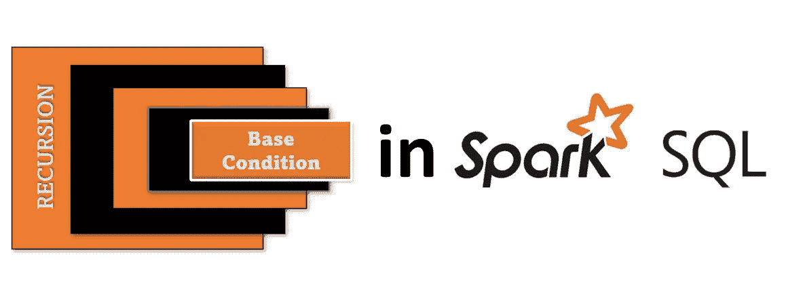
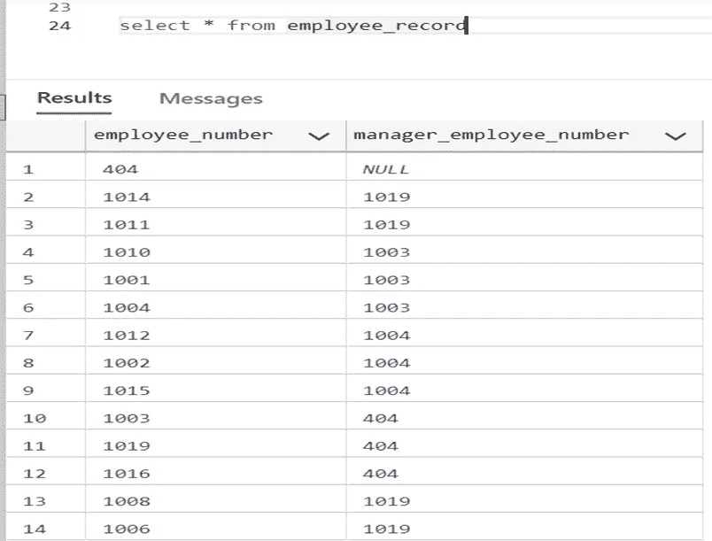
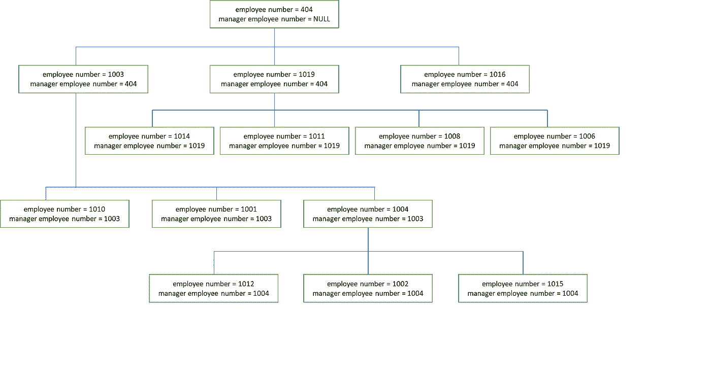
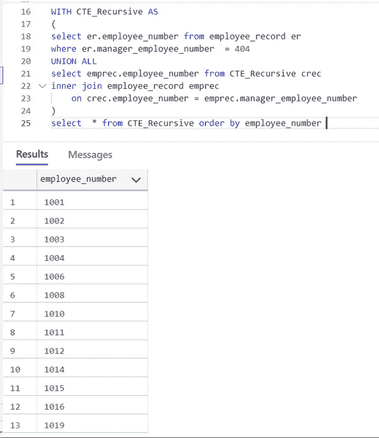
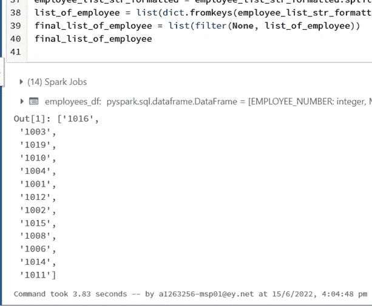

# 如何在 Spark 中实现递归查询

> 原文：<https://medium.com/globant/how-to-implement-recursive-queries-in-spark-3d26f7ed3bc9?source=collection_archive---------0----------------------->



为了使用另一列来标识一列的顶级层次结构，我们使用递归公共表表达式，在关系数据库中通常称为 [*递归 CTE*](https://docs.microsoft.com/en-us/sql/t-sql/queries/with-common-table-expression-transact-sql?view=sql-server-ver16#guidelines-for-defining-and-using-recursive-common-table-expressions) 。[递归 CTE](https://docs.microsoft.com/en-us/sql/t-sql/queries/with-common-table-expression-transact-sql?view=sql-server-ver16#guidelines-for-defining-and-using-recursive-common-table-expressions) 是许多传统关系数据库如 SQL Server、Oracle、Teradata、Snowflake 等的重要特性之一。使用 [Dataframe](https://spark.apache.org/docs/3.1.1/api/python/reference/api/pyspark.sql.DataFrame.html) 操作时，Spark SQL 不支持递归 CTE。在本文中，我们将检查如何使用 [PySpark](https://spark.apache.org/docs/latest/api/python/#:~:text=PySpark%20is%20an%20interface%20for,data%20in%20a%20distributed%20environment.) 实现 Spark SQL 递归 [Dataframe](https://spark.apache.org/docs/3.1.1/api/python/reference/api/pyspark.sql.DataFrame.html) 。

在实现这个解决方案之前，我研究了许多选项，而 [SparkGraphX](https://spark.apache.org/docs/latest/graphx-programming-guide.html) API 有可能实现这个目标。然而，我找不到任何可以满足项目需求的可持续解决方案，我试图实现一个更像 SQL 的解决方案，并且与 [PySpark](https://spark.apache.org/docs/latest/api/python/#:~:text=PySpark%20is%20an%20interface%20for,data%20in%20a%20distributed%20environment.) 兼容。因此我想出了使用 [*列表理解*](https://docs.python.org/3/tutorial/datastructures.html#tut-listcomps) 和*迭代映射*函数在 [PySpark](https://spark.apache.org/docs/latest/api/python/#:~:text=PySpark%20is%20an%20interface%20for,data%20in%20a%20distributed%20environment.) 中实现递归的解决方案。

## 前言

在递归查询中，有一个子元素，或者我们可以说是种子元素，它位于层次结构的最低级别。带有种子元素的查询是生成结果集的第一个查询。在下一步中，seed 元素生成的任何结果集都将与另一列连接，以生成结果集。这个步骤一直持续到顶层层次结构。一旦没有检索到新行，迭代就结束。

我已经尝试使用[数据帧](https://spark.apache.org/docs/3.1.1/api/python/reference/api/pyspark.sql.DataFrame.html)、[列表理解](https://docs.python.org/3/tutorial/datastructures.html#tut-listcomps)和迭代映射函数在 [PySpark](https://spark.apache.org/docs/latest/api/python/#:~:text=PySpark%20is%20an%20interface%20for,data%20in%20a%20distributed%20environment.) 中复制相同的步骤，以达到相同的结果。让我们从实时实现开始，在进入 [PySpark](https://spark.apache.org/docs/latest/api/python/#:~:text=PySpark%20is%20an%20interface%20for,data%20in%20a%20distributed%20environment.) Dataframe 操作之前，让我们检查一下关系数据库中的递归查询。

## 关系数据库递归查询示例

要在本地创建数据集，可以使用下面的命令。

```
CREATE TABLE employee_record (employee_number INT ,manager_employee_number INT); 
insert into employee_record values( 404,NULL);
insert into employee_record values( 1014,1019);
insert into employee_record values( 1011,1019);
insert into employee_record values( 1010,1003);
insert into employee_record values( 1001,1003);
insert into employee_record values( 1004,1003);
insert into employee_record values( 1012,1004);
insert into employee_record values( 1002,1004);
insert into employee_record values( 1015,1004);
insert into employee_record values( 1003,404);
insert into employee_record values( 1019,404);
insert into employee_record values( 1016,404);
insert into employee_record values( 1008,1019);
insert into employee_record values( 1006,1019);
```

下面是结果集的截图:



该表代表了雇员和其经理之间的关系，简单地说，对于一个特定的组织，经理是雇员的经理，经理的经理。这意味着该表包含雇员-经理数据的层次结构。

让我们更明白这一点。请看下图，其中包含了看起来像是层级结构的雇员。



这是我们的 SQL 递归查询，它检索直接或间接向 employee_number = 404 的经理报告的所有雇员的雇员号:

```
WITH CTE_Recursive AS 
(
  select er.employee_number from employee_record er
  where er.manager_employee_number = 404
  UNION ALL
  select emprec.employee_number from CTE_Recursive crec
  inner join employee_record emprec
  on crec.employee_number = emprec.manager_employee_number
)
select * from CTE_Recursive order by employee_number
```

上述查询的输出如下:



在上面的查询中，before `UNION ALL`是雇员编号为 404 的经理的直接雇员，而 after union all 充当一个‘iterator’语句。在 CTE，我们使用同一个 CTE，它将一直运行，直到在员工编号为 404 的经理手下获得直接和间接员工。

## PySpark 代码来识别数据的层次结构

在 [PySpark](https://spark.apache.org/docs/latest/api/python/#:~:text=PySpark%20is%20an%20interface%20for,data%20in%20a%20distributed%20environment.) 中，我将使用 [Dataframe](https://spark.apache.org/docs/3.1.1/api/python/reference/api/pyspark.sql.DataFrame.html) 操作、[列表理解](https://docs.python.org/3/tutorial/datastructures.html#tut-listcomps)，以及使用 Lambda 表达式的迭代映射函数来识别数据的层次结构，并以列表的形式获得输出。

首先，让我们创建模式。

```
# Employee DF
schema = 'EMPLOYEE_NUMBER int, MANAGER_EMPLOYEE_NUMBER int'
employees_df = spark.createDataFrame(
[[404,None],
[1016,404],
[1003,404],
[1019,404],
[1010,1003],
[1004,1003],
[1001,1003],
[1012,1004],
[1002,1004],
[1015,1004],
[1008,1019],
[1006,1019],
[1014,1019],
[1011,1019]], schema=schema)
```

我已经创建了一个用户定义的函数(UDF)，该函数将一个列表作为输入，并在迭代完成时返回一个完整的列表集。

```
def get_emp_recursive_udf(x) :
  emp_list = []
  direct_emp_list = list(employees_df
    .select('EMPLOYEE_NUMBER')
    .filter(employees_df.MANAGER_EMPLOYEE_NUMBER == x) 
    .toPandas()['EMPLOYEE_NUMBER'])
  driterative_list = list(map(lambda y :
    get_emp_recursive_udf(y), direct_emp_list))
  final_lst = direct_emp_list + driterative_list
  emp_list.append(final_lst)
  return emp_list
```

现在，让我们使用 UDF。一旦我们得到函数的输出，我们将把它转换成一个格式良好的二维列表

```
#Enter the Input Employee List
input_emp_list = [404]
employee_list = list(map(lambda y : get_emp_recursive_udf(y),input_emp_list))
employee_list_str = str(employee_list)
employee_list_str = employee_list_str.replace("[","").replace("]","").replace("'","").replace(" ","").replace("None","").replace(',,',',')
employee_list_str_formatted = employee_list_str.replace(",,",",")
employee_list_str_formatted = employee_list_str_formatted.split(",")
list_of_employee = list(dict.fromkeys(employee_list_str_formatted))
final_list_of_employee = list(filter(None, list_of_employee))
final_list_of_employee
```

运行完整的 [PySpark](https://spark.apache.org/docs/latest/api/python/#:~:text=PySpark%20is%20an%20interface%20for,data%20in%20a%20distributed%20environment.) 代码后，下面是我们得到的结果集——我们在 SQL CTE 递归查询中得到的输出的完整副本。



太好了！代码如预期的那样运行良好。厉害！

## 结论

在这篇博客中，我们能够展示如何将简单的递归 CTE 查询转换成等价的 [PySpark](https://spark.apache.org/docs/latest/api/python/#:~:text=PySpark%20is%20an%20interface%20for,data%20in%20a%20distributed%20environment.) 代码。借助这种方法， [PySpark](https://spark.apache.org/docs/latest/api/python/#:~:text=PySpark%20is%20an%20interface%20for,data%20in%20a%20distributed%20environment.) 用户也可以找到递归元素，就像传统关系数据库中的[递归 CTE](https://docs.microsoft.com/en-us/sql/t-sql/queries/with-common-table-expression-transact-sql?view=sql-server-ver16#guidelines-for-defining-and-using-recursive-common-table-expressions) 方法一样。 [PySpark](https://spark.apache.org/docs/latest/api/python/#:~:text=PySpark%20is%20an%20interface%20for,data%20in%20a%20distributed%20environment.) 用户可以从 Spark SQL [Dataframe](https://spark.apache.org/docs/3.1.1/api/python/reference/api/pyspark.sql.DataFrame.html) 中找到递归元素，以优化时间性能的方式提供一个精细且易于实现的解决方案。