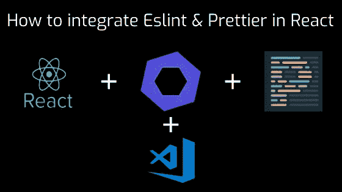
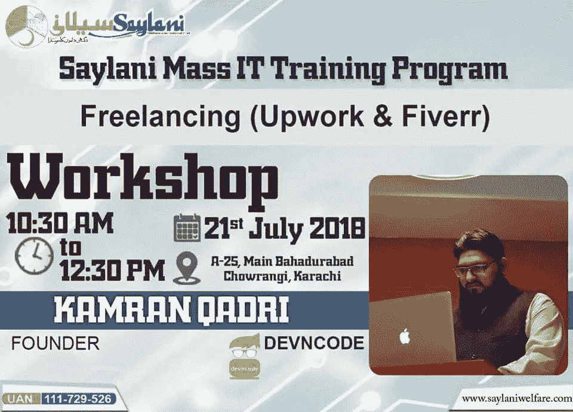

# 如何在 React 中整合 Eslint & Prettier

> 原文：<https://medium.com/quick-code/how-to-integrate-eslint-prettier-in-react-6efbd206d5c4?source=collection_archive---------0----------------------->



你听说过 E**slint**P**rettier**他们有多牛逼如果没有，那么你可以在这里阅读[这里](https://eslint.org/)和[这里](https://prettier.io/)，今天我们将学习如何融入 React。

# 创建 React 应用

要创建 react 应用程序，您可以从 npm 使用 create-react-app 包，所以首先要做的是安装它，因此启动终端并运行以下命令。

```
sudo npm i -g create-react-app
```

然后创建应用程序，运行下面的命令，*注意它将创建与项目名称的文件夹，所以你不需要这样做*。

```
create-react-app projectName
```

现在移动到文件夹中，使用下面的命令启动应用程序，*注意你不需要运行 yarn 或 npm install，因为它已经为你做了。*

```
cd projectName 
yarn start or npm start
```

# 安装 Eslint 和更漂亮的

第二件事是安装，所以运行以下命令！

**Eslint，它是由 Airbnb 配置的，它需要包…**

```
npm i -D eslint eslint-config-airbnb eslint-plugin-import eslint-plugin-jsx-a11y eslint-plugin-react
```

**更漂亮，它的配置避免了与 Eslint 及其必需包的冲突…**

```
npm i -D prettier eslint-config-prettier eslint-plugin-prettier
```

现在停止让用户提交💩我们将把下面的包安装到这个库中。

```
npm i -D husky lint-staged pretty-quick
```

**husky** :将在提交代码前运行 npm 脚本。

**lint-staged** :将根据扩展名对过滤后的文件运行自定义脚本。js 或者。jsx

漂亮快捷的:美化你的代码。

# 在 Packages.json 中添加脚本

在 packages.json 文件中添加以下脚本。

下面的脚本将在提交前运行，并运行我们的自定义脚本 lint-staged。

```
"precommit": "NODE_ENV=production lint-staged"
```

下面的脚本将首先运行，如果有些东西不符合标准，将很快格式化代码，然后 eslint 将根据 eslint 规则检查代码，如果出现错误，将给出错误，并停止提交代码，最后将文件添加到 stage，以便也可以提交。

```
"lint-staged": { "*.{js,jsx}": [ "pretty-quick --staged", "eslint src/ --fix", "git add" ]}
```

# 制定规则

现在一切都已经安装和设置好了，您需要为两者设置规则。

**Eslint**

对于 eslint create。eslintrc 文件并添加到下面。

**更漂亮**

为了更漂亮的创作。prettierrc 文件放在根目录下并添加到下面。

现在都设置好了，您可以玩代码，看看结果如何。React 初学者可以从[最佳 React 教程](https://blog.coursesity.com/best-react-native-tutorials/)中受益。

# 奖金小费

您可以在您喜欢的 IDE 或代码编辑器中安装扩展来突出显示 eslint 错误，并根据您设置的规则自动格式化代码。

我最喜欢的代码编辑器是 [Visual Studio Code](https://code.visualstudio.com/) ，这就是你如何设置 vscode。

**扩展**

首先要添加对 Eslint 和 Prettier 的支持，你需要安装下面两个扩展。

1.  [Eslint](https://marketplace.visualstudio.com/items?itemName=dbaeumer.vscode-eslint)
2.  [更漂亮](https://marketplace.visualstudio.com/items?itemName=esbenp.prettier-vscode)

**设置**

要使这些扩展可用，您必须做一些设置。

非常感谢你的阅读，如果你喜欢这个教程，不要忘记鼓掌，如果你也喜欢，在要点上加一些星星。

我最近用 Upwork 和 Fiverr 上传了我关于自由职业的工作室视频，以下是链接。

1.  [向上工作](https://www.youtube.com/watch?v=ET2rHun7_U0)
2.  [Fivver](https://www.youtube.com/watch?v=oL69lBmm1cA)



我也做过一些开源项目，如果你试着给你反馈，这是非常值得的。

[**为原子的有角材料片段**](https://atom.io/packages/atom-angular-material-snippets?lipi=urn%3Ali%3Apage%3Ad_flagship3_profile_view_base%3BXvukosGMSaK9Jahp8hzDKw%3D%3D)

[**材质设计精简版 Visual Studio 代码片段**](https://marketplace.visualstudio.com/items?itemName=smkamranqadri.vscode-material-design-lite-snippets)

[**Bolt 语言对 Visual Studio 代码的支持**](https://marketplace.visualstudio.com/items?itemName=smkamranqadri.vscode-bolt-language)

[**云标签— Chrome 扩展**](https://github.com/smkamranqadri/tabs-in-cloud-chrome-extension)

要了解更多关于我的信息，请点击这里关注我和 devncode。

```
Facebook: [https://www.facebook.com/smkamranqadri](https://www.youtube.com/redirect?v=oL69lBmm1cA&event=video_description&redir_token=4l14ZREebdBdhU5yCNO4rV1q6lB8MTUzMzk4ODM0NUAxNTMzOTAxOTQ1&q=https%3A%2F%2Fwww.facebook.com%2Fsmkamranqadri) 
Twitter: [https://twitter.com/smkamranqadri](https://www.youtube.com/redirect?v=oL69lBmm1cA&event=video_description&redir_token=4l14ZREebdBdhU5yCNO4rV1q6lB8MTUzMzk4ODM0NUAxNTMzOTAxOTQ1&q=https%3A%2F%2Ftwitter.com%2Fsmkamranqadri) 
Github: [https://github.com/smkamranqadri](https://www.youtube.com/redirect?v=oL69lBmm1cA&event=video_description&redir_token=4l14ZREebdBdhU5yCNO4rV1q6lB8MTUzMzk4ODM0NUAxNTMzOTAxOTQ1&q=https%3A%2F%2Fgithub.com%2Fsmkamranqadri) Facebook: [https://www.facebook.com/devncode17](https://www.youtube.com/redirect?v=oL69lBmm1cA&event=video_description&redir_token=4l14ZREebdBdhU5yCNO4rV1q6lB8MTUzMzk4ODM0NUAxNTMzOTAxOTQ1&q=https%3A%2F%2Fwww.facebook.com%2Fdevncode17) 
Twitter: [https://twitter.com/devncode17](https://www.youtube.com/redirect?v=oL69lBmm1cA&event=video_description&redir_token=4l14ZREebdBdhU5yCNO4rV1q6lB8MTUzMzk4ODM0NUAxNTMzOTAxOTQ1&q=https%3A%2F%2Ftwitter.com%2Fdevncode17) 
LinkedIn: [https://www.linkedin.com/company/devn...](https://www.youtube.com/redirect?v=oL69lBmm1cA&event=video_description&redir_token=4l14ZREebdBdhU5yCNO4rV1q6lB8MTUzMzk4ODM0NUAxNTMzOTAxOTQ1&q=https%3A%2F%2Fwww.linkedin.com%2Fcompany%2Fdevncode%2F) 
Github: [https://github.com/devncode](https://www.youtube.com/redirect?v=oL69lBmm1cA&event=video_description&redir_token=4l14ZREebdBdhU5yCNO4rV1q6lB8MTUzMzk4ODM0NUAxNTMzOTAxOTQ1&q=https%3A%2F%2Fgithub.com%2Fdevncode) 
Medium: [https://medium.com/devncode](https://www.youtube.com/redirect?v=oL69lBmm1cA&event=video_description&redir_token=4l14ZREebdBdhU5yCNO4rV1q6lB8MTUzMzk4ODM0NUAxNTMzOTAxOTQ1&q=https%3A%2F%2Fmedium.com%2Fdevncode) 
Youtube: [https://www.youtube.com/channel/UC0_W...](https://www.youtube.com/channel/UC0_WFaOYjFrZH2zxwI4BZOQ/videos)
```