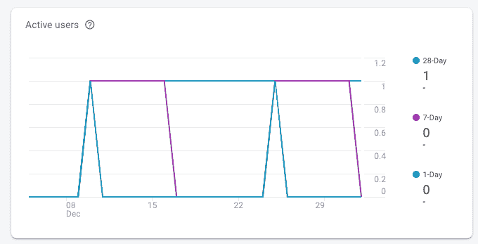

# 如何将 Firebase 集成到您的原生 C++ Android 游戏中？

> 原文：<https://medium.com/androiddevelopers/how-to-integrate-firebase-into-your-native-c-android-game-aa0d76eeba23?source=collection_archive---------0----------------------->

当你真正深入挖掘时，许多游戏都有一个共同的核心:几乎总是有一个 C++的软本体核心。Firebase 为 Android、iOS、Unity 和 Web 提供了 native feeling SDKs，这使得将您的游戏或应用程序连接到其遍布全球的基础架构变得非常容易。不幸的是，如果你生活在 C++中，这些 SDK 很难集成，对于许多游戏开发者来说使用起来非常不方便。不要担心，因为 Firebase 有一个跨平台的 C++ SDK，它抽象出所有平台特定的结构，让你的游戏尽可能快地与云对话！

Firebase C++ SDK 有五个平台目标:Android、iOS 和桌面(Windows、Linux 和 MacOS)。所有五个 API 都是相同的，但是要成功地用 Firebase 编译游戏并初始化库，需要注意一些平台特有的细微差别。在这篇文章中，我将介绍 Android。

# C++

Cocos 2dx 4.0 使用 CMake 作为其默认构建系统，这也是集成 C++ Firebase SDK 的首选方式。我在这里介绍的所有内容都应该很容易适用于其他构建系统或引擎。如果您想跟进，现在是键入 cocos new 的好时机:

`cocos new CocosFirebase -p <com.your_company.your_game> -l cpp -d .`

该条规定:

*   `cocos new CocosFirebase`:创建一个名为 CocosFirebase 的新项目
*   `-p <com.your_company.your_game>`:你游戏的包名，不带< >“我扔进去的。
*   `-l cpp`:语言为 C++
*   `-d .`:在我当前的工作目录下创建游戏

如果您对 CMake 不熟悉，我强烈建议您阅读我的简介文章。类似地，我将使用二进制 Firebase SDK，但是我所涉及的大部分内容都将使用开源 SDK。

现在我需要下载最新版本的 [Firebase C++ SDK](https://firebase.google.com/support/release-notes/cpp-relnotes) 。出于本教程的目的，我选择将它放在`third_party/firebase_cpp_sdk`中。除非你打算在 Linux 上发布你的游戏，否则我推荐你现在使用二进制 Firebase SDK。我在这里解释了二进制和开源 SDK 的优缺点。

# Android 集成

首先要做的是更新您的项目级`build.gradle`文件。对于 Cocos 项目，这位于`proj.android/build.gradle`。你得在`buildscript.dependencies`下面加上`classpath 'com.google.gms:google-services:4.3.3'`。我的`buildscript {`区块现在看起来像这样:

这是为了确保你可以用`google-services`调用应用插件。这是谷歌提供的插件,它简化了大部分构建过程。

接下来，您需要包含 Firebase 模块。我喜欢在我的`settings.gradle`文件中添加一个变量指向我的 Firebase 目录，以防我在多个 Gradle 模块中引用 Firebase。将下面一行添加到您的`settings.gradle`文件中，该文件位于 Cocos 项目的`proj.android/settings.gradle`中:

如果您使用的是开源 SDK，您还会希望将它添加到`settings.gradle`:

`includeBuild`对二进制编译也没有负面影响，所以可以随意保留。

`gradle.ext.firebase_cpp_sdk_dir`创建一个变量，我以后可以在构成我的项目的各个模块中引用它作为`$gradle.firebase_cpp_sdk_dir`。`$settingsDir`是这个`settings.gradle`所在的目录，所以这个路径在以后被引用时就变成了一个绝对路径。

最后，更新你的模块级`build.gradle`文件，这是一个 Cocos 项目的`proj.android/app/build.gradle`。首先在顶部添加`apply plugin: 'com.google.gms.google-services'`:

然后在我的文件末尾(在`dependencies {`部分之后)，我添加:

Android SDK 的真正神奇之处正在于此。您添加到`firebaseCpp.dependencies`的任何依赖项都会自动扩展并添加到您的项目中。例如，当您添加一个类似`analytics`的依赖项时，它会扩展为`'com.google.firebase:firebase-analytics:17.2.1'`。通过这种方式，您可以始终将 C++库与 Java 库相匹配，并且当您更新 Firebase C++ SDK 时，Java 依赖项也会自动更新。

注意，如果你交叉引用了 [C++安装指南](https://firebase.google.com/docs/cpp/setup?platform=android)，你可能想知道为什么我没有添加:

这将一个变量从 Gradle 传递到 C++，这对于基于 Android 的游戏来说非常方便。因为 iOS 和桌面目标不会使用 Gradle，所以我会以一种更加跨平台的方式来创建我的`CMakeLists.txt`文件，冒着这个`firebase_cpp_sdk_dir`变量在 Java 和 C++构建系统之间不同步的风险。

最后，如果你还没有，在 Firebase 控制台中创建一个新的 Android 应用程序。[下载](https://support.google.com/firebase/answer/7015592)相应的`google-services.json`文件，并把它放在`proj.android/app`下，就像对待任何其他 Android 项目一样(如果你有一个更深奥的应用程序架构，你希望它与`.gradle`文件放在一起，在那里你调用`apply plugin: 'com.google.gms.google-services'`)。

# C++构建系统

此时，我的项目的托管部分知道了 Firebase，但是我的游戏的 C++部分仍然一无所知。所以接下来你应该打开你的项目的根`CMakeLists.txt`文件。

首先，您需要`add_subdirectory`安装 Firebase C++ SDK 的目录。如果你记得以前，这是我的项目中的`third_party/firebase_cpp_sdk`:

这将使 CMake 意识到不同的 Firebase 目标。

接下来，您需要在 CMake 项目中找到依赖于 Firebase 的可执行文件或库。默认情况下，Cocos 将其放在`${APP_NAME}`变量中。如果你没有使用 Cocos，请记住在 Android 上这几乎总是一个库(通过`add_library`)而不是一个可执行文件，因为即使是[本地活动](/androiddevelopers/getting-started-with-c-and-android-native-activities-2213b402ffff?source=friends_link&sk=4cc5ed9d47c7c4f27a9155ec45cf0764)也是从一个托管进程中产生的。

一旦你知道了你游戏的目标名称，你需要[查找你想要使用的 Firebase 产品所需的 Firebase 目标](https://firebase.google.com/docs/cpp/setup?platform=android#libraries-android-cmake)。由于我正在使用 Firebase Analytics，这意味着我需要`firebase_analtyics`和`firebase_app`。

最后，用你需要的 Firebase 依赖项更新你游戏的`target_link_libraries`:

# 从 C++调用 Firebase

我选择了 Analytics，因为它是最简单的 Firebase 产品，也是测试 Firebase 与 Android 集成的最佳方式。要开始获取分析事件，您只需调用`::firebase::App::Create`。

在 Android 上，这确实需要两条额外的信息:

首先，您需要当前的`JNIEnv*`指针和`JniHelper::getEnv()` ( `JniHelper`是 Cocos 特定的类，它提供了一组方法来简化通过 JNI 从 C++调用 Java)。

接下来你需要一个作为`jobject`的游戏活动的引用。Cocos 通过`JniHelper::getActivity()`实现了这一点。

为了在我的 Cocos 项目中初始化 Firebase，我首先将一个`::firebase::App`添加到我的`AppDelegate.h`中:

然后我用下面的代码初始化它:

在其他平台上，`Create()`不接受任何参数。所以用`#ifdef __ANDROID__`有条件编译这个并不少见。

如果您做的一切都正确，您应该会看到一个用户出现在您的分析仪表板中:

# 接下来呢？

现在是时候开始为你的游戏添加一些自定义事件了。我还会推荐 [Crashlytics](https://firebase.google.com/products/crashlytics) 作为你的下一个 Firebase 集成。它的 [NDK 支持](https://firebase.google.com/docs/crashlytics/ndk-reports)对于追踪那些在游戏中突然出现的深奥的原生问题是至关重要的。一旦集成了分析功能，就很容易引入[远程配置](https://firebase.google.com/products/remote-config)来更好地调整游戏以适应特定的用户群，甚至让你的设计师在开发过程中随时调整游戏价值，而不必经历完整的构建/部署周期。

如果你像我一样，原生 C++游戏开发的最大痛点之一就是与 web 后端接口。由于现在大多数游戏都有某种服务组件，我建议看看 Firebase [云功能](https://firebase.google.com/products/functions)、[实时数据库](https://firebase.google.com/products/realtime-database)和[认证](https://firebase.google.com/products/auth)来真正感受 Firebase 的强大。

# 如果我不用 Cocos 或者 CMake 怎么办？

Firebase 集成仍然支持旧的`ndk-build`流程，附带文档。另外，Firebase 的二进制发行版将它的各种编译好的库文件存储在按操作系统和 CPU 架构组织的`libs/`下(甚至 Android 的 STL 版本)。

没有 Cocos 的`JniHelper`类，检索`JNIEnv`会有点棘手。`JNIEnv`通过了大多数 JNI 回调，但是*在当前调用栈之外缓存它是不安全的。相反，当您希望初始化 Firebase 时，您可能希望缓存来自您的`JNI_OnLoad`回调的`JavaVM*`指针，并从中调用 [GetEnv](https://docs.oracle.com/javase/9/docs/specs/jni/invocation.html#getenv) 。*

如果没有 Cocos 的便利库，获取一个`jobject`活动引用也可能有点困难，因为没有通用的方法来检索当前活动。许多 Java 开发人员可能倾向于将他们的游戏活动缓存在一个静态字段中，以便更容易从 C++访问，但是如果不小心的话，这可能会导致您泄漏当前的活动。我通常会设计我的游戏，让一个活动“拥有”我的本机应用程序，并通过一些“初始化”调用来启动它(再次提醒，除非我准备好在我的活动的`onDestroy`回调中处理清理，否则不要缓存它)。如果您使用的是`android_native_app_glue.h`，活动被存储在与大多数回调相关联的`android_app`结构中，尽管通过`activity->clazz field`对其进行访问容易引起混淆(这在相应的`native_activity.h`头文件中被错误命名)。

最后，你可能没有办法`apply plugin: 'com.google.gms.google-services'`。Firebase 插件[包括一个脚本](https://firebase.google.com/docs/cpp/setup?platform=android#custom-build-systems)，用于将内容提取到游戏的`.xml`资源中，使其更容易集成。在尝试无梯度集成之前，我建议阅读这篇关于`google-services`插件实际上在做什么的文章[。](/@samstern_58566/how-to-use-firebase-on-android-without-the-google-services-plugin-93ecc7dc6c4)

# 资源

 [## 面向 Firebase 开发者的 CMake

### C++ Firebase SDK 依赖 CMake 作为其主要的跨平台构建系统，用于开源 SDK 和它的…

medium.com](/firebase-developers/cmake-for-firebase-developers-537aaa7eb437)  [## 我是使用 Firebase C++ SDK 还是 Firebase C++ SDK？

### 二进制和开源 Firebase SDKs Firebase 的快速概述提供了一个强大的跨平台 c++ SDK…

medium.com](/firebase-developers/do-i-use-the-firebase-c-sdk-or-the-firebase-c-sdk-2b61bdd17443)  [## 现代制造概论

### 人们喜欢讨厌建筑系统。只需观看 CppCon17 的演讲，就能看到开发人员将…

cliutils.gitlab.io](https://cliutils.gitlab.io/modern-cmake/)  [## Firebase for games |使用 Firebase 增强您的游戏性能！

### 通过分析，了解玩家如何体验你的游戏:他们玩游戏花了多少时间，他们花了多长时间…

firebase.google.com](https://firebase.google.com/games)  [## firebase/firebase-cpp-sdk

### 该存储库包含 Firebase C++ SDK 源代码，支持 Android、iOS 和桌面平台。它包括…

github.com](https://github.com/firebase/firebase-cpp-sdk)  [## Cocos 引擎官网| Cocos Creator | Cocos2d-x |开源跨平台游戏…

### Cocos 引擎官网| Cocos Creator | Cocos2d-x |开源跨平台游戏开发引擎

www.cocos.com](https://www.cocos.com/en/products#Cocos2d-x)  [## Google Analytics for Firebase |免费且无限制的应用程序分析

### Google Analytics for Firebase 提供多达 500 个不同事件的免费、无限制报告。SDK 自动…

firebase.google.com](https://firebase.google.com/products/analytics)  [## Firebase Crashlytics |崩溃报告，帮助您更快地确定优先级和修复稳定性问题

### Firebase Crashlytics 可帮助您实时跟踪、优先处理和修复影响应用质量的稳定性问题。花费…

firebase.google.com](https://firebase.google.com/products/crashlytics)  [## Firebase 的云功能|无需管理服务器即可运行您的移动后端代码

### 创建由 Firebase 产品触发的功能，如实时数据库中的数据更改、新用户…

firebase.google.com](https://firebase.google.com/products/functions)  [## Firebase 实时数据库|实时存储和同步数据

### Firebase 实时数据库是一个云托管的 NoSQL 数据库，让您可以在您的用户之间存储和同步数据…

firebase.google.com](https://firebase.google.com/products/realtime-database)  [## Firebase 身份验证|简单、免费的多平台登录

### Firebase Authentication 旨在简化安全身份认证系统的构建，同时改进登录和…

firebase.google.com](https://firebase.google.com/products/auth)