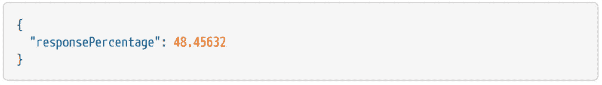
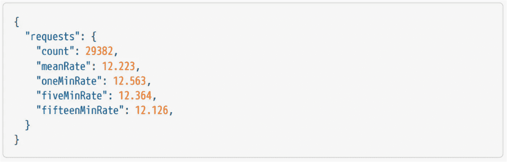
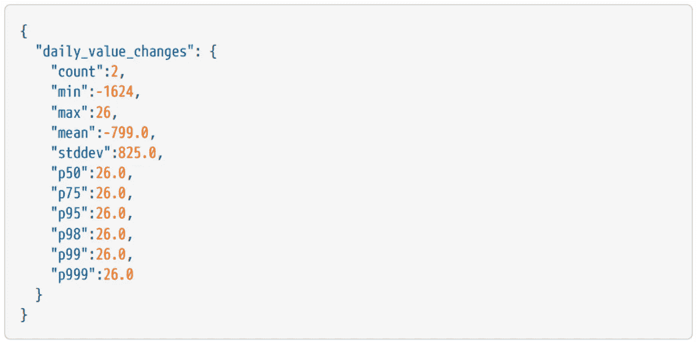
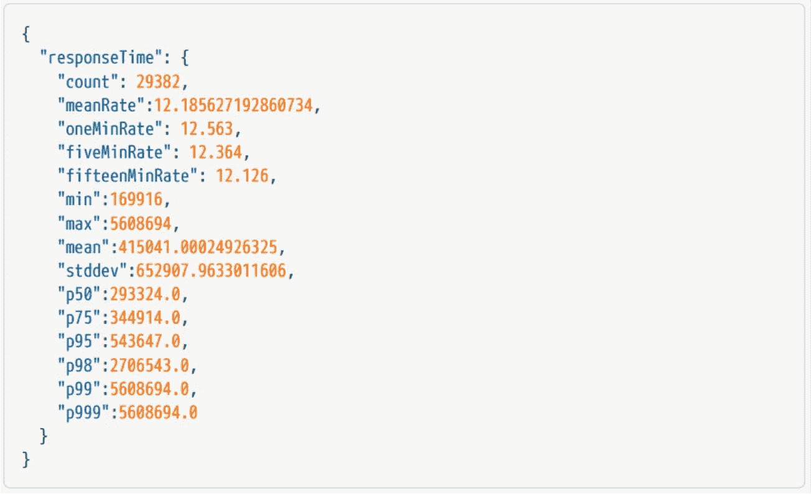
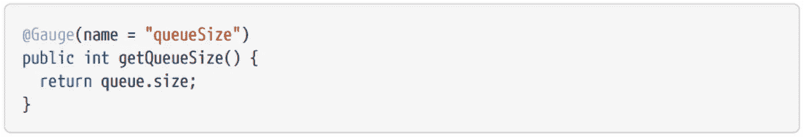
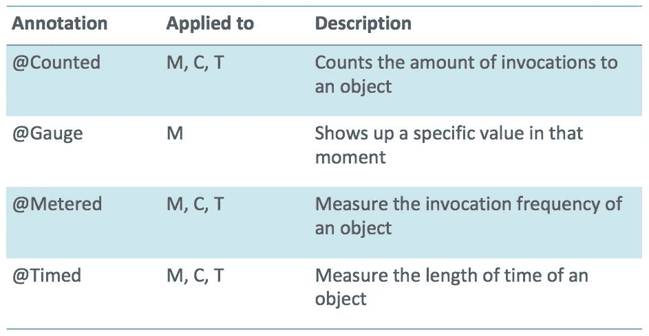
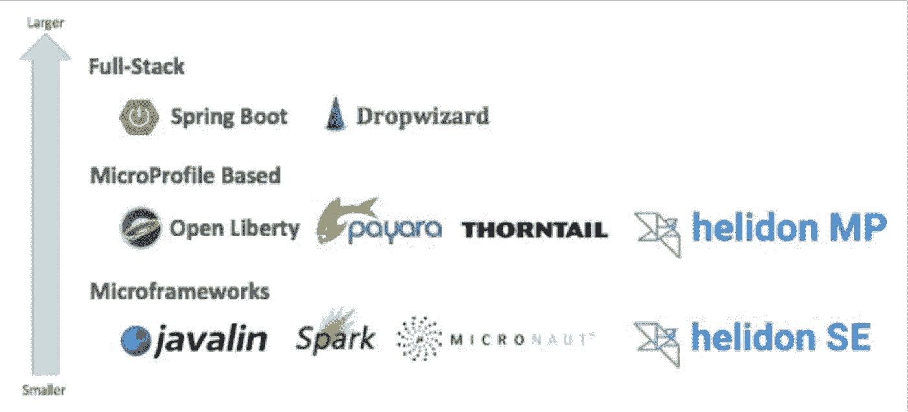
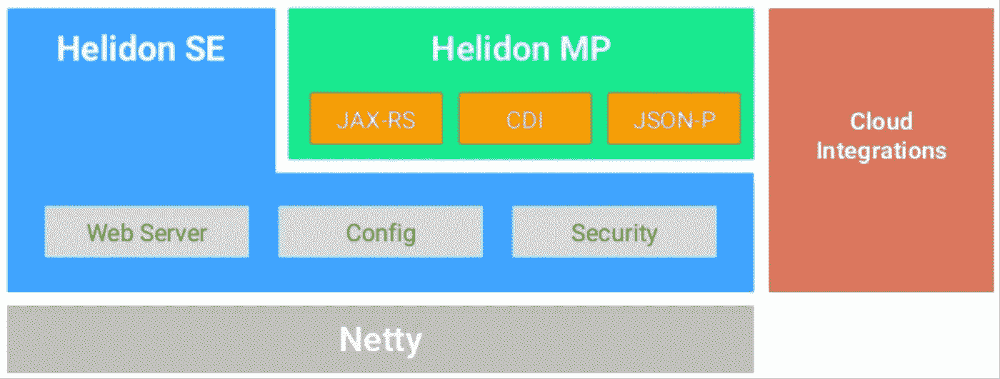
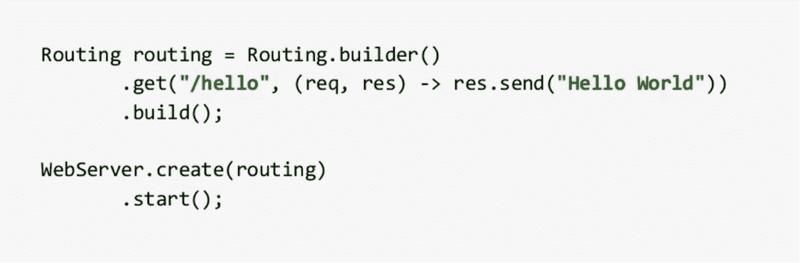
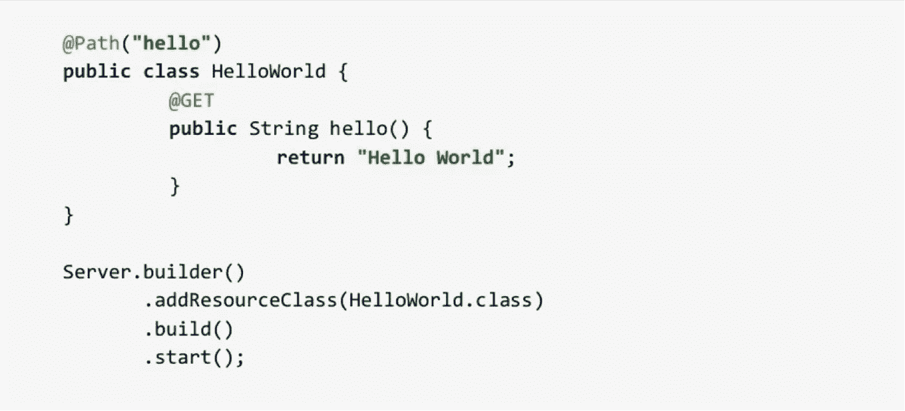

# 如何通过监控指标来保持微服务的可用性

> 原文：<https://medium.com/oracledevs/how-to-keep-your-microservices-available-by-monitoring-its-metrics-d88900298025?source=collection_archive---------0----------------------->

微服务在你的项目中增加了很多东西:包括它的复杂性，这已经不是什么秘密了。

想象一下那个美好的画面:很多服务以多米诺骨牌风格停止，你搞不清楚它是从哪里开始的，发生了什么，下一个失败的会是谁。噩梦！

这就是为什么有度量和监控流程。它们让你不至于“被动”。相反，你可以做好一切准备。

本文将介绍如何使用度量来保持服务的可用性，以及如何通过使用 Helidon，特别是它的 MicroProfile 实现来实现。

# 关于指标

首先，让我们了解什么是指标:

> 度量是一种用于定量评估、控制和/或选择**的方法:一个人、一个过程、一个事件或一个机构。**

**重要的是强调“定量”这个词:一个有用的度量标准必须是具体的。它需要是你可以用数字来衡量的东西，而不是用概念。**

**例如:你和你的老板一起做年度回顾，他/她说你今年做得很好，因为你和你的团队合作得很好。这是一个概念，我们不能把它作为我们的衡量标准。**

**但是，相反，他/她说你做得很好，因为你为你的组织带来了 100 万美元，而你的目标是 80 万美元。这是一个指标(对你来说是一个好指标，祝贺你！).**

**它是可测量的，可计数的，可比较的。可以考虑极限、平均、求和等。**

# **度量≠健康检查**

**有时，对于什么是指标，什么是运行状况检查，会有一些误解，有些人可能会认为它们是相互的。**

**Healthcheck 是表示某个服务是否处于活动状态的任何东西。**

***“喂服务，你还活着吗？是啊！”***

***“喂服务，你还活着吗？否…”***

**举例来说，这是一个很好的信息，但通常这还不够。仅仅因为一个服务是活的，并不意味着它工作得很好。这就是度量非常有用的地方。**

**度量有助于确定服务的健康状况。举例来说，让我们使用洛基巴尔博亚服务。**

****场景 1** :战斗前**

****健康检查** : *我是洛奇·巴尔博亚。我还活着。***

***刺拳强度:100%***

***出血:0 毫升/秒***

***视力:100%***

***出汗:1 毫升/秒***

**信心:10**

**发音:“阿德里安”**

**在这里，我们的洛基巴尔博亚服务做得很好！现在过一段时间再来对比一下。**

****场景二**:与伊万·德拉戈打了 15 回合后**

**健康检查:我是洛奇·巴尔博亚。我还活着。**

***刺拳强度:0.5%***

***出血:100 毫升/秒***

***视力:1%***

***出汗:200 毫升/秒***

***置信度:0***

***发音:“Aaanhanaaannnn”***

**这里我们的服务是活跃的，但是面临一些问题。他将在几秒钟内耗尽血液，他几乎不能击打他的对手…而且，最糟糕的是:我们听不懂他在说什么。**

**这就是指标与运行状况检查协同工作的方式。它将为您提供关于使用、性能、峰值和/或闲置等重要信息。例如，通过监控和充分利用这些信息，您可以:**

*   **计划何时/如何扩大或缩小规模**
*   **定义何时需要垂直/水平缩放**
*   **决定将应用程序的某个部分分解成一个独立的服务**

**这不仅有助于您保持微服务的可用性，还能帮助您明智地使用资源。**

# **微轮廓度量**

**在 MicroProfile 规范中有 3 种类型的度量。**

1.  **基础**
2.  **小贩**
3.  **应用**

****Base** 是任何微配置文件实现所必需的，有 4 组指标:**

*   **虚拟机（Java Virtual Machine 的缩写）**
*   **线**
*   **线程池**
*   **分类加载**
*   **操作系统（Operating System）**

****Vendor** 是可选的，正如同样的暗示，它是由供应商根据自己的实现创建的任何指标。它不是便携式的。**

****应用**是可选的，由你创建(你是全能开发者！)，在您的应用程序源代码中。**

**MicroProfile 中的所有指标都是通过使用 Rest API 公开的，并且有两种输出格式:JSON 和 Prometheus。**

**在这两种格式中，您有相同类型的指标:**

*   **测量**
*   **计数器**
*   **米**
*   **柱状图**
*   **计时器**

**看看下面的例子:**

****

**Gauge JSON**

****

**Counter JSON**

****

**Meter JSON**

****

**Histogram JSON**

****

**Timer JSON**

# **面向度量的代码**

**我们已经看到有一种称为“应用程序”的指标类型。在这里，您可以针对自己的应用创建自己的指标。**

**根据 MicroProfile 规范来做这件事的方法非常简单:只需添加一个注释:**

****

**Gauge metric example**

**以下是注释及其用法的完整列表:**

****

**M=Method, C=Class, T=Type**

**现在你已经知道了如何在你的应用中添加指标，让我们更深入地了解 Helidon 的细节。**

# **赫利登**

****

**Helidon 项目是:**

*   **一组用于微服务开发的库**
*   **开源(Apache 2.0)**
*   **Helidon SE:微框架**
*   **Helidon MP:微轮廓实现**

**与其他微服务框架相比:**

****

**下图显示了 SE 和 MP 之间的关系:**

****

**如您所见，Helidon 架构中描述了“云集成”。它允许您将您的微服务与您首选的云提供商集成。**

**Helidon SE 有更多的函数式编程，如下所示:**

****

**另一方面，赫林顿议员有一个 JAX-遥感的方法。像这样:**

****

**例如，使用 Helidon MP 的定时方法如下所示:**

**另一方面，使用 Helidon SE 的计数方法如下:**

**无论您使用哪一个，您的 Helidon 应用程序都将以相同的方式公开和处理指标。所以无论如何你都可以监视他们。**

**现在轮到你了！使用 MicroProfile 度量来尝试您自己的代码，并让我知道结果。**

**如果您想使用 Helidon MP 和 Helidon SE 检查更多代码，请查看支持本文的完整源代码:**

** [## 接骨木/直升机-度量

### 通过在 GitHub 上创建帐户，为 eldermoraes/helidon-metrics 的发展做出贡献。

github.com](https://github.com/eldermoraes/helidon-metrics) 

此外，请查看 MicroProfile Metrics 规范和 Helidon 项目页面:

 [## eclipse/microprofile-metrics

### 微轮廓-度量。通过在 GitHub 上创建一个帐户，为 eclipse/microprofile-metrics 开发做出贡献。

github.com](https://github.com/eclipse/microprofile-metrics)  [## 赫利登

### 编辑描述

helidon.io](https://helidon.io)**