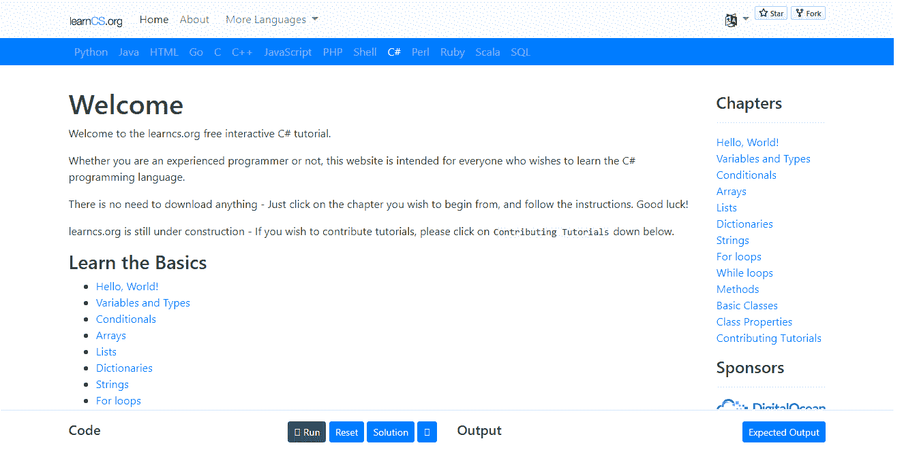

# 2021 年如何在线学习任何编程语言

> 原文：<https://medium.com/quick-code/how-to-learn-any-programming-language-online-in-2021-2ef4ddba5dcf?source=collection_archive---------0----------------------->

Photo by [Sergey Zolkin](https://unsplash.com/@szolkin?utm_source=unsplash&utm_medium=referral&utm_content=creditCopyText) on [Unsplash](https://unsplash.com/?utm_source=unsplash&utm_medium=referral&utm_content=creditCopyText)

编程有很多好处。许多人想学习它，但是迈出第一步是相当困难的。从远处看，编码世界似乎令人望而生畏，许多人倾向于回避，因为他们不知道如何学习和理解这么多东西。如果你想学习编程的艺术，你需要选择一个起点。就在大约十年前，这令人难以置信地困惑。但是今天这很简单。

有许多相当实惠甚至免费的课程，你可以订阅来学习如何编程。然而，如何决定他们应该先学习哪种语言呢？现在，在一个理想的场景中，您应该考虑检查最广泛使用的编程语言，然后做出您的选择。在你学会并完全掌握了这门语言之后，你就可以朝着更复杂的概念前进了。

# 为什么要学编程？

学习如何编码可以为你打开许多新的大门。这里有几件事可能会说服你学习编程。

## 你得到更高的薪水！

这也许是最明显的原因之一。如果你将软件开发人员的平均工资与其他主流职业进行比较，你会发现大多数开发人员最终会赚得更多。首先，软件开发人员需求量很大，他们的技能非常有价值。例如，一名 Java 开发人员一年可以挣 80，000 美元。平均而言，几乎所有程序员的年薪都超过 75，000 美元。

## 广阔的职业机会

如果你学习编程，你将能够为广泛的不同行业做出贡献。你可以决定做一名自由职业者，为自己工作，也可以加入当地的公司。软件开发人员受雇于各行各业，从银行业到网络安全，再到制造业和其他加工企业。

## 做一些很酷的事情

作为一名软件开发人员，你将获得独立和目标感，这是你在其他职业中无法获得的。你可以自己创造很酷的东西，为全球创新做出贡献。

## 广泛的社区支持

IT 社区是最强大的专业社区之一。它非常活跃，非常有帮助，几乎任何你能想到的话题都有相关信息。例如， [GitHub](https://github.com/) 是世界上最大的软件开发平台之一。 [Medium](/) 是一个平台，人们可以在这里撰写大量关于他们所创造的软件解决方案和工具的文章。从 Youtube 视频到免费资源和小组讨论，这个社区非常活跃。

## 不缺乏学习资源

如果你对如何学习编程感到困惑，那也没什么好担心的。网上有数百种不同的学习资源，从专门的培训课程到广泛的视频课程。许多老师使用独特的教学方法，所以你不仅会获得知识，还会获得很多乐趣。

# 五大流行的编程语言以及如何学习它们

首先，当你寻找一门编程语言时，你会被众多的选择宠坏。最广泛使用的是 JavaScript、Java、Python、PHP 和 C#。从桌面和移动平台、基于云的应用到科学实验，它们在各行各业都有广泛的应用。这个地方和其他地方一样是个好的开始。可以马上开始学习编程。

# Java 语言(一种计算机语言，尤用于创建网站)

Java 非常有名，你可以用它来构建各种各样的应用程序，比如大型企业级 web 应用程序、网站、移动和桌面应用程序。事实上，大多数 Android 应用程序都是用 Java 编写的。

## 优势

Java 对于初学者来说相对简单明了；即使你对编程一无所知，学习它也是可能的。特别是 Java，不允许直接访问内存。这意味着它比允许你这样做的 C ++要安全得多，而这经常会引起问题，尤其是对初学者来说。还添加了单独的安全管理组件。

用 Java 编写的程序可以在任何平台上运行(Windows、Linux、移动操作系统)。一旦你为一个平台写了，你就不应该完全为另一个平台重写。你所需要的是 Java 虚拟机(JVM)，它为那个平台“翻译”你的代码。当然，可能存在某些系统限制，但尽管如此，这种方法大大加快了多平台开发的速度。

Java 是一种面向对象的语言。简而言之，这意味着 Java 中的一切都由对象来表示，即具有状态和行为的实体。对象是构成继承层次结构的类的实例。什么都不懂也不用担心。对于初学者来说，这意味着 Java 允许你重用你写的东西，并以最少的麻烦创建脚本。

Java 支持多线程，这个功能在语言中实现得非常好。这种语言的多线程特性确保了几个任务可以由同一个程序同时运行。

Java 为你能想到的几乎每个任务都提供了大量的库，你可以在工作中自由地使用它们。

## 哪里可以用 Java？

目前，Java 无处不在。您可以在各种行业部署 Java。它通常用于亚马逊和谷歌等公司使用的企业级 web 服务器应用程序。不仅如此，全球顶级的移动操作系统 Android 也大量使用 Java。在很多大数据技术和游戏开发中也会用到。除此之外，许多科学应用和软件工具都是用 Java 制作的。Java 创作的其他例子有《我的世界》、IntelliJ IDEA 和 Eclipse。

## 学习 Java 的资源

*   [CodeGym.cc](http://www.codegym.cc/) 。对于想学习如何编码的人来说，这是最好的网站之一。它有超过 1200 个实际任务，并帮助您磨练您的编码技能，以便您获得 Java 方面的专业知识。CodeGym 也因其顶尖的教学方法而闻名。你有一个自动代码验证器，教程使用最新的技术，包括讲故事，游戏化，可视化，使学习过程更有趣，更容易。

*   [Java 语言基础](https://www.pluralsight.com/paths/java)。我遇到很多学生，他们认为获得 API 和语法就足以理解 Java。然而，有许多更基本的语言概念是必须学习的。Java 语言基础是一门介绍性的课程，在这里你可以了解如何有效地使用 Java。除此之外，您将掌握 Java 中的控制流、面向对象和集合，并获得编写自己的 Java 应用程序所需的技能。

*   [完整的 Java 大师班](https://www.udemy.com/course/java-the-complete-java-developer-course/?LSNPUBID=JVFxdTr9V80&ranEAID=JVFxdTr9V80&ranMID=39197&ranSiteID=JVFxdTr9V80-6QCuRnNznf5Y3JgD6i5w8g&utm_medium=udemyads&utm_source=aff-campaign)。Udemy 上有，这是一门一体化的课程，让你了解 Java 的初始概念，开始编程。这个 14 小时的课程将帮助你熟练掌握 Java 8 到 11。有超过 480，000 名学生注册，它也非常受欢迎。

# Java Script 语言

接下来是 JavaScript 语言。今天，它是一种多范例编程语言，支持交互式网页，并成为 web 应用程序的重要组成部分。JavaScript 的使用已经扩展到了网络浏览器之外，并被编译成本地移动应用。它的引擎用于部署服务器端网站和非浏览器应用，以及 AJAX、UI web 应用、webOS、bookmarklets 等。

## 优势

JavaScript 易于理解和实现，这使得它对初学者很友好。其次，JS 在网络上随处可见，所以它的名气无与伦比。除此之外，它还提供了与其他语言相当完美的兼容性，并允许您在一系列不同的应用程序中使用 JS。

JS 还允许编码人员创建各种丰富的接口，因为它是以客户端为中心的，所以降低了对服务器的需求。简而言之，对于那些对前端开发和一些其他项目感兴趣的人来说，JavaScript 是一个很好的选择。

## 哪里可以使用 JavaScript？

JavaScript 在你的网络浏览器中运行，所以你不需要下载任何特殊的应用程序。然而，Node.js 是一个允许在服务器端应用程序上使用 JavaScript 的运行时。JS 使用最广为人知的例子包括网站的前端。

## 学习 JavaScript 的资源

可以从多个地方学习 JavaScript。其中包括:

*   [Freecodecamp](http://www.freecodecamp.org/) 。FreeCodeCamp 是获得在线认证和足不出户自学编程的最佳场所之一。这是一个非营利组织，致力于帮助人们发展他们的编码技能。

*   [学习 JavaScript](https://learnjavascript.online/) 。对于想要提高 JavaScript 技能的人来说，这是一个简单的学习平台。对于已经对编程有清晰概念的开发新手来说，这是理想的选择。它使用抽认卡来帮助你记住概念，并主持一系列项目来推进你的学习。

*   [学 JS](http://www.learn-js.org/) 。Learn JS 是一个非常棒的工作空间，可以轻松地学习 JavaScript 编码。它有从最简单到高级的教程，是学习 JS 最全面的平台之一。

# 计算机编程语言

Python 是一种通用语言，用于后端 web 编程、分析数据、人工智能和深度学习。它非常容易理解，这使得它如此受新手追捧。社区也很棒，几乎每个任务都有可用的库。

## 优势

就可读性而言，Python 是最简单的语言之一，并且很容易解决问题。它还兼容许多平台。除此之外，它还允许您重用代码片段。也许最好的部分是 Python 有大量可用的库，允许开发人员非常轻松地管理文档。

## 哪里可以用 Python？

Python 适用于各种应用，尤其是数据科学。程序员也用它来汇集用不同语言编写的不同应用程序。除此之外，许多 web 开发框架，如 Flask 或 Django，都是使用 Python 编写的。

Python 也是各种流行网站的支柱，如 Instagram、Spotify、网飞、Instacart 等。

## 学习 Python 的资源

*   代码大战。Codewars 采用了一种严肃的方法来教授 Python。它有一系列的课程供你选择和开始。交互式学习平台只是让那些希望快速进入编码和学习 Python 的未来专业人士变得更容易。

*   [Hackr.io](http://www.hackr.io) 。Hackr.io 提供了大量关于如何使用 Python 的资源。它是社区支持的，所以你可以访问大量的论坛，人们在那里讨论他们的问题和解决方案。Hackr.io 让你可以访问不同平台的多门课程。

*   [谷歌的 Python 类](https://developers.google.com/edu/python/)。Google 的 Python 类不需要介绍。这是一个免费的课程，可以让你磨练你的 Python 技能并理解基本原理。由于它没有任何高级课程，你将不得不在获得基础知识后立即搜索其他教程。

# 服务器端编程语言（Professional Hypertext Preprocessor 的缩写）

几十年来，PHP 一直被用于服务器端应用程序编码，并且是这个列表中最古老的。它在 2000 年的网络开发者中风靡一时，甚至在今天依然流行。排名前 1000 万的网站中平均有 80%使用 PHP 进行服务器端编程。

## 优势

PHP 非常容易理解和学习。这种语言也非常灵活，即使在完成项目后，你也可以自由地进行修改。它还具有成本效益，并兼容一系列不同的操作系统。

## 哪里可以用 PHP？

PHP 主要被后端开发者用来创建和维护网站。它还支持一系列的 WordPress、Magento、Drupal 和其他网站。使用 PHP 的其他常见例子包括 Wikipedia、Mailchimp 和 Flickr。

## 学习 PHP 的资源

要学习 PHP，你可以求助于以下资源:

*   [代码学院](https://www.codecademy.com/)。Codecademy 确实不需要介绍，因为它是这个星球上最大的编码平台之一，有数百万人访问它。如果你想成为 PHP 专家，Codecademy 是个不错的选择。它有奇妙的课程，并自动跟踪你的进展。

*   [极客 forGeeks](https://www.geeksforgeeks.org/php/) 。GeeksforGeeks 为那些想自学编程的人提供了大量的教程。除了 PHP 教程，网站还有 Java 和 Python 的教程。

*   [SoloLearn](https://www.sololearn.com/Course/PHP/) 。SoloLearn 是另一个奇妙的学习平台，它有一个交互式框架。它为想学习 PHP 的人提供了全方位的模块。你可以通过大量的作业来学习 PHP 的实际用例。

# C#

最后，你有 C#。IIt 在开发网站、服务器端应用、控制台应用、视频游戏(以及 Unity 游戏引擎)方面很受欢迎。C#是微软开发的一种非常像 Java 的语言。它也是面向对象的，支持多线程。

## 优势

对于一个菜鸟来说，C#是一个公平的首发选择。它是面向对象的，并且使用了当今的编程实践。C#还包括一个异常丰富的框架，带有许多内置函数，使得开发变得快速。

## 哪里可以用 C#？

像大多数专注于一般用途的编程接口一样，C#也可以用于开发一系列基于云的服务、web 应用程序的服务器端、桌面应用程序和游戏。

画画。NET 和 Microsoft Visual Studio 都是用 C#和 C++编写的。

## 学习 C#的资源

有很多资源平台可供想学习 C#编程的个人使用。其中一些包括:

*   [教程老师](https://www.tutorialsteacher.com/csharp/csharp-tutorials)。这是学习 C#的绝佳场所。该平台针对简化课程交付进行了优化，并配备了一系列独特的功能。你也可以参加一些快速测试来提高你的技能。

*   [C#站](http://csharp-station.com/Tutorial/CSharp/SmartConsoleSetup.aspx)。有了 23 节以上的 C#课程，从头到尾掌握 C#语言是一个很好的选择。这份受欢迎的选择将帮助您深入了解 C#。它非常适合初学者以及只想练习的有经验的开发人员。

*   【LearnCS.org】T4。这个学习平台以实践为导向，将帮助您快速发展 C#技能。它会让你对这门语言有一个基本的了解，然后专注于更高级的概念。

# 包扎

如果你已经决定在这个时代学习编程，你首先需要做的就是决定最适合你需求的语言。

如果您对开发从交互式 UI web 应用程序到非浏览器应用程序和 WebOS 的各种 web 项目感兴趣，请考虑 JavaScript。如果你想在几年后成为一名数据科学家，Python 是一个不错的选择。对于那些想要从许多职业机会中进行选择的人来说，通用 Java 语言将是一个很好的选择。不管你的选择是什么，现在有这么多可用的资源，所以这是一个充分利用时间的好方法！