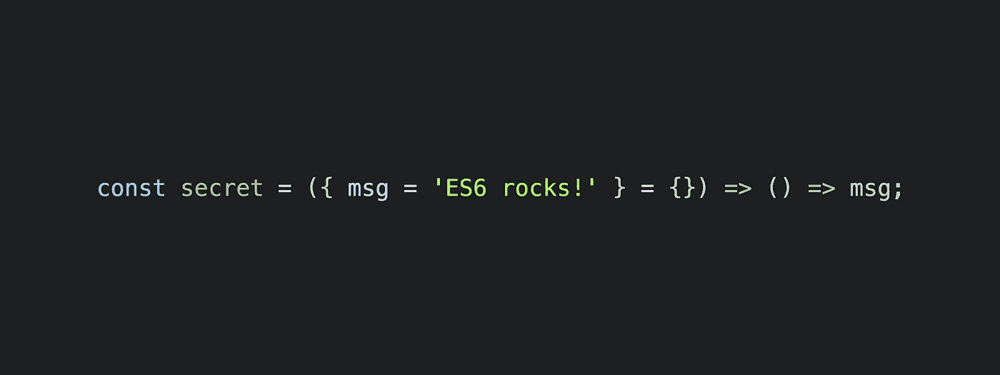

# 如何学习 ES6

> 原文：<https://medium.com/javascript-scene/how-to-learn-es6-47d9a1ac2620?source=collection_archive---------2----------------------->

[大约在 2015 年 6 月该标准正式发布时，我们进行了一项调查](/javascript-scene/javascript-scene-tech-survey-d2449a529ed#.dqzl9f46i),看看有多少人在使用 ES6。将近一半的受访者已经这样做了。由于 transpilers 和 polyfills 的存在，世界上采用 ES6 的速度比以前语言规范的增强要快得多。ES6 包含许多强大的增强功能，将使您的团队更加高效。

> 如果你还没学过 ES6，现在是**的时候了。**

## 常见借口

*   *“我在等浏览器支持。”Babel 可以让你转换大多数 ES6 代码，因此它可以在追溯到 IE8 的浏览器中工作。不要被落下。*
*   *“我不想引入编译步骤。”如果你正在构建任何重要的应用程序，无论如何你都应该编译，原因有很多。*
*   *“我是初学者，在学习 JavaScript 的同时学习 ES6 听起来很难。”*我听到了，但是 ***ES6 是 JavaScript*** *。这是当前官方的 JavaScript 标准，你想阅读的所有新书和教程都将使用 ES6 示例。与此同时，*

## 我准备好学习了！

1.  复制并粘贴博客和教程的例子到[巴别塔 REPL](https://babeljs.io/repl/) 中，看看巴别塔如何将它们编译成 ES5。
2.  观看 [ES6:路线图网络广播](https://ericelliottjs.com/product/es6-the-road-map-2-hour-webcast-recording/)录音(包含互动示例)
3.  [“组合软件”](/javascript-scene/the-rise-and-fall-and-rise-of-functional-programming-composable-software-c2d91b424c8c#.rwlql9fg4)系列使用 ES6 例子从头开始处理函数式编程。ES6 语法基础在[“一个函数式程序员的 JavaScript 介绍”](/javascript-scene/a-functional-programmers-introduction-to-javascript-composing-software-d670d14ede30)中有所涉及。
4.  [《理解 ES6》](https://leanpub.com/understandinges6)尼古拉斯·扎卡斯著
5.  [“探索 ES6”&“设置 ES6”](https://leanpub.com/b/es6-bundle)Axel Rauschmayer
6.  凯尔·辛普森《你不知道的 JS: ES6 &超越》
7.  继续阅读 [JavaScript 场景](https://medium.com/javascript-scene)中的大量示例代码。

附:慎用`class`和`extends`T3。你需要知道语法，因为尽管有危险，你还是会经常遇到。特别是，尽可能避免使用`extends`关键词。浏览这些资源，了解原因:

*   [《JavaScript 的两大支柱》原型 OO](/javascript-scene/the-two-pillars-of-javascript-ee6f3281e7f3#.rswnqsqv8)
*   [“JavaScript 中关于继承的常见误解”](/javascript-scene/common-misconceptions-about-inheritance-in-javascript-d5d9bab29b0a#.3kch48mxu)
*   [《Dev 团队内部死亡螺旋》](/javascript-scene/inside-the-dev-team-death-spiral-6a7ea255467b#.ih0cvwr3r)

> [通过课程提升您的技能&关于 ES6、TDD、原型 OO、React、&等的网络广播。](https://ericelliottjs.com/product/lifetime-access-pass/)

***Eric Elliott****著有《编写 JavaScript 应用程序》* *(O'Reilly)，以及《学习通用 JavaScript App 开发与节点&**。他为 Adobe Systems******Zumba Fitness*******华尔街日报*******ESPN*****BBC**等顶级录音师贡献了软件经验******

**他大部分时间都在旧金山湾区和世界上最美丽的女人在一起。**