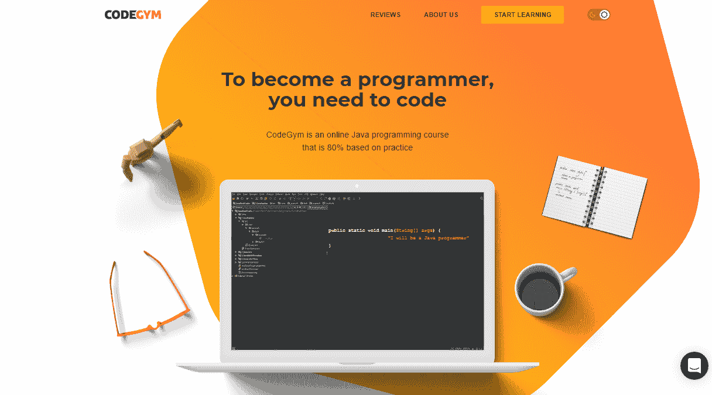
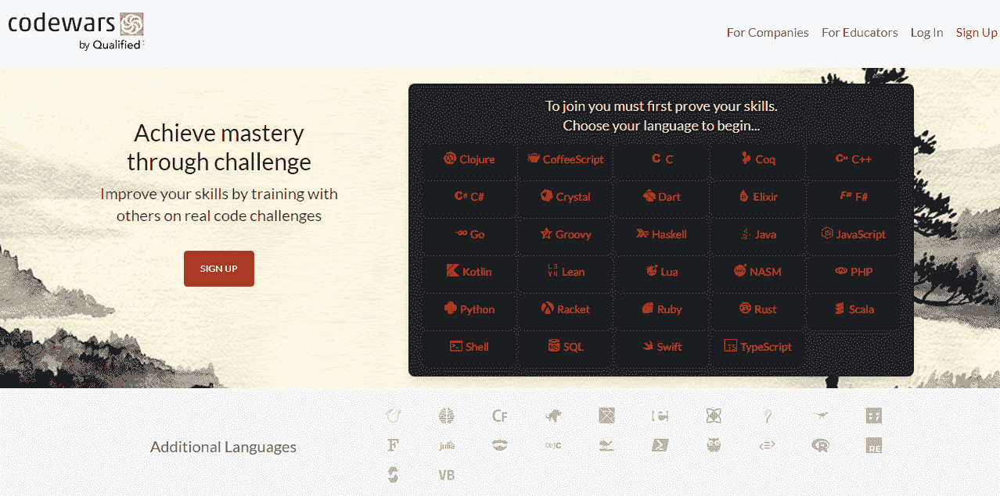
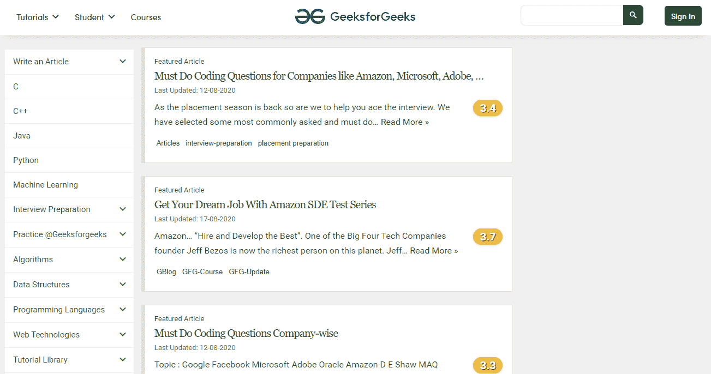
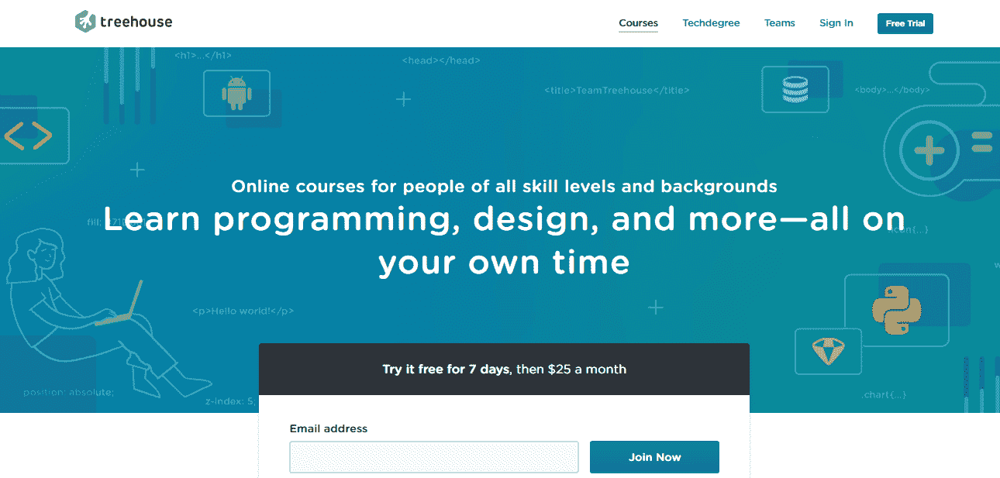
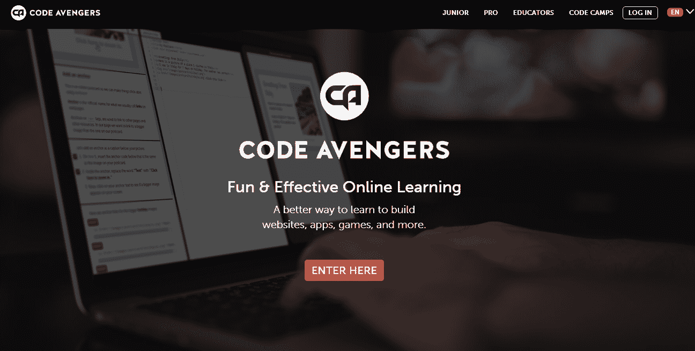

# 如何在线学习编程:最好的入门网站

> 原文：<https://medium.com/quick-code/how-to-learn-programming-online-best-websites-to-start-with-2329ba90cfc6?source=collection_archive---------0----------------------->

Photo by [AltumCode](https://unsplash.com/@altumcode?utm_source=unsplash&utm_medium=referral&utm_content=creditCopyText) on [Unsplash](https://unsplash.com/s/photos/coding?utm_source=unsplash&utm_medium=referral&utm_content=creditCopyText)

在不断变化的世界中，越来越多的新职业出现并受到欢迎。但是有几个行业在几十年后仍然很受欢迎。是编程。

让我们面对现实:自我教育是艰难的，需要很多年——一个好的程序员应该终生学习编程，因为领域总是在发展的。然而，我相信一个好的指南会让你更容易掌握一门新的编码语言。与编码书籍或 YouTube 教程相比，现代在线课程更高效、更容易掌握，它们被认为是学习编程的最佳方式。

在这篇文章中，我将解释在选择正确的课程时应该考虑什么标准，并给出我关于平台的建议。

# 选择编程课程时要考虑的标准

那么，如何选择一门编程课程，为什么选择一门合适的课程如此重要？让我们弄清楚。

# 标准 1。注重实践

学编程肯定需要理论知识，但这还不够。理论如果不把学到的技能马上付诸实践是无效的，因为写代码本身就是编程！这就是为什么考虑面向实践的在线学习是有意义的，它将允许你最终将你的知识转化为一个真正的现实世界的项目。因此，学习编码的理想比例应该是 20/80，让你用 20%的时间阅读讲座或观看视频，用剩下的 80%编写代码。

所以，首先，尽量找一个实际任务多的课程。

# 标准 2。代码验证

下一个重点是代码验证。很多时候，当程序员新手解决一个问题时，他们不知道他们是否正确地解决了这个问题。即使您得到了正确的答案，它也很可能不适用于其他数据。怎么办？当然，如果你有一个导师，你可以指望得到帮助。然而，我们在这里谈论的是自定进度的学习，在这种情况下，验证是其最大的问题之一。在最近 10 年里，具有自动代码验证的平台开始出现，这是我认为的一个转折点。在他们出现之前，我几乎总是建议未来的程序员跟一个活生生的老师学习，至少在第一阶段。

所以，选择在线课程时的第二点是代码验证的可用性，自动或人工验证。

# 标准 3。社区

社区是一个值得单独发布的东西。但是，长话短说，在学习编程的漫长道路上，社区是至关重要的。

没有什么比在学习过程中遇到挫折或困难时有人可以帮助更好的了。这就是为什么确保你参与的课程拥有一个支持你的社区是很重要的，在那里你可以随时寻求帮助。支持的感觉让你保持动力，甚至不给你放弃的机会。所以，在开始之前，考虑检查一下课程是否有活跃的论坛。

# 标准 4。参考点

营销的力量是传奇式的——它会让你想到，你会在一个月内轻松学会一门新的编程语言，并马上找到一份高薪工作。然而，事实往往是编码培训需要更多的时间和努力。开发新手有自己的节奏，并根据不同学生的不同目的设定自己的职业、短期和长期目标。

以学生为中心的课程包含了让你保持动力的指导方针。他们提供了一个训练地图，所以你可以跟踪你的进展。除此之外，在大多数情况下，它们都是结构良好的，这意味着教育计划是一致的，从一个主题逻辑地转移到另一个主题，让你前进。

# 让你从零到英雄的最佳编程课程

既然你已经知道在选择合适的学习平台时应该把什么标准放在列表上，那么让我们跳到我为初学者挑选的最理想的课程。在详细考虑它们之前，请坚持使用表格来熟悉一些基本信息，例如:

*   他们可以到达的平台。
*   他们支持的编程语言。
*   定价。

# CodeGym

[CodeGym](https://codegym.cc) 是一门在线编程课程，采取动手的方式学习 Java 语言，并提供超过 1200 个编码任务。注册 CodeGym 后，您将从最早的课程开始编写第一行代码。

这个在线平台也因其庞大的社区而闻名，学生们在这里分享他们的经验，回答彼此的问题，并谈论他们在学习编程时面临的挑战。

除此之外，CodeGym 还有一个移动版本，允许每个经常在移动中的人使用他们的智能手机编码。然而，智能验证器会在一瞬间检查你的任务，分析错误，然后给你提示消除错误。

# 代码集

了解另一个致力于学习编程语言的教育资源， [Codecademy](https://www.codecademy.com) 。它提供了一种质的不同的教育方式，使其成为第一个真正的网络原住民。在 Codecademy，您将获得大量认证课程，其中大部分都是免费的。这些程序的结构非常好，你可以按照设定的时间表学习编程。

另一件让 Codecademy 如此特别的事情是，这个平台为不确定从哪里开始的学生提供了一个进行测验并得到正确方向的机会。所以，一旦你选择了要学习的语言，你就会写真实的、有效的代码，得到反馈，通过完成测验来测试你的知识，最后，找到一份工作。

# 代码战

[Codewars](https://www.codewars.com) 是少数几个竭尽全力证明编程可能很有趣并让你保持动力的教育网站之一。该平台使您能够提高您的技能，同时与您的同行一起接受名为 kata 的真实代码挑战培训。相当激烈的竞争环境和高度上瘾的任务让学生继续参与学习过程。

这些资源不仅可以让你进行武打训练，还可以鼓励你创造自己的挑战，赢得等级和荣誉，比较你的解决方案，并与其他专家讨论武打。简而言之，这种颇具创新性的教育方式有助于学生更快地获得所需的知识和进步。

# 极客博客

我经常在我的项目中引用这个资源，并衷心地向我的学生推荐它。[极客博客](https://www.geeksforgeeks.org)是一个门户网站，旨在以写得好、解释得好的计算机科学和编程文章、测验和教程的形式为您的查询提供解决方案。贡献者对他们所做的事情有独特的方法——他们提供了不止一种方法来处理问题。选择权在你。

如今，极客论坛是一个由来自全球的 100 多万注册专家组成的社区。该平台可以夸耀许多学生的成功故事，他们在许多科技公司的工作中受益。

# 树屋

[Treehouse](https://teamtreehouse.com) 平台相当专注于教你管理某个数字项目所需的技术技能，从移动应用到 CMS 博客。此外，它还汇集了几乎所有热门编程语言的教育材料，比如 Java、C++、Ruby、Python。所以，你不必在网上到处寻找你想学的下一门语言。

除此之外，大多数的教程和作业都很短，而且是以实践为导向的。所以，你不用花很长时间就能清楚地了解这个网站是如何运作的，但是很快你就会对编程有信心。

# 代码复仇者

Code Avengers 是另一个在线数字技术教育服务，最适合寻找实践教程和编码挑战的新手开发者。有大量不同语言的测验，包括 JS、Python 和 CSS，这将让学生以正确的方式应用获得的知识和技能。完成课程后，他们可以创建数字媒体应用程序、网站和游戏来提供卓越的 UX。

# 站点点

SitePoint 是一个所谓的图书馆，拥有超过 400 本书籍和课程，由最好的技术出版商提供，他们都是各自领域的专业人士。这些材料包含与编程语言、框架、工具、库和其他项目相关的文章和教程。该平台是为努力提高编码水平的开发人员、设计人员、程序员、产品创造者和企业家而建立的。

SitePoint 网站的另一个突出之处是其简单的导航。主页上有一个搜索标签——它不会让你忽略它——它会提供一大堆符合你要求的文章。

# 结束语

编程需要大量的知识和大量的技术技能。但是，这并不意味着你不能独立在线收购后者。为此，你需要做的就是找到合适的学习平台，申请合适的项目。幸运的是，对于开始掌握编码的新手来说，网络上有很多选择。希望你能从我在这篇文章中列出的那些中找到最好的一个。

最后，记住一件事——学习编程的最好方法是让编程成为一件经常性的事情并努力学习。