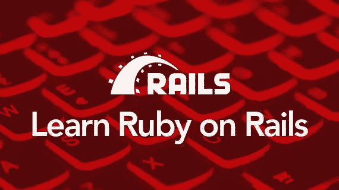

# 2020 年如何学习 Ruby on Rails？逐步指南

> 原文：<https://medium.com/quick-code/how-to-learn-ruby-on-rails-in-2020-step-by-step-guide-b53e5b9cb841?source=collection_archive---------0----------------------->

你刚刚迈出编程的第一步，就已经面临一个常见的问题:你不知道从哪里开始，先学什么。然而，您知道您想要使用什么技术:Ruby on Rails。恭喜你！你决定加入一个由志同道合者组成的充满活力的社区。

我们的 OnlineITguru 团队由致力于 Ruby 编程语言的人组成，我们愿意帮助你学习 Rails。遵循我们简单的分步指南，了解如何学习 Ruby on Rails。

# 1.Ruby on Rails 101，或者掌握初级水平

# 学习 CSS，HTML 和 JavaScript

你可能想知道为什么 CSS，HTML 和 JavaScript 总是走在一起。简单地说，HTML 构建了一个网站的内容(表格、块、图像等)。)借助标签。CSS 然后说这些网站元素应该如何显示。最后，JavaScript 使网站变得动态，因此它可以响应点击，创建密码或更改表单输入中的值。更多附加信息请访问 [**Ruby On Rails 在线培训**](https://onlineitguru.com/ruby-on-rails-online-training-placement.html)

CSS、HTML、JavaScript 是成为前端开发人员需要学习的技术。由于 Ruby on Rails 是一个全栈框架，涵盖了后端(发生在服务器上的)和前端 web 开发(发生在浏览器中的)，所以从前端基础开始很重要。

这里有一些工具可以帮助你学习前端 web 开发的基础知识:

*   Udacity 上的 HTML 和 CSS 入门课程没有遵循类似课程的结构。这个 Udacity 课程让你像一个真正的前端开发人员一样思考:你不会关注语言的语法。相反，您将学习如何一步一步地将设计模型转换成网页。更重要的是，这门课程包括了一章关于响应设计技术的内容，这在 HTML/CSS 课程中是很少教授的。
*   Codecademy 的制作网站课程在你建立第一个网站的时候教你 CSS 和 HTML 的基础知识。该课程是免费分发的，但是，您可以通过付费计划获得额外的功能。

# 先学 Ruby 再学 Rails

需要明确的是，Ruby 是一种编程语言，而 Ruby on Rails(提示:如果你只说“Rails”，你会听起来更有知识)是一个 web 应用程序框架——一个简化网站构建的预写代码的集合。Rails 扩展了 Ruby 语言，解决了日常问题，因此您不必重新发明轮子。

初学开发的人经常会想，在迁移到 Ruby on Rails 之前，是否需要先学习 Ruby 语言。我们认为你应该。我们的建议是先学 Ruby。当然，Rails 提供了开箱即用的解决方案；但是当你面对更严重的问题时，你将不得不与 Ruby 代码斗争。

学习 Ruby 的方法有很多:在线课程、书籍、视频教程，甚至导师项目。如果你想独立学习，你可能会钻研当今流行的书籍和在线课程。但是请记住:无论你如何学习 Ruby，成功的方法是实践你所学的东西。初学者的一个常见错误是获得书本知识而不实践:理论是伟大的，但如果你不能将它付诸实践，它就没有多大价值。您可以通过 [best ruby on rails 教程](https://blog.coursesity.com/best-ruby-on-rails-tutorials/)更自由地探索应用程序开发过程。

我们挑选了一些书籍和课程来帮助你学习 Ruby 的基础知识:

*   **代码学校**。Code School 是一个在线平台，在这里您可以掌握 Ruby 和其他编程语言，包括 HTML/CSS、JavaScript、Python 和. net。Code School 的突出之处在于其有趣的方法:每节课都有一个故事情节，您可以在阅读简短解释、观看视频教程和直接在浏览器中练习编码时跟随它。我们的 RubyGarage 团队推荐参加免费试用 Ruby 课程。事实上，代码学校课程是我们教育计划的一部分。自从我们在 2011 年推出以来，RubyGarage 一直在运行 Ruby/Rails 课程。我们在代码学校实施家庭作业，以使我们的学员更好地融入 Ruby/Rails 技术。
*   **克里斯·派恩《学会编程》(Ruby 系列刻面)。这是一本给编程初学者的书。从编写您的第一个单行程序到创建一个基本的视频游戏，您将在学习过程中得到仔细的指导。学习编程强调编程只能通过实践来学习。**

# 学习 Ruby on Rails

一旦你对 Ruby 了如指掌，你终于可以开始学习 Rails 了！许多开发新手都想知道，如果有其他框架，为什么还要学习 Ruby on Rails。然而，答案是明确的:由于其广泛的开箱即用功能、部署速度和可伸缩性，这个 web 应用程序框架是初创公司的完美解决方案。让我们看看哪些教育平台可以帮助你在线学习 Ruby on Rails，以及你应该阅读哪些书籍来掌握 RoR 的基础知识。

总的来说，Rails 的在线课程看起来都一样，提供的产品也一样。我们挑选了几个我们个人喜欢的平台:

*   **代码学校的 Rails for Zombies Redux** 课程。这门课程有趣的名字不应该欺骗你:你将学习 CRUD 原理、活动记录模型和 MVC 架构。这个课程是为那些已经有一些编程、web 开发和 Ruby 知识的人设计的。顺便说一下，成功完成本课程后，你将获得一枚徽章，可以放在你的简历上。
*   Codecademy 的 Learn Ruby on Rails 课程是为初级程序员设计的。Codecademy 是一个学习技能的平台，你可以在完成一门课程后直接应用到现实生活中。在 Codecademy，你将学习如何构建一个类似 Flipboard 的主页，以及如何使用 Git 管理你的代码版本，还有其他许多有用的技能。Codecademy 课程将理论与浏览器内的模拟器结合起来练习编码。一个小提示:阅读参考资料时做笔记有助于你记住信息。

我们还挑选了一些我们的 Ruby/Rails 开发人员喜爱和推荐的书籍。

 [## Ruby on Rails 面试问答- 2019 | OnlineITGuru

### 你是正确的地方，如果你正在寻找 Ruby on Rails 面试问题和答案，获得更多的信心来破解…

onlineitguru.com](https://onlineitguru.com/interviewquestions/ruby-on-rails-interview-questions) 

*   **Sam Ruby，戴维·托马斯和 David Heinemeier Hansson 的《使用 Rails 4 进行敏捷 Web 开发》。**这是基础知识的终极指南，包括 Rails 安装和架构(模型、视图和控制器)。在按照本书的实用部分创建自己的第一个店面之前，您还将学习一点 Ruby。*敏捷 Web 开发*的复杂性在整本书中逐渐增加。这本书的实践方法是由故事驱动的章节，迭代练习和手把手的叙述支持的。
*   Michael Hartl 的 Ruby on Rails 教程。许多 Ruby/Rails 开发人员承认，他们只是通过学习 Michael Hartl 的 Rails 教程来学习 Rails。这本书牵着你的手，引导你完成 web 开发的整个周期:从编码最佳实践到编写测试。所有章节都与练习捆绑在一起，练习你刚刚学到的东西；主要项目是一个类似 Twitter 的应用程序。

# 给自己找一个 Ruby on Rails 导师

给自己找一个导师可能是学习 Ruby on Rails 的最好方法..首先，有人在你身边，可以解释困难的概念，审查你的代码，并指导你找到更好的解决方案，从而加快你的学习过程。第二，导师是支持的来源，他不会让你在某个问题上绊倒，也不会让你重蹈导师的覆辙。我们 RubyGarage 已经在我们的团队中发展了一种导师文化，以在初级和高级开发人员之间建立更密切的关系，并加速学习。

# 2.提升你的技能:Ruby/Rails 中级

在你学习了 Ruby/Rails 的基础知识之后，你可能会想更进一步，构建更复杂的应用程序，包括数据的导入/导出、公共/私有 API 和管理面板的实现。以下是帮助您实现这一目标的一些资源:

# 成为雄心勃勃的卢布主义者

你不要低估书籍在学习编程中的作用。尽管技术发展迅速，但好的编程书籍与时俱进，并在新版本和更新后更新。为了不迷失在众多关于 Ruby 和 Rails 的书籍中，我们为您挑选了一些特别好的资源。这里有几本书包含了关于 Ruby 扩展特性的信息，供优秀的 Ruby 爱好者阅读:

*   David A.Black 的《扎实的 Rubyist 》(第二版)这本书假定你有一些编程背景，但是，你可以在阅读的时候研究一些不熟悉的概念。从第一页到最后一页，Black 向您介绍了面向对象的编程方法。对于更有经验的开发人员来说，这本书是一个有价值的参考；初学 Ruby 的人可以从学习基础知识(安装 Ruby)到更高级、更动态的 Ruby 特性有一个很好的开始。
*   **David Flanagan 和 Yukihiro Matsumoto 开发的 Ruby 编程语言。**这本书来自 Ruby 的创作者 Yukihiro Matsumoto 和 JavaScript/Java 开发者 David Flanagan，是一本必读的书。在开始阅读之前，请确保您已经有了一些编程经验。这本书没有提供练习，这可能会让一些读者失望。总的来说，这是一本结构良好的参考书，涵盖了与 Ruby 相关的所有内容。

# 练习 Ruby on Rails

熟能生巧。开始时，您将学习 Ruby 的语法并遵循预先编写的案例。但是随着你成为一名 Rubyist，你需要把你学到的东西付诸实践。

为了加深你的知识，我们推荐阅读奥比·费尔南德斯的【T4 铁路 4 道】。这本所谓的 Rails 开发人员“圣经”以参考书的形式出现，当你对某个主题有任何疑问时，你都可以参考。在这里你可以找到关于 Rails 核心的任何问题的答案。读者还标记出深入的叙述，并侧重于关于宝石和流程优化的实用章节。

# 加入 Ruby/Rails 社区

别忘了 Ruby/Rails 有一个最友好、最有活力的社区！不要错过加入一群分享见解和支持你的人的机会。这里有一些有用的资源，可以帮助你联系 Ruby/Rails 社区:

*   StackOverflow 和 Quora。StackOverflow 面向所有类型的开发人员:在这里，您可以提出任何与软件开发主题相关的问题，并得到热情的回应。另一方面，Quora 是一个分享不同领域见解的平台。在 Quora 上，你可以问一些技术问题，也可以问一些不太复杂的问题，比如你应该学习哪种编程语言。
*   Ruby on Rails 链接:Rails Slack 社区。 Slack 是一个非常受团队欢迎的信使。通过加入一个 Slack 团队，你可以很容易地与一大群狂热于 Rails 的人交流！松弛对话被组织成包括前端、编码和工作(对于那些正在找工作的人)的主题。
*   **GitHub** 。加入 GitHub 上的现有项目来完善您的技能，与他人联系，并在创建真正的软件时获得宝贵的经验。即使您不能编写长串代码，您也可以通过修复或修复来为项目做出贡献。如果您有兴趣了解更多关于 GitHub 及其优势的信息，请阅读我们关于开源项目及其在开发人员生活中的作用的文章。

# 3.高级 Ruby/Rails——还有很长的路要走！

一旦你学会了 Ruby 和 Rails 的基础知识，你还有很多工作要做。构建自己的应用程序以获得尽可能多的经验很重要；犯错误并学会如何改正；迷失在概念中，寻找解决方案。一个鼓舞人心的例子是詹妮弗·德瓦尔特，她在 180 天内建立了 180 个网站:每当你认为你要放弃的时候，想想她难以置信的渴望。

要深入了解 Ruby，请注册参加 [**Ruby 认证**](https://onlineitguru.com/ruby-on-rails-online-training-placement.html) 的现场免费演示

一旦你开始写你自己的代码，提高你的输出是很重要的。注意编码最佳实践，包括*干*(不要重复自己)、*吻*(保持简单，愚蠢)和 *YAGNI* (你不会需要它)，它们允许你编写可维护的代码，并防止你重新发明轮子和添加镀金(不必要的额外功能)。

将来，你可能会作为团队的一员来构建 web 应用程序。这就是为什么学习 Git 是必不可少的——一个版本控制系统，用来维护你的代码，保存最新版本。Git 是一种有用的编程实践，因为它可以帮助您备份对代码的更改并监控您的工作进度。

# 结论

学习如何编码是具有挑战性的，尽管你可以找到大量的资源，这些资源都是用勤奋和热情精心制作的。我们分享了我们个人喜欢的书籍和网站，并推荐给个人学习。但是无论选择什么学习方法，都要记得将理论付诸实践，并得到更有经验的开发者的支持。不要问自己学 Ruby on Rails 要多久；定一个目标，尽全力去实现就好了。祝你好运！