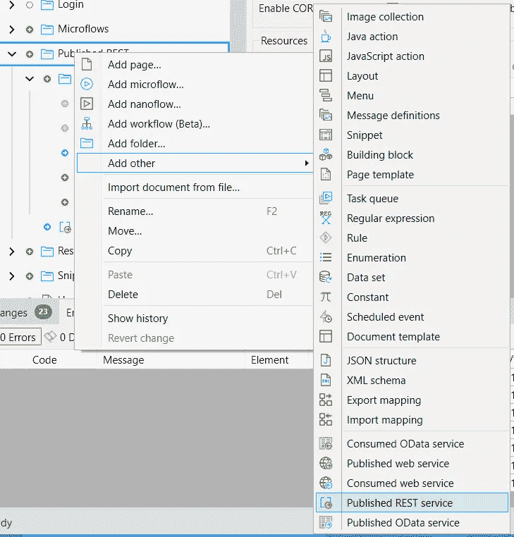

# 如何用 Mendix 制作一个 Slack bot

> 原文：<https://medium.com/mendix/how-to-make-a-slack-bot-with-mendix-781353dfee7?source=collection_archive---------1----------------------->


# 使用 Slack REST API 和 Mendix 发布的 REST 服务。

> 大家好，欢迎。作为一名为 Mendix 工作的开发人员传播者，我在这里的大部分职责是花大量时间监控 Mendix 社区 Slack 频道([点击这里！](https://bit.ly/MxCommunitySlack))。
> 
> 自然地，我们在工作空间中安装了一些令人惊讶的工具，这让我思考——制作一个 Slack bot 到底需要什么，单独使用 Mendix 能完成吗？

在网上搜索后，我发现每个例子都极其复杂，需要大量的 Java、Python 或 Javascript 编码技能。虽然我可以沿着这条路走下去，但我致力于用低代码的方式来做这件事。我很高兴我坚持下来了，因为我现在可以告诉你们所有人，这实际上是多么容易，你们所有人也可以使用 Mendix 制作一个 Slack bot，而不用其他任何东西！

# 我们今天做什么？

在本教程中，我们将制作一个 Slack 机器人，它可以使用 RESTful api 发送消息。它还将订阅频道内的事件，因此机器人将能够回复频道中发送的提及或某些关键字。

# 入门指南

在我们开始之前，请确保您注册了 Slack，并有一个 Slack 工作区设置，通过一个通道，您也可以添加机器人。此外，由于 Slack 会向你的应用程序发布的 REST 服务发布消息，为了在开发过程中在本地测试你的应用程序，我建议使用隧道工具将你的本地主机暴露给 web(为此我使用了 [NGROK](https://ngrok.com/) )。

# 在空闲时设置 bot

要开始，你可以去 https://api.slack.com/apps?new_classic_app=1 的[点击**创建新应用**。](https://api.slack.com/apps?new_classic_app=1)


从头开始选择**，给你的机器人起个名字，我要新建一个，叫它 message bot。选择您为此创建的 Slack 工作区以在其中开发您的应用程序，然后单击“**创建应用程序**”。**

****

**一旦创建了您的应用程序，您就可以转到“ **OAuth and permissions** ”，我们这里需要的是我们的 bot 的令牌，因此在“**OAuth Tokens for Your Workspace”**下，单击**“Install to workplace”。现在它会说我们需要为我们的机器人添加一个范围。沿着页面往下走，你会看到一个标题为“ **Bot token Scope** ”的部分。这就是我们需要的，所以点击**添加 OAuth 范围**，我们想要的是 **Chat:write，**或者对于**公共频道**你可以添加 **Chat:write.public** 。****

****

**这将允许机器人在聊天中实际发布消息。现在，根据你要做的事情，你可能需要添加其他作用域，所以如果你遇到任何错误，看看这些，你应该能够找出你希望机器人做的动作所需的作用域。**

**现在回到 OAuth，再次点击**“安装到工作区”**。然后单击 allow，它将为您生成一个 bot 令牌。**

**如果它以“ **xoxb** -Your_Token_Vaue”开头，你就会知道它是一个机器人令牌。**

****

**一旦你有了它，我们就可以用它和通道 ID 一起向作为机器人的通道发送消息。为此，我准备了一个简单的应用程序，我将在这里添加一个方法，使用 Slack 的 API 作为机器人发送消息**

# **作为机器人发送消息**

**这个版本可以在几乎所有能够使用 HTTP 方法或 REST 调用的传统编程栈(Java、JavaScript、Python 等)中工作——在开始开发应用之前，你甚至可以在 [Postman](https://www.postman.com/) 中试用它。我们需要做的就是用 Slack 为我们的应用程序创建一个认证系统，然后我们需要集成发布消息的 API，然后我们需要发布一个 REST 端点，Slack 可以为通道中的事件发布消息**

> **事件可以是消息、反应、渠道中的提及等等，可以把松弛事件看作类似于一个网络钩子**

**要将您的消息发送到服务，您必须提供服务的端点。在这种情况下，它是[https://slack.com/api/chat.postMessage](https://slack.com/api/chat.postMessage)**

**因为端点将 HTTP 方法的类型描述为 POST，所以我们需要确保在这里也使用 POST。**

****

**你还需要一些标题。我们想为**内容类型**添加一个头，这需要是'**应用程序/json'** 。接下来，我们需要另一个名为 **Authorization** 的头，这是我们可以使用之前获得的 bot 令牌的地方。您希望这个头的值是' **Bearer'** ，然后是一个**空格' '**，然后是您的**令牌值**。**

****

**现在，要发送消息，我们必须为此提供一个 JSON 主体，因为这是一个 POST HTTP 方法。这里有一个我们将要使用的简化结构，你可以在这里查看完整的 API 文档页面[。](https://api.slack.com/methods/chat.postMessage)**

```
{
  “channel”:”{1}”,
  “text”:”{2}”
}
```

****

> **请注意，在 Studio Pro 中，您可能需要在请求前提供一个额外的花括号。**

**这个请求已经被精简到最基本的部分——它只有 channel 和 text，channel 是一个字符串，text 也是一个字符串。还有很多其他的选项可以使用，比如附件和图标，还有很多其他很酷的东西。所以去看看文档页面，玩玩吧。您可以看到我在这里使用了占位符，只是使用标准的 Mendix REST 动作将我的值从微流传递到请求中。**

**它确实会向我们发送一个响应，但我不会在这里处理它，相反，你可以运行你的应用程序并测试它，如果成功，当你调用这个微流时，你应该会在通道中看到一条消息！**

**要测试消息发送，您需要您的通道 ID，它可以从 Slack 通道的 URL 中获得(通道 URL 中最后一个'/'之后的最后一个值)，然后您可以将您的第一条消息作为 bot 发送！请记住，您需要首先确保您的机器人被添加到频道中，要做到这一点，只需在频道中使用 bots @ reference 并添加它们。**

**你的消息现在应该从你的 Mendix 应用程序发送到 Slack，并出现在频道中，就好像是机器人发送的一样，只要你运行这个微流。**

# **为您的应用订阅频道中的活动**

**为了让 Slack 向我们的 Mendix 应用程序发布消息，我们需要在 Slack bot 的设置中启用事件。通过启用该功能，Slack 将对我们应用程序发布的 REST 服务进行更新。我们可以使用它来实现逻辑，以处理用户在使用通道时可能触发的不同类型的事件。您可以订阅特定的事件，为此您可以设置特定的端点，或者您可以将所有更新发布到同一个端点，并构建您自己的逻辑来处理每个独特的事件。例如，当有人对消息作出反应或当新用户加入频道时，可以让机器人做一些事情。对于我的构建，我只添加了一个事件端点，然后处理由我的 Mendix 应用程序中发布的 REST 服务调用的微流中的所有逻辑。**

**为此，请访问 api.slack.com 的“活动订阅|”。**

****

**将“启用事件”打开，您将看到一个请求 URL 字段。这就是我们需要使用我之前提到的工具打开隧道的地方。NGROK 工具从您的本地主机打开一个安全连接，并以一种安全的方式将它作为一个可用的端点公开给 web。**

**打开你的文件浏览器，找到你下载的 ngrok.exe 文件。现在，在您的终端或命令提示符下打开这个 exe。你也可以点击打开 exe 文件在你的终端中打开它。然后键入“**ngrok http { YOUR Mendix app PORT NUMBER }**”，我通常使用端口 8080 作为我的默认 MENDIX APP 配置，但这将使用您喜欢的任何端口号，例如“ **ngrok http 5000** ”将工作，只要您的 MENDIX APP 也被设置为在端口 5000 上运行。**

****

**按 enter 键，ngrok 将打开端点，您应该会看到类似这样的内容:**

****

**你应该知道这同时开放了 HTTP 和 HTTPS 端点，Slack 需要使用 HTTPS。**

# **在 Mendix 中处理事件**

**我们现在有了一个可以在 Slack 中使用的活动端点，但是我们需要在设置好发布的 REST 服务之后再回到这个问题上来。**

**切换回 Studio Pro，在项目浏览器中右键单击并选择在“Other”下添加一个已发布的 REST 服务。**

****

**给你的服务起一个名字，我把我的命名为“SlackBot”，然后点击 OK**

****

**接下来，向名为“SlackEvent”的服务添加一个资源，并单击 OK**

****

**然后向服务添加操作，这是我们定义 API 方法(GET、POST、PUT、PATCH、DELETE)的地方，配置它自己的操作路径，并配置微流来处理端点的逻辑。**

**不需要设置操作路径，默认情况下，端点类似于:**

## **[http://{ LocalHost }/rest/{服务名称}/{版本号}/{资源名称}/{操作路径}](http://%7BLocalHost%7D/rest/%7BService_Name%7D/%7BVersion_Number%7D/%7BResource_Name%7D/%7BOperation_Path%7D)**

**以下是如何设置操作的示例:**

****

**我们现在有了一个可以接受请求的有效 URL，但是在我们可以处理每一种事件类型之前还有更多工作要做…..认证。**

# **证明**

**开始的时候我有点困惑，但是实际上很简单。当我们在 Slack 中添加事件端点时，他们的 api 将向端点发送一个质询，其请求正文中包含“质询”值，如下所示:**

```
{
  "token":"your_token",
  "challenge":"your_ChallangeValue",
  "type":"url_verification"
}
```

**您所要做的就是在流程开始时，第一次调用它时，将这个挑战字符串发送回给他们**

****

# **为 Slack 中的事件设置 RequestURL**

**如果一切都是正确的，我们可以制定一个 URL，我们可以添加到 Slack Events 订阅页面。URL 应该是您的 NGROK https 端点的组合，其余的将是您发布的服务的服务端点。**

## **大概是:[https://{ NGROK _ HTTPS _ URL }/{ Your _ Published _ Rest _ Operation }](/mendix/{NGROK_HTTPS_URL}/{Your_Published_Rest_Operation})**

**这是我的最后的样子:**

**[https://ff98-86-181-134-55 . ngrok . io/rest/slack bot/v1/slack Event/Event](https://ff98-86-181-134-55.ngrok.io/rest/slackbot/v1/SlackEvent/Event)**

**请记住，NGROK 仅用于开发，因此它将每 2 小时超时一次，此后，您必须为您的本地主机生成一个新的 URL。一旦投入生产，就不再需要这个了，你可以直接使用你的云 URL。**

**您可以在事件页面上将该值设置为请求 URL。如果你成功了，Slack 会告诉你它已经验证了终点。**

****

**如果出现问题，您可以正常调试您的微流，设置您的 **REST 消耗**和 **REST 发布**日志级别也可能有助于通过控制台让您更深入地了解发生了什么问题。**

****

**在你可以定制你的机器人动作之前，我们需要处理的最后一件事是确保它能够识别自己，否则你可以创建一个无限循环，机器人可以在它向群组发布消息时触发自己，如果我们不过滤掉它自己在频道中的活动。**

**为此，我们必须导入请求有效负载 Slack 提供我们的应用程序的 REST 服务。有效载荷将如下所示:**

```
{ "token":"dKyT4vmA1NJLt6vq8o1WurMd",
 "team_id":"T02LUP42T19",
 "api_app_id":"A02MJE1059N",
 "event":{
   "bot_id":"B02NK4L1XHN",
   "type":"message",
   "text":"Hello from Mendix",
   "user":"U02MEPHFY2K",
   "ts":"1637273612.003700",
   "team":"T02LUP42T19",
   "bot_profile":{
    "id":"B02NK4L1XHN",
    "deleted":false,
    "name":"message bot",
    "updated":1637253238,
    "app_id":"A02MEP8D37Z",
    "icons":{
     "image_36":"[https://a.slack-edge.com/80588/img/plugins/app/bot_36.png](https://a.slack-edge.com/80588/img/plugins/app/bot_36.png)",
     "image_48":"[https://a.slack-edge.com/80588/img/plugins/app/bot_48.png](https://a.slack-edge.com/80588/img/plugins/app/bot_48.png)",
     "image_72":"[https://a.slack-edge.com/80588/img/plugins/app/service_72.png](https://a.slack-edge.com/80588/img/plugins/app/service_72.png)"
       },
      "team_id":"T02LUP42T19"
     },
    "channel":"C02LRPR0XGD",
    "event_ts":"1637273612.003700",
    "channel_type":"channel"
   },
   "type":"event_callback",
   "event_id":"Ev02MGFCNHP1",
   "event_time":1637273612,
   "authorizations":[
    {
     "enterprise_id":null,
     "team_id":"T02LUP42T19",
     "user_id":"U02LUPJ8T4J",
     "is_bot":true,
     "is_enterprise_install":false
    }
  ],
  "is_ext_shared_channel":false,
  "event_context":"4-eyJldCI6Im1lc3NhZ2UiLCJ0aWQiOiJUMDJMVVA0MlQxOSIsImFpZCI6IkEwMk1KRTEwNTlOIiwiY2lkIjoiQzAyTFJQUjBYR0QifQ"
}
```

**创建一个 JSON 结构，粘贴到 JSON 中，在结构部分点击 R **efresh** ，然后点击 OK 关闭窗口。**

****

**接下来创建一个导入映射，并在 Schema source 下选择您创建的 JSON 结构。确保选择所有字段以获得您想要的所有详细信息，或者挑选您需要的信息。**

****

**点击确定关闭窗口，然后在映射编辑器的左上方选择“自动映射”。**

****

**您现在应该会看到类似这样的内容:**

****

**最后，使用这个映射来导入 HTTPRequest，并添加一个检查来查看发布消息的用户是否是一个机器人，如果是，则什么也不做并返回空值。**

****

**你现在可以自由地处理任何事件，以任何你希望的方式。我对此的快速方法是使用**包含**和**查找**关键字来检查消息的内容。这种方法允许您添加任意多的独占分割，通过这样做，您可以在微流中创建一个对话树，这是一种简单的方法(但是您可以进一步将每个响应存储在数据库中，这将使这种设置在运行时可配置)。要发送这个响应，只需重用我们之前用来发送测试消息的 postMessage API。**

**我的例子看起来是这样的**

****

# **斜线命令**

**斜杠命令到底是什么？简单地说，它们类似于网钩。当用户输入带有斜杠“/”的某个关键字(在 Slack 中设置)时，Slack 会将更新推送到唯一的端点。**

**这确实是事件和斜杠命令的最大区别。简单地在您发布的 REST 服务上添加一个新方法，对于我的例子，我保持简单。当用户键入/ping 时，机器人将响应 pong。我知道有一点“你好，世界”，但我主要是在这里玩。**

**添加一个新的端点，并为操作路径输入 Ping，这也是一个 POST 方法。**

****

**然后在处理逻辑的微流中，只需将响应的内容属性设置为‘Pong’。**

****

**最后，在 Slack 中，转到左边菜单中的斜杠命令，然后单击“创建新命令”**

****

**您的端点将再次是来自 **NGROK** 的 URL 和您的 HTTP 方法的 **URL 的组合。****

****

# **全部完成**

**恭喜，你一路过关斩将。您现在可以测试您的应用程序并了解您的机器人！不要忘记，您必须将您的 bot 添加到 Slack 通道，以便它们将更新发送到事件端点。只需在 Slack 中发送@YourBotName，它就会要求为您添加机器人。因为 Slack 的 API 有很多其他的特性可以使用，如果你想要更具体的东西，请告诉我。**

**在你走之前，这是我和我的机器人的简短对话-**

****

**编码快乐！**

# **阅读更多**

**[](https://api.slack.com/start) [## 开始你的旅程

### Slack 平台的最佳实践和指南 Slack 平台让您扩展、扩充和自动化您的…

api.slack.com](https://api.slack.com/start) [](https://api.slack.com/authentication) [## 证明

### Slack 平台的安装、权限和用户安全框架

api.slack.com](https://api.slack.com/authentication) [](https://api.slack.com/messaging) [## 信息发送

### 在整个空闲时间内发送、检索、更新、删除消息

api.slack.com](https://api.slack.com/messaging) [](https://api.slack.com/interactivity/slash-commands) [## 启用斜线命令的交互性

### 斜线命令允许用户通过在消息编辑器框中键入字符串来调用您的应用程序。提交的斜线…

api.slack.com](https://api.slack.com/interactivity/slash-commands) 

*来自发布者-*

*如果你喜欢这篇文章，你可以在我们的* [*中页*](https://medium.com/mendix) *找到更多喜欢的。对于精彩的视频和直播会话，您可以前往*[*MxLive*](https://www.mendix.com/live/)*或我们的社区*[*Youtube PAG*](https://www.youtube.com/c/MendixCommunity/community)*e .*

*希望入门的创客，可以注册一个* [*免费账号*](https://signup.mendix.com/link/signup/?source=direct) *，通过我们的* [*学苑*](https://academy.mendix.com/link/home) *获得即时学习。*

有兴趣加入我们的社区吗？你可以加入我们的 [*Slack 社区频道*](https://join.slack.com/t/mendixcommunity/shared_invite/zt-hwhwkcxu-~59ywyjqHlUHXmrw5heqpQ) *或者想更多参与的人，看看加入我们的*[*Meet ups*](https://developers.mendix.com/meetups/#meetupsNearYou)*。***