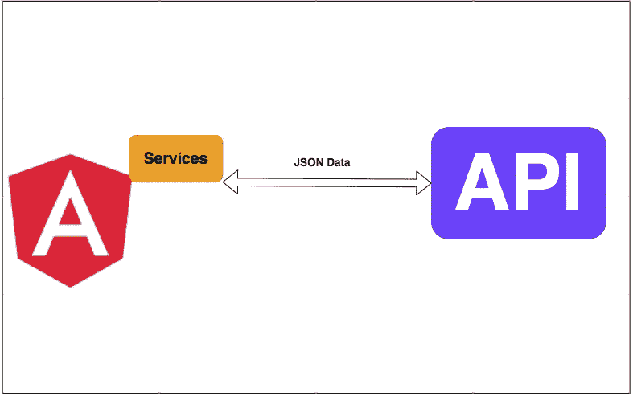

# 如何在 Angular 应用中进行 API 调用

> 原文：<https://medium.com/bb-tutorials-and-thoughts/how-to-make-api-calls-in-angular-applications-ab5364cf9533?source=collection_archive---------0----------------------->

## 带有示例项目的初学者指南

在 web 应用程序中，您在页面上显示的所有数据都应该驻留在某个地方，例如，缓存、数据库、存储帐户等。您需要从不同的来源获取数据，进行一些处理，然后在 UI 上呈现数据。所有的数据现在和大多数时候都可以通过 API 访问…