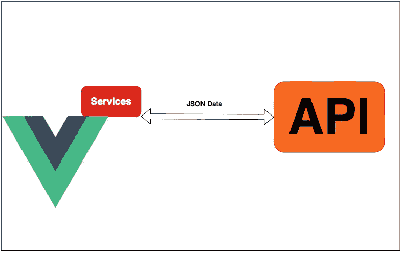

# 如何在 Vue 中进行 API 调用？JS 应用程序

> 原文：<https://medium.com/bb-tutorials-and-thoughts/how-to-make-api-calls-in-vue-js-applications-43e017d4dc86?source=collection_archive---------0----------------------->

## 包含 Fetch 和 Axios APIs 的初学者指南

在 web 应用程序中，您在页面上显示的所有数据都应该驻留在某个地方，例如，缓存、数据库、存储帐户等。您需要从不同的来源获取数据，进行一些处理，然后在 UI 上呈现数据。现在所有的数据都可以通过 API 访问，而且大多数…