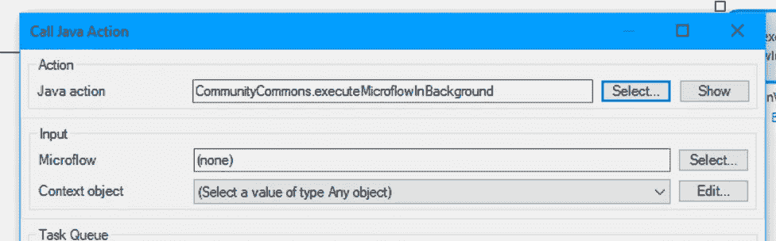
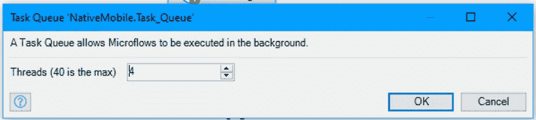
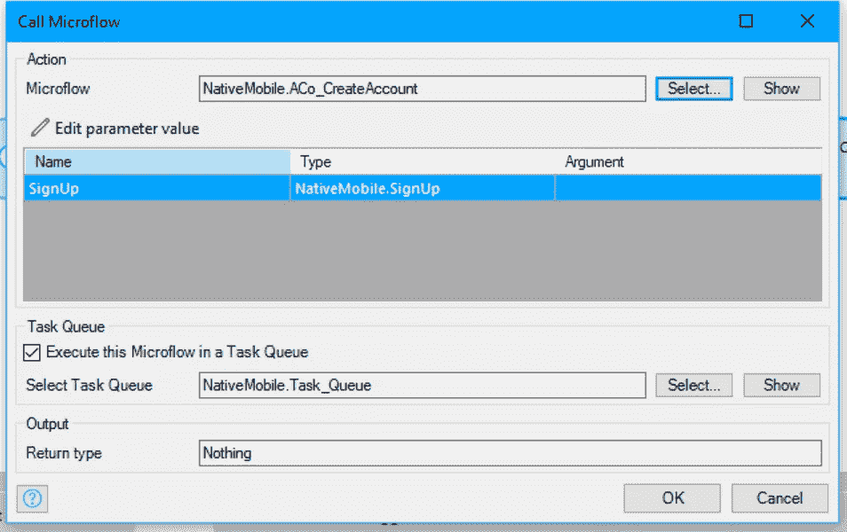

# 如何在 Mendix 9 中让应用多线程化

> 原文：<https://medium.com/mendix/how-to-make-apps-multithreaded-in-mendix-9-ebc1f3a16087?source=collection_archive---------4----------------------->

How to Make Apps Multithreaded in Mendix 9

> 在计算机体系结构中，多线程是中央处理器(CPU)(或多核处理器中的单核)在操作系统的支持下同时提供多个执行线程的能力——[**维基**](https://en.wikipedia.org/wiki/Multithreading_(computer_architecture)) **。**

简单吧？开玩笑的。如果你和我一样，这可能会让你在理解之前多读几遍。为了解释多线程，我通常使用人脑的类比。你一次只能做一件事，对吗？但是，你怎么能同时说话和走路呢？你的大脑不想让你每次说话都停下来，所以它会划分资源，同时做这两项工作。这就是多线程。

如今，云计算允许应用程序划分它们的处理时间(大脑)，同时运行多个动作(比如走路和说话)。

# 如何让我的 Mendix App 使用多线程？

让你的 app 多线程化最简单快捷的方法就是从市场上下载 Community Commons 函数库，使用**executefilowinbackground****Java action**。为此，从微流中调用 Java 动作。该操作需要两个参数才能工作:一个上下文对象(可以为空)和您想要调用的微流的名称。

这是对任何长时间运行的进程的快速修复，这些进程可以在主进程完成时在后台完成。

另一个选择是使用**流程队列模块，**也可以在市场上买到。随着 Mendix 9 的发布，这变得简单多了。现在 Studio Pro 已经内置了任务队列，开箱即用。任务队列是基于进程队列模块的，但是现在为了开发时的简单性，它本身包含在 Studio pro 中。

[https://bit.ly/MXW21](https://bit.ly/MXW21)

# 如何使用任务队列

这可以通过几个步骤完成:

1.  右键单击项目浏览器中的模块或文件夹。
2.  选择**添加其他**。
3.  点击**任务队列**。
4.  输入**螺纹数量的值。**

仅此而已，真的。现在，无论何时您在另一个微流中调用一个微流或 Java 动作，您都可以选择在任务队列中执行它们。如果选中该框，您将能够选择之前创建的队列。当这个微流被调用时，它将在自己单独的线程中执行。

# 要记住的事情

*   线程是按顺序进程 FIFO(先进先出)执行的，但这并不意味着它们会按任何特定的顺序执行。这意味着您永远无法确定微流将以特定的顺序执行，所以要确保没有线程依赖于另一个线程的结果。
*   您可以使用的唯一参数类型是布尔值、整数/长整型、小数、字符串、日期和时间、枚举和提交的持久实体。
*   线程将以系统级权限执行，因此您不能在线程的逻辑中应用用户上下文。
*   一个线程只有在调用完成后才会启动。这意味着它只会在您创建线程的微流或 Java 操作完成后触发。这是因为不可能在一个事务的中间创建一个新线程。
*   单个节点上的单个节点的最大线程数是 40。
*   添加的线程越多，服务器的负载就越大。通常两个或三个线程就足够了。
*   一个名为 Queue 的[日志节点](https://docs.mendix.com/refguide/logging#mendix-nodes)专门用于与任务队列相关的所有事情。
*   市场上有一个[任务队列助手](https://marketplace.mendix.com/link/component/117272)模块，其中包含用于监控队列的页面和概述。

## 阅读更多

 [## Mendix World 2021 |召集您的应用开发团队 2021 年 9 月 7 日至 9 日

### 好像你需要说服…在一个全球制造商社区，他们想通过探索什么来相互学习…

bit.ly](https://bit.ly/MXW21)  [## 曲目|门迪克斯世界 2021

### 在今年 Mendix World 开幕之前，手工制作您的议程。浏览专为您量身定制的 8 个专题讲座中的 85 个以上专题讲座…

www.mendix.com](https://www.mendix.com/mendix-world/tracks/) 

*   【https://docs.mendix.com/refguide/task-queue#3-monitoring 
*   [https://docs.mendix.com/appstore/modules/process-queue](https://docs.mendix.com/appstore/modules/process-queue)
*   [https://docs.mendix.com/refguide/task-queue#process-queue](https://docs.mendix.com/refguide/task-queue#process-queue)

*来自发布者-*

*如果你喜欢这篇文章，你可以在我们的* [*媒体页面*](https://medium.com/mendix) *或者我们自己的* [*社区博客网站*](https://developers.mendix.com/community-blog/) *找到更多喜欢的。*

*对于希望入门的创客，您可以注册一个* [*免费账户*](https://signup.mendix.com/link/signup/?source=direct) *，并通过我们的* [*学院*](https://academy.mendix.com/link/home) *获得即时学习。*

*有兴趣加入我们的社区吗？你可以加入我们的* [*懈怠社区频道*](https://join.slack.com/t/mendixcommunity/shared_invite/zt-hwhwkcxu-~59ywyjqHlUHXmrw5heqpQ) *或者想更多参与的人，看看加入我们的* [*遇见 ups*](https://developers.mendix.com/meetups/#meetupsNearYou) *。*