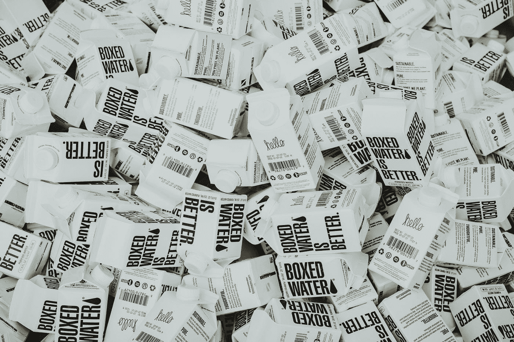
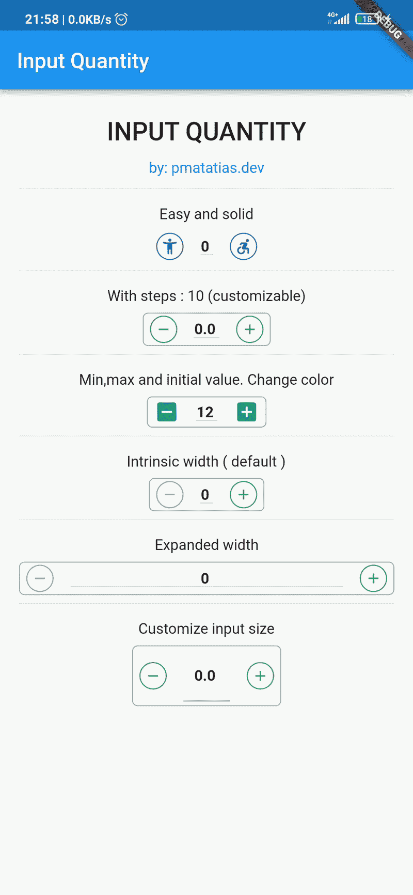
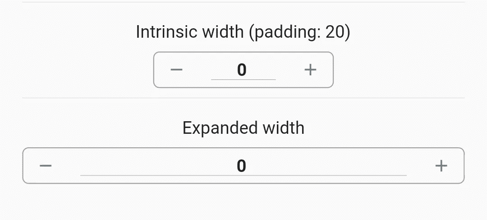

# 如何在 Flutter App 中进行数量输入

> 原文：<https://medium.easyread.co/how-to-make-quantity-input-in-flutter-app-efe0b6f9acc0?source=collection_archive---------2----------------------->

## 一个用 TextFormField 构建的 flutter 小部件，用于数量输入。



Photo by [Clay Banks](https://unsplash.com/@claybanks?utm_source=medium&utm_medium=referral) on [Unsplash](https://unsplash.com?utm_source=medium&utm_medium=referral)

你用过电商 app 吗？当您将商品添加到购物车时，您会发现一个数量输入小部件，用于输入您想要购买的商品。创建一个带有增加项目的加号按钮和减少项目的减号按钮的小部件是很容易的。最后，我们添加一个文本小部件来显示商品的数量。是的，我们现在有了数量输入。

> 但是如果用户需要输入 16723 个条目呢？

是的...这是一个随机数，但很有可能发生。在这种情况下，用按钮添加数字是低效的，因为数字太大，也不是倍数。所以，我们不能应用这些步骤来达到这个目的。如果你想为此创建一个定制的小部件，它将需要一些非常复杂的函数。但是在“[**pub . dev**](https://pub.dev/publishers/pmatatias.dev/packages)**”**即 [**input_quantity**](https://pub.dev/packages/input_quantity) 中有一个已经开发并开源的包。

在本文中，我们将探讨颤振中的**输入量包。**我们将看到如何实现小部件，并探索包内的功能。我们将知道它如何帮助我们创建一个用于数量输入的小部件。

> ***目录***

> *-介绍
> -实施
> -更深层次的实施
> -结论*

[](https://pub.dev/packages/input_quantity) [## 输入 _ 数量|颤振包

### 用于数量输入的 Flutter 小部件。按下按钮增加或减少输入值。用文本栏构建…

公共开发](https://pub.dev/packages/input_quantity) 

## 介绍

输入数量包是一个用于输入数量的 flutter 小部件。这个小部件是用 TextFormField 构建的，所以用户可以手动输入他们想要输入的条目数。这些软件包提供了一些功能:

*   简单易用
*   光标会自动向右移动，以获得更好的用户体验
*   设置最大值、最小值和初始值
*   用 **ChangeNotifier** 开发，以避免每次值改变时重新构建小部件。
*   使用这些步骤来更改按下的每个键
*   大小是固有的和可扩展的，这意味着小部件的大小可以设置得尽可能小，或者设置为扩展以填充可用空间

## 履行

像 *pub.dev* 中的所有包一样，首先，我们需要将包添加到 *pubspec.yaml* 文件的依赖项中。

```
$ flutter pub add input_quantity
```

在这个包被添加到你的 *pubspec.yaml* 之后，如下图所示，接下来你可以在你的 flutter 应用中使用它作为一个组件部件。

```
dependencies:
  input_quantity: ^any
```

最后，您只需要导入包并在 StatefullWidget 或 StatelessWidget 中的任何地方使用它们。这里有一个简单的例子


Simple input qty

> 从上图可以看出，初始值是一个带小数点的数字。这是因为我们将 **initVal** = 0.0。如果想用整数表示，可以设置 **initVal** = 0。double 和 int 都被接受，因为 InputQty 使用 num 作为 *runType* 。

在我们进入更深层次的实现之前，我们需要知道这个包提供的属性。

InputQty 中有一些属性和参数:

*   *num*maxVal:最大值输入。默认情况下**maxVal**=*num . max finite*
*   *num*initVal:初始值。默认 **initVal = 0**
*   *num*minVal:最小值。也可以设置负数。默认 **minVal = 0。**
*   *num*步骤:按钮按下时增加/减少数值的数字。默认**步数= 1**
*   *所需的无效功能(编号？)* **onQtyChanged:** 函数捕捉小部件中的每一个变化。你会得到 num？此函数的值。您可能需要将其转换为所需的数据类型。例如:value.toInt()或 value.toDouble()。
*   *bool***is intrinsicwidth:**这将影响 textfield 的宽度。默认情况下为 true，textfield 将用 intrinsictWidth 小部件包装。如果将其设置为 true，那么 InputQty 将扩展到可用空间。
*   *输入解码*？ **textFieldDecoration:** 输入用于装饰文本字段的说明。

## **更深层次的实现**

> 我想改变按钮和文本之间的距离

如果设置 **isIntrinsicWidth = false，**文本字段将占用最大的可用空间。并且按钮会自动放置在 textfield 之间的空间中。

但是如果您希望宽度仍然是固有的大小，可以将 padding 设置为 InputDecoration。像下面这样:



Example result

> 你还想用 InputQty 小部件实现另一件事吗？

欢迎在下方留言评论。或者你可以在 GitHub 上提出问题。

[](https://github.com/pmatatias/input-quantity/issues) [## 发放数据/输入数量

### 关于这个项目有问题吗？注册一个免费的 GitHub 账户来开一期并联系它的…

github.com](https://github.com/pmatatias/input-quantity/issues) 

## 结论

数量输入用于从用户处获取物品的数量。当太大时，使用按钮来增加或减少值是没有效率的。为了更好的用户体验，我们需要一个手动类型的小部件。InputQuantity 包是实现这一功能的一个简单的解决方案。

## 请自行尝试，节省从头开发输入量的时间。请随意提出[问题](https://github.com/pmatatias/input-quantity/issues)或打开 PR 为这个包做贡献。

[](http://pub.dev/packages/input_quantity) [## 输入 _ 数量|颤振包

### 用于数量输入的 Flutter 小部件。按下按钮增加或减少输入值。用文本栏构建…

公共开发](http://pub.dev/packages/input_quantity) 

感谢您的阅读。