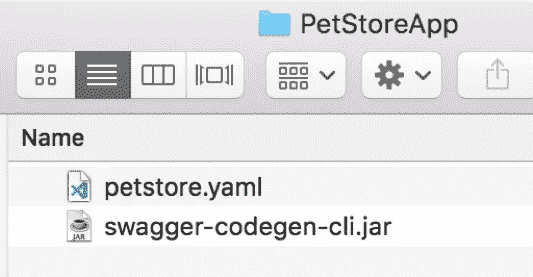
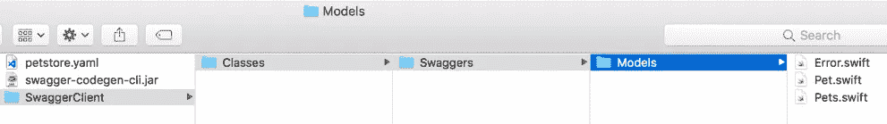

# 如何让 Swagger Codegen 为您的团队工作

> 原文：<https://medium.com/capital-one-tech/how-to-make-swagger-codegen-work-for-your-team-32194f7d97e4?source=collection_archive---------1----------------------->


Swagger Codegen，开源 API 客户端代码生成器，对于您的团队来说是一个非常强大、省时的协作工具。像大多数功能强大的工具一样，它可能并不完全符合您开箱即用的需求。为了让 Swagger Codegen 真正为您和您的团队工作，理解 Swagger Codegen 是如何工作的是很有帮助的。但是，首先你可能会问，为什么？

# “懒惰”的美德

> “我们将鼓励你培养程序员的三大美德:**懒惰、急躁和傲慢。”** — [拉里·沃尔](http://wiki.c2.com/?LarryWall)、[程序员](http://wiki.c2.com/?ProgrammingPerl)(第一版)、[奥赖利及其合伙人](https://www.oreilly.com/)

在讨论代码生成工具的时候，如果不提到拉里·沃尔的“程序员的三大美德”，那我就失职了在这三种美德中，斯瓦格·科德根可能有充分的理由，但我认为最有力的理由是懒惰。

在这种情况下，拉里·沃尔在他的名著《Perl 编程》的词汇表中对懒惰的解释是，“使你尽最大努力降低整体能量消耗的品质。它让你写一些省力的程序，其他人会觉得有用…”

现在，当拉里·沃尔称赞程序员懒惰的优点时，他并不是指抄近路和做懒惰的事情，比如不写单元测试。拉里·沃尔对懒惰的定义绝不应该被看作是对普遍懒惰的辩护。但是，如果你在“懒惰”方面做得很好，并且希望在阅读完这篇文章后你会这样做，那么使用 Swagger Codegen 不仅意味着减少你自己的能量消耗，还意味着减少团队所有成员的能量消耗。

您不需要编写、维护或担心自动生成的代码的一致性！你可以节省你的劳动和精力来完成像写关于代码生成的博客这样的任务。😇

但是等等，在我们开始凭空生成代码之前，我们必须讨论一下作为一个团队我们需要做些什么。

# OpenAPI 规范

[OpenAPI 规范](https://swagger.io/specification/)(以前称为 Swagger 规范)是一个*“RESTful API 的语言无关接口*，它使精通不同编程语言的各种开发人员能够以每个人都能理解的方式讨论 REST APIs。该规范允许开发人员在任何人编写一行代码之前创建一个定义 API 如何工作以及它应该做什么的契约。这允许创建和维护 API 的开发人员和他们的客户就一个非常具体的契约达成一致，并且*说“如果我将这个带有这些头的主体发布到这个端点，那么我希望得到这种格式的响应。”*

举个具体的例子，我邀请你看看这个[宠物店应用](https://github.com/OAI/OpenAPI-Specification/blob/master/examples/v2.0/yaml/petstore.yaml)的 OpenAPI 规范。随着您对 OpenAPI 规范的了解越来越多，Pet Store 示例将会变得非常熟悉。这是每个开发人员在为每种新语言实现代码生成规则时使用的参考点。集成测试总是根据 OpenAPI 倡议的 Github Repo 中的 OpenAPI 规范来执行。

在简要回顾了``petstore.yaml``之后，我们可以看到一个简单但完整的 API 已经被定义了。基于该规范中定义的需求，我们可以实现一个后端服务，该服务返回数据库中所有宠物的列表，或者向数据库中写入一个新的宠物，并将其发布到 API。在前端，我们可以构建我们需要与 API 交互的模型，并实现我们可以用来调用端点来获取新宠物或发布新宠物的正确服务。

我们*可以*做所有这些…但是作为“懒惰”的程序员，我们可以使用 Swagger Codegen 来代替！

# Swagger Codegen 入门

在使用 Swagger Codegen 之前，您需要在本地安装它。有许多不同的方式安装和使用 Swagger Codegen。为了最大限度地控制修改项目以满足我们的需求，也为了跟上这篇博客，获得 Swagger Codegen 的最好方法是克隆整个 repo:[https://github.com/swagger-api/swagger-codegen](https://github.com/swagger-api/swagger-codegen)。一旦本地有了项目，就需要运行`mvn clean package`。如果成功完成，您将看到在目录`modules/swagger-codegen-cli/target/`中创建的`swagger-codegen-cli.jar`。

*注意—如果您的环境中没有“mvn”命令行工具，您可以在此处* *找到下载和安装 Maven* [*的说明。*](https://maven.apache.org/)

这个。jar 文件是一个命令行工具，它提供了在您准备好生成代码后使用 Swagger Codegen 所需的唯一界面。让我们举一个简单的例子，生成 Swift 客户端模型，用于与我们之前看到的宠物商店 API 进行交互。

让我们为我们的实验创建一个干净的工作目录:

```
mkdir ~/PetStoreApp; cd ~/PetStoreApp; open .;
```

将 swagger-codegen-cli.jar 文件复制到 PetStoreApp 文件夹中，并将 [petstore.yaml 文件](https://raw.githubusercontent.com/OAI/OpenAPI-Specification/master/examples/v2.0/yaml/petstore.yaml)下载到同一文件夹中(在浏览器中右击网页>另存为…)

现在，PetStoreApp 文件夹中应该有两个文件。



# 生成代码

在您的终端中，确保您位于/PetStoreApp 目录中，并运行以下命令:

```
 java -jar swagger-codegen-cli.jar generate -i petstore.yaml -l swift4 -Dmodels 
```

你可以在这里找到所有你可以用来生成代码的选项的完整分类。您也可以使用``help generate``命令。jar 文件，以了解有关该命令的更多详细信息。但是现在，让我们分解上面的简单命令:

`***java -jar swagger-codegen-cli.jar***`

java 命令行工具允许我们传递一个 Java 归档(JAR)文件，并在命令行中执行它。这样我们就可以运行 Swagger Codegen 命令行工具。

`***generate***`

Generate 是传递给 Swagger Codegen CLI 工具的命令。这是调用该工具的主要方式，传递给 CLI 工具的其他内容都是修改生成命令执行的选项。

`***-i petstore.yaml***`

这是输入规范文件。在这个例子中，我们已经传入了宠物商店 API yaml 文件。Swagger Codegen 将使用这个规范文件来生成我们的代码。

`***-l swift4***`

在这里，我们指定我们希望 Swagger Codegen 为我们的应用程序生成客户端 Swift 代码。我们指定了 Swift 4，但是 Swagger Codegen 也支持 Swift 2 和 Swift 3。

`***-Dmodels***`

最后一个选项指定我们只想为我们的 API 生成模型文件。这包括在规范底部的 OpenAPI 规范的“定义”部分中定义的模型。Swagger Codegen 可以在客户端为您生成网络代码的模拟实现。为了使这篇博客简单，我将把我们的讨论限制在生成的模型上，把生成的网络代码留给另一篇博客。可能😀

从 PetStoreApp 目录运行上述命令后，您应该会看到以下内容:



注意，Swagger Codegen 这次为我们生成的唯一文件是模型文件。这些是我们在用来生成这些模型的生成命令中引用的``petstore.yaml`文件的``definitions``部分中定义的模型文件。如上所述，我们使用的``-Dmodels``标志向 Swagger Codegen 工具发出信号，表明我们只希望生成模型。单独生成模型是 Swagger Codegen 的一个非常强大的特性，因为它允许我们做一些事情。

1.  它允许我们在应用程序中自由使用任何网络库。Swagger Codegen 支持为 RXSwift、Alamofire 和 PromiseKit 构建所有网络请求管理代码。
2.  生成模型减少了在服务的后端和前端定义共享模型时可能出现的人为错误。即使你拼错了一个属性名，你也可以保证它在网络请求的两端以完全相同的方式拼错！
3.  如果您的应用程序使用许多不同的模型与您的后端服务进行通信，或者如果这些模型经常更改，您可以显著减少维护或从头编写这些模型所需的时间和精力。如果您的前端和后端服务是用不同的语言实现的，这一点尤其正确。

# YAML 到斯威夫特

Swagger Codegen 基于我们作为输入规范传入的 petstore.yaml 文件为我们创建了三个新文件。让我们仔细看看 Pet.swift 文件。

```
public struct Pet: Codable {
  public var _id: Int64
  public var name: String
  public var tag: String? public init(_id: Int64, name: String, tag: String?){
    self._id = _id
    self.name = name
    self.tag = tag
} public enum CodingKeys: String, CodingKey {
     case _id = “id”
     case name
     case tag
   }
}
```

当我们将这个生成的 Swift 模型与 OpenAPI 规范中的原始定义进行比较时，我们会清楚地看到这种关系。该对象的原始 OpenAPI 规范如下所示:

```
 Pet:
   required:
     - id
     - name
   properties:
    id:
    type: integer
    format: int64
   name:
    type: string
   tag:
    type: string
```

尽管数据的格式略有不同，但我们构建 Swift 对象(或任何其他语言的对象)所需的所有信息都存在于 OpenAPI 规范中。然而，OpenAPI 规范并不是最终生成 Swift 对象的数据。在用特定语言创建对象之前，Swagger Codegen 会根据 OpenAPI 规范生成一个中间状态。

# 中间代表

仍然在/PetStoreApp 目录中，我们可以运行一个类似于刚才运行的命令，但是这一次我们将传递一个命令来显示中间状态。

```
java -jar swagger-codegen-cli.jar generate -i petstore.yaml -l swift4 -DdebugModels
```

传递-DdebugModels 标志会将大量数据转储到终端。为了使你自己居中，你可以在终端`”importPath” : “/Models.Pet”`中搜索这个字符串

这是为表示上述 OpenAPI 规范中的 Pet 模型而生成的中间数据对象。您会注意到这与 OpenAPI 规范具有相同的信息，但是格式略有不同。这些数据已经被格式化，我们可以很容易地用来生成一个 Swift 类。例如，您将看到这个数据对象的属性之一是一个变量数组。这些变量中的每一个都是我们的 Pet 类的属性，这个对象给了我们很多关于这些变量的非常具体的信息。下面是我们可以看到的仅关于 id 属性的数据:

```
…
“vars” : [ {
   “baseName” : “id”,
   “getter” : “getId”,
   “setter” : “setId”,
   “datatype” : “Int64”,
   “datatypeWithEnum” : “Int64”,
   “dataFormat” : “int64”,
   “name” : “_id”,
   “defaultValueWithParam” : “ = data.id;”,
   “baseType” : “Int64”,
   “jsonSchema” : “{\n \”type\” : \”integer\”,\n \”format\” : \”int64\”\n}”,
   “exclusiveMinimum” : false,
   “exclusiveMaximum” : false,
   “hasMore” : true,
   “required” : true,
   “secondaryParam” : false,
   “hasMoreNonReadOnly” : true,
   “isPrimitiveType” : true,
   “isContainer” : false,
   “isNotContainer” : true,
   “isString” : false,
   “isNumeric” : true,
   “isInteger” : false,
   “isLong” : true,
   “isNumber” : false,
   “isFloat” : false,
   “isDouble” : false,
   “isByteArray” : false,
   “isBinary” : false,
   “isFile” : false,
   “isBoolean” : false,
   “isDate” : false,
   “isDateTime” : false,
   “isUuid” : false,
   “isListContainer” : false,
   “isMapContainer” : false,
   “isEnum” : false,
   “isReadOnly” : false,
   “vendorExtensions” : {
    “x-swift-optional-scalar” : true,
     “x-codegen-escaped-property-name” : true
    },
    “hasValidation” : false,
    “isInherited” : false,
    “nameInCamelCase” : “Id”
    “isXmlAttribute” : false,
    “isXmlWrapped” : false
   }
…
```

一些非常有用的 Swift 开发人员为我们创造了一些神奇的东西。一个特别的例子是“名称”属性。你会注意到`“name”`是`“_id”`，但是`“baseName”`是`“id”`。这很有帮助，因为 id 是 Obj-C 中的保留关键字。

为了使生成的代码更好地与 Obj-C 互操作，如果您向上滚动，您会注意到，即使我们的 Pet 模型被定义为具有属性名`“id”`，这种情况已经在生成的 Swift 类中得到安全处理。这样，当我们在客户端使用对象时，我们将引用属性为`“_id”`。但是，每当对象被序列化为 JSON 并发送给服务器时，都会使用正确的“id”属性名。

但是这里似乎仍然缺少一些东西…我们如何从一个 OpenAPI 规范，到这个庞大而笨拙的 JSON blob，再到一个完美呈现的 Swift 类？答案是[小胡子模板](https://mustache.github.io/)！

# 胡子模板

mustache 模板系统用于将变量值插入到静态文本模板中。在来自 [Mustache 文档](https://mustache.github.io/mustache.5.html)的最简单的例子中，很清楚 Mustache 模板系统是如何得名的。无数看起来像小胡子的花括号被用来标识应该被替换的变量值。

```
Template:{{#person?}}
  Hi {{name}}!
{{/person?}}Hash:{
 “person?”: { “name”: “Jon” }
}Output:Hi Jon!
```

使用这个相同的系统，我们不仅可以为用 Swift 编写的移动应用生成*模型*，还可以为[我们可能想要的每种语言生成*代码*](https://github.com/swagger-api/swagger-codegen/tree/master/modules/swagger-codegen/src/main/resources)。继续讨论 Swift 的例子，让我们研究一下如何使用 mustache 模板系统为 Swift 对象创建一个模板。

# 你自己试试！

Swift 4 模型对象的 Swagger Codegen 实现可以在[这里](https://github.com/swagger-api/swagger-codegen/blob/master/modules/swagger-codegen/src/main/resources/swift4/modelObject.mustache)找到。但是让我们做一个简单的版本来说明一些基本情况:

```
Template:import Foundationpublic class {{classname}}: Codable {
{{#vars}}
public var {{name}}: {{{datatype}}}{{^required}}?{{/required}}{{#defaultValue}} = {{{defaultValue}}}{{/defaultValue}}
{{/vars}}init({{#vars}}{{name}}: {{{datatype}}}{{^required}}?{{/required}}{{^isFinal}},{{/isFinal}} {{/vars}}) {
    {{#vars}}
    self.{{name}} = {{name}}
    {{/vars}}
  }
}Hash:{
“classname”: “Pet”,
 “vars”: [
  {
   “name”: “_id”,
   “datatype”: “Int64”,
   “required”: true,
   “defaultValue”: 1
  },
  {
   “name”: “name”,
   “datatype”: “String”,
   “required”: false,
   “isFinal”: true
  }
 ]
}Output:import Foundationpublic class Pet: Codable {
public var _id: Int64 = 1public var name: String?init(id: Int64, name: String? ) {
       self._id = _id
       self.name = name
       }
}
```

我建议取上面的模板和 JSON hash，插入到简单的 [Mustache 演示 app](https://mustache.github.io/#demo) 中。在这里，您可以修改 hash 值或修改 mustache 模板，看看是否可以改进或创建新的功能。您如何重新创建在本博客开头的 Swift 对象中看到的编码密钥枚举？如何修改 mustache 模板，以便用该模板创建的所有数据模型都符合等价或散列协议？如果你能回答这些问题，那么你就已经是那种“懒惰”的程序员了，可能再也不需要编写或更新另一个数据模型了！

# 标准 Swagger Codegen 定制

Swagger Codegen 的大多数用户从来不需要修改 Swagger Codegen 库本身的 mustache 模板，因为每种语言的 mustache 模板的默认实现已经涵盖了大多数用例。然而，还有其他方法可以修改 Swagger Codegen 的输出，而不需要修改 mustache 模板。修改不同语言模板行为的默认方式是传入一个配置对象。

您可以使用以下命令找出每种语言支持的配置属性:

```
 java -jar swagger-codegen-cli.jar config-help -l <language (e.g. swift4, kotlin)>
```

可以选择使用库来管理响应。目前 PromiseKit，RxSwift 都有。

```
 responseAs
      Optionally use libraries to manage response. Currently PromiseKit, RxSwift are available. unwrapRequired
      Treat ‘required’ properties in response as non-optional (which would crash the app if API returns null as opposed to required option specified in json schema
 ```
```

要使用这些属性，您需要创建一个新文件，您可以在其中创建一个 JSON 对象，作为新参数传递给 Swagger Codegen CLI 工具。仍然在您之前创建的 PetStoreApp 文件夹中，您可以运行以下命令来创建一个 JSON 对象，该对象将 RxSwift 指定为用于处理 HTTP 响应的库:

```
echo {“responseAs”:”RxSwift”} > config.json
```

现在，您可以将这个 config.json 文件传递到原始 CLI 命令中来生成我们的代码，同时删除指令-Dmodels 并允许 Swagger Codegen 生成除数据模型之外的所有文件:

```
java -jar swagger-codegen-cli.jar generate -i petstore.yaml -l swift4 -c config.json
```

# 结论

现在你不仅应该对 Swagger Codegen 工具能做什么有了很好的理解，而且应该对如何使用它们来体现“懒惰”的优点有了很好的理解。然而，我们仍然只是刚刚触及了 Swagger Codegen 这一惊人的强大工具的表面，以及它如何帮助您减少总体能源消耗，阿拉拉里·沃尔。

Swagger Codegen 正处于非常活跃的开发阶段，并且有一个相关的社区，所以一定要查看他们的 Github 页面,了解关于 Swagger Codegen 的最新消息。此外，除了 Swagger codegen 之外，还有一些其他优秀的 Codegen 工具。我很想听听你喜欢的其他工具或者你使用它们的经历。如有任何问题或评论，请随时在 Twitter 上联系我。

[](https://medium.com/capital-one-tech/api/home)

*声明:这些观点仅代表作者个人观点。除非本帖中另有说明，否则 Capital One 不属于所提及的任何公司，也不被其认可。使用或展示的所有商标和其他知识产权都是其各自所有者的所有权。本文为 2018 首都一。*