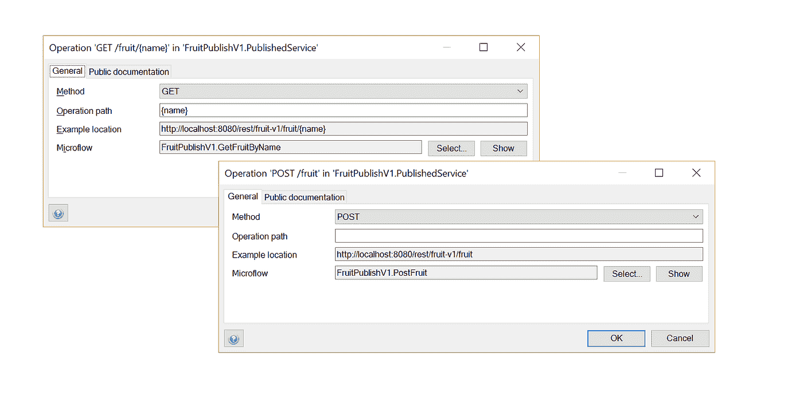
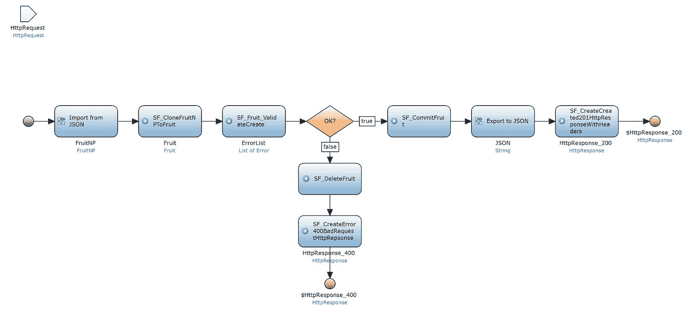
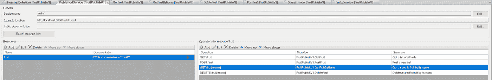
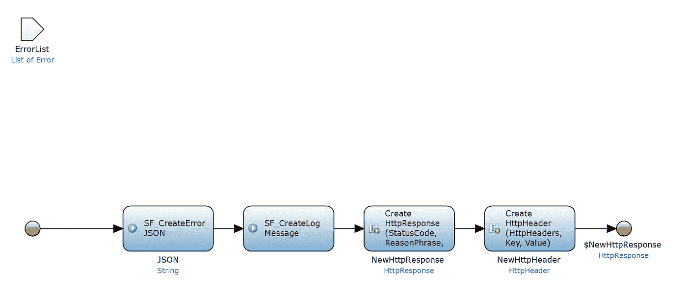
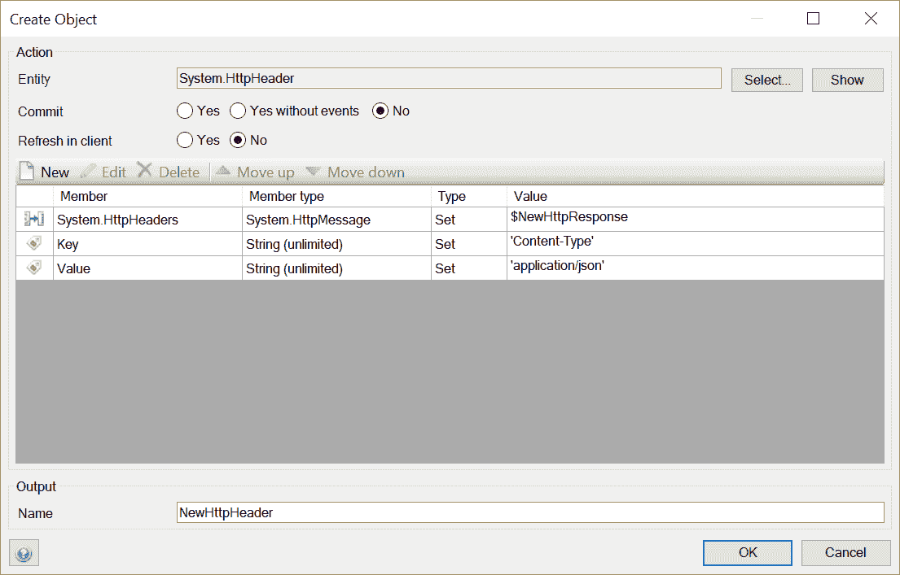

# 如何充分利用 Mendix 的原生 REST 发布功能

> 原文：<https://medium.com/mendix/how-to-make-the-most-out-of-mendix-native-rest-publish-functionality-1a150b43ef10?source=collection_archive---------1----------------------->

Mendix Modeler 最受欢迎的特性之一已经发布，并且正在不断改进中:本地发布的 REST 服务！在这篇博客中，我想解释一下 Mendix 工具箱中的这个附件是做什么的，为什么你应该使用它以及如何使用它。

就像[莫连接](https://www.youtube.com/watch?v=4ZT2AXgGzAU)五年前说的:每个人、每个事物都需要连接。即使莫说的是手机和人，应用程序也是如此。如今，我们产生了大量的数据，如果我们不与其他应用程序共享这些数据，以便它们可以进一步改善它们的使用，那我们就是疯了。

这正是最新发布的 REST 服务让我们能够做到的。当然，这在已发布的 web 服务和 REST 模块中已经是可能的了，但是我们 Mendix 开发人员喜欢在 Mendix Modeler 中本地提供令人敬畏的特性。尤其是像这样好用的！

我们现在可以创建一个已发布的 REST 服务，并立即定义所需的端点和操作。安全由 Mendix 负责，除此之外，我们还自动获得 Swagger 文档，与我们的客户、合作伙伴和同事共享。正是这些功能让我非常开心！

在使用了这些服务之后，我想利用这个机会给你一些建议，告诉你如何充分利用你发布的服务。为了将这些提示放在一个上下文中，我们将使用一个关于水果的示例服务。

# 1.使用 HttpRequest body 属性在 POST 操作中接收数据。

*尽量将操作路径/参数的使用限制为仅标识符，因为数据在 URL 和您的传出请求中是可见的。可以在 GET 或 DELETE 操作的操作路径中使用参数，但是要避免在 POST 操作中使用这些参数。*

OK:GET-> localhost:8080/rest/fruit-v1/fruit/banana

不 OK:POST-> localhost:8080/rest/fruit-v1/fruit？name =香蕉& color =黄色

# 2.使用导入映射来解析请求的正文。

*从 Mendix 7.11 开始，您可以在从 JSON 导入活动中使用 HttpRequest 作为输入。*

# 3.想想向后兼容性。例如，您可以为每个版本创建一个新的域模型，这样在您部署一个新版本时，不是每个人都需要更新他们的服务。

另外，将版本添加到您的服务名中，这样它将在您的文档中可见。从 Mendix 13.1 开始，版本控制被合并到建模器中。

# 4.为每种类型的错误创建通用响应流，例如 [422](https://httpstatuses.com/422) 和 [404](https://httpstatuses.com/404) 以及成功消息，例如 [200](https://httpstatuses.com/200) 和 [201](https://httpstatuses.com/201) 。这将使您能够快速构建验证和错误处理。

没有人喜欢用蹩脚的错误处理来消费 web 服务。不要犯同样的错误！

# 5.发送响应时一定要设置 HttpHeader！

*没有这个，接收端就不知道你在给他们提供什么样的内容。在某些情况下，这将导致错误。*

如果你也想发布自己的服务，看看[我的 YouTube 教程](https://www.youtube.com/watch?v=HzrFkv0U4n8)了解更多信息，从[Mendix app store](https://appstore.home.mendix.com/link/app/106541/TimeSeries/Native-REST-publish-example-project)下载我的示例项目或者[在 Github](https://github.com/Criccle/RESTPublish) 上找到它。关于 REST API 的一些最佳实践，请看一下这个网站或者这篇文章。

其他重要资源包括:

1.  [https://docs . mendix . com/how to/integration/consume-a-rest-service](https://docs.mendix.com/howto/integration/consume-a-rest-service)
2.  [https://docs.mendix.com/refguide/call-rest-action](https://docs.mendix.com/refguide/call-rest-action)
3.  [https://video.mendix.com/watch/RMw45uwCAjYi2ej7ykAseu](https://video.mendix.com/watch/RMw45uwCAjYi2ej7ykAseu)如何修正——消费休息服务
4.  [https://getting started . mendix cloud . com/link/path/44/Importing-and-export-Your-Data](https://gettingstarted.mendixcloud.com/link/path/44/Importing-and-Exporting-Your-Data)
5.  [https://ww2.mendix.com/expert-webinar-REST-Services.html](https://ww2.mendix.com/expert-webinar-REST-Services.html)
6.  [https://ww2.mendix.com/Expert-Webinar.REST-Integration.html](https://ww2.mendix.com/Expert-Webinar.REST-Integration.html)

想自己动手使用 [Mendix](https://www.mendix.com/) 吗？[在这里报名吧！](https://signup.mendix.com/link/signup/?ref=27200)