# 如何用 11 行代码让你的应用程序好 10 倍

> 原文：<https://medium.com/javascript-scene/how-to-make-your-app-10-times-better-with-11-lines-of-code-b79e1bc5a655?source=collection_archive---------2----------------------->

> 偶尔，我会发现一个产品如此之好，以至于它对我的快乐、我们公司的利润或两者都产生了可衡量的影响。在极少数情况下，当我发现这样一个我想与其他开发者分享的产品时，我会邀请该公司参与一个**赞助的帖子。**
> 
> 我只会为我知道、使用和喜爱的东西写赞助帖子。我永远不会代言任何我不相信的产品。这是一个你可以信任的承诺。
> 
> ~埃里克·艾略特

我职业生涯的大部分时间都在帮助公司改进他们的 web 应用程序。我职业生涯的前半部分是一名致力于用户体验优化的顾问，特别关注增长(如何让用户分享你的产品)和转化率(如何让用户做你想让他们做的事情)。

我所有最好的建议可以归结为三个词:

> **听用户**

每次我开始建立一个新的软件开发团队，我的首要任务就是缩短用户反馈循环。用户反馈回路是[高速开发](/javascript-scene/how-to-build-a-high-velocity-development-team-4b2360d34021)的一个重要工具。这是我所知道的发现和优化产品/市场契合度的最好和最快的方法。

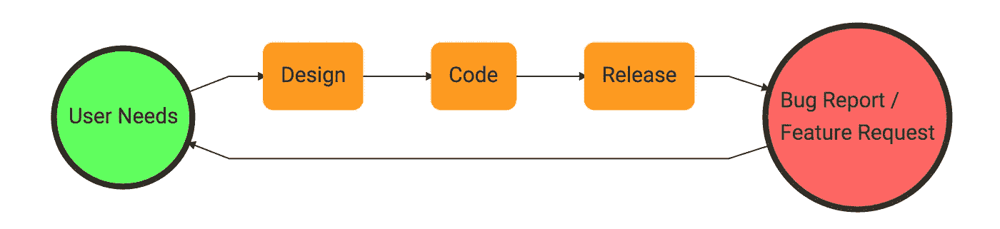

1.  发现用户需求。
2.  为这些需求设计一个解决方案。
3.  用代码实现设计。
4.  发布产品。
5.  收集用户反馈和错误报告，以发现并优先考虑所需的更改。

最后一步是 Usersnap 的用武之地。这个概念很简单:从用户那里获得反馈的简单方法。我见过许多提供类似服务的其他产品，但这款产品有一个特点:

与简单的联系方式不同，Usersnap 会自动抓取用户的屏幕截图，并让用户对截图进行注释，指出他们遇到的问题。正如我们稍后将看到的，Usersnap 也有助于设计步骤。

# 修复您的 bug

修复 bug 的一个重要部分是识别哪些 bug 正在困扰你的用户。有了 Usersnap 的反馈小工具，你的用户就可以随时告诉你有什么事情困扰着他们。

## 记录错误

有时事情不工作是因为页面上有错误。Usersnap 能够记录开发人员控制台输出，并通过屏幕截图发送给您。您必须使用小部件定制对话框选择控制台录制:

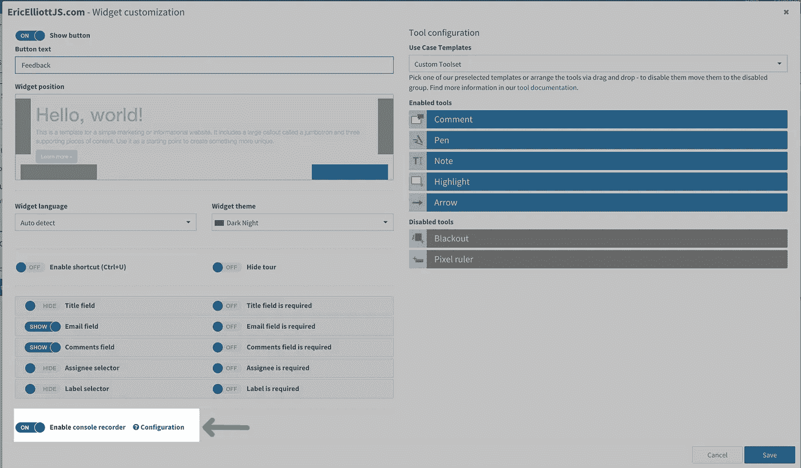

“Enable console recorder” option.

# 集成用户快照

集成 Usersnap 轻而易举。当你注册的时候，他们会带你去一个有导游的地方让你开始。跟着向导走。

顾名思义，嵌入只有 11 行代码，是异步加载的，所以它不会阻塞页面加载:

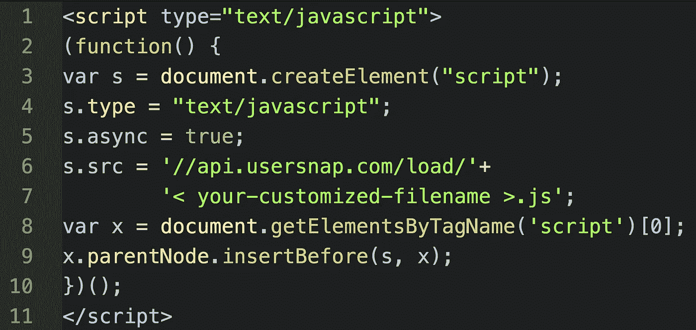

Usersnap code screenshot

有几种内容管理系统的配置选项。

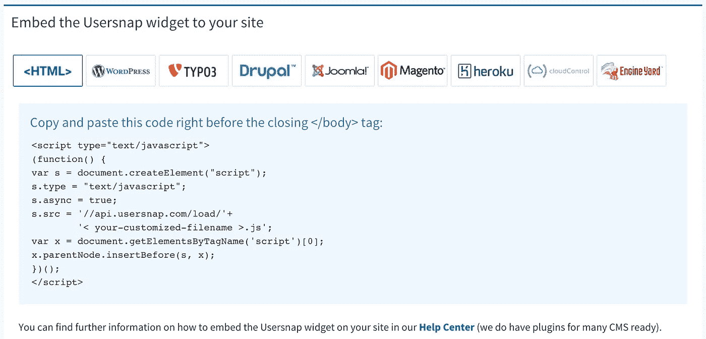

Embed options

他们有 WordPress、Drupal、Joomla、Magento 等的插件……大部分的大玩家都被覆盖了，对于那些没有被覆盖的，HTML 嵌入应该可以完成这项工作。

## WordPress 插件

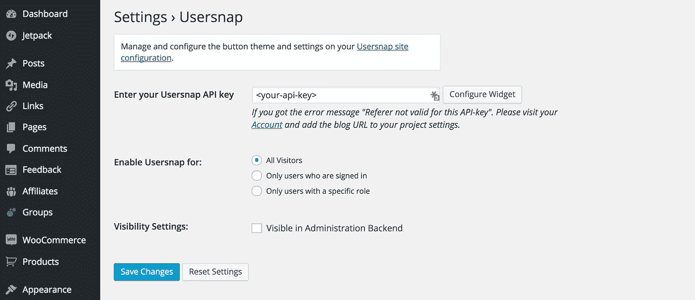

## 松散集成

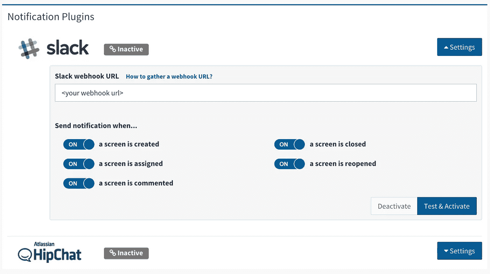

下面是 Slack 中一些真实用户反馈的样子。我喜欢用户可以圈出并强调他们给出反馈的具体内容:

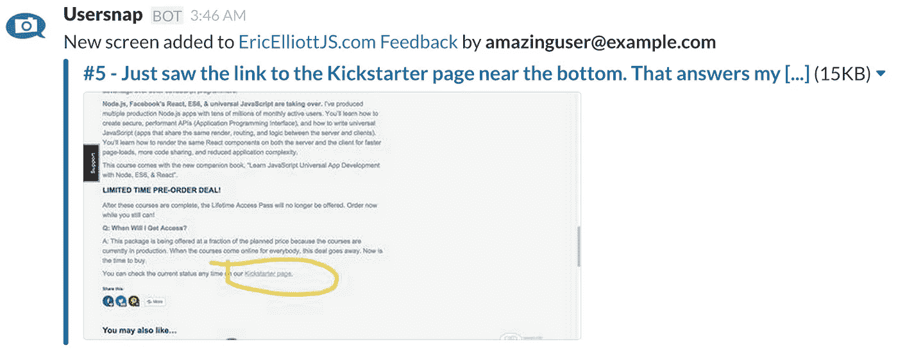

# 在窗帘后面

Usersnap 反馈消息被称为“屏幕”，因为它们都包含屏幕截图。在 Usersnap 仪表板中，每当有人留下反馈或更新现有屏幕时，您将获得**实时通知**。

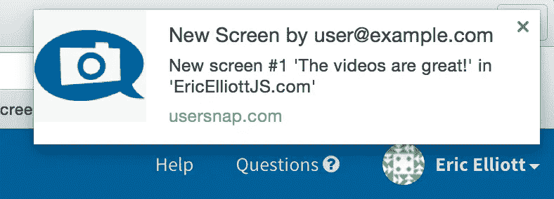

New screen notification

屏幕分为两类:打开(对于新屏幕)和关闭(对于已解决的屏幕)。这对于跟踪错误报告状态非常有用:

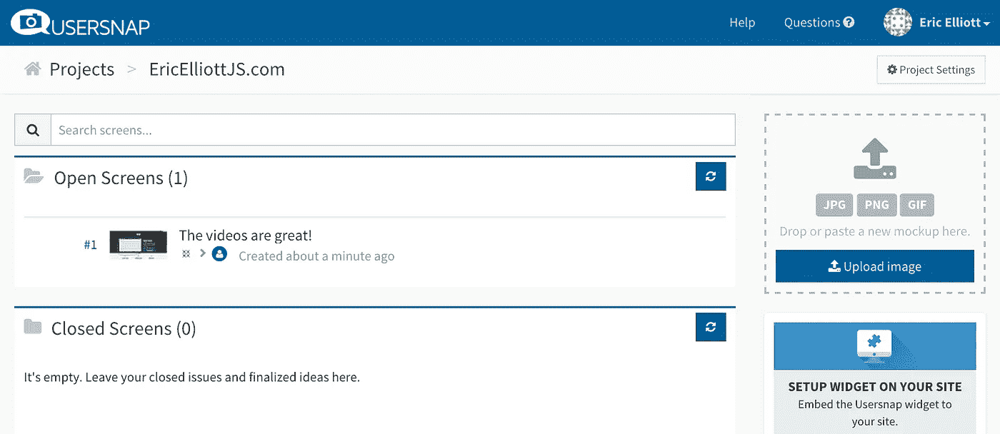

每个屏幕的左侧是一个复选框。选中它会将其移动到“关闭的屏幕”类别。

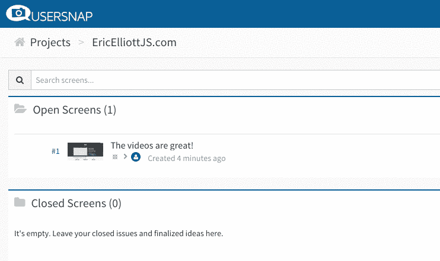

点击屏幕会显示详细视图。这里有几个很酷的功能值得一提:

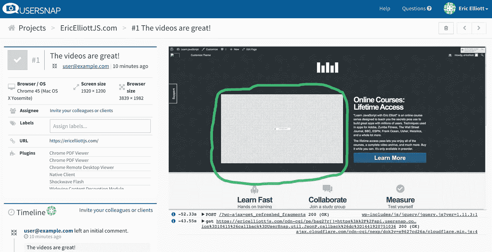

Usersnap screen detail

在左侧，您将看到重要信息，如用户的浏览器/操作系统组合、屏幕大小、浏览器大小、用户安装的插件和实时活动时间表。在右侧，您将看到捕获的屏幕截图，以及用户注释(在本例中，视频周围的绿色圆圈)。

在截图下面，您会看到一个控制台消息日志。该报告的有趣之处在于，您可以单击消息中的箭头来深入查看该对象。

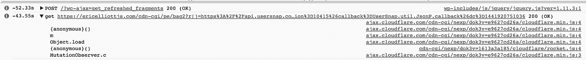

Drilling down into a console object

**一个有趣的警告:**截图不会显示远程嵌入——相反，它们显示为一个带有错误信息的纹理框。

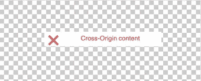

Cross-Origin content error

如果你在屏幕上看到这个，**不要惊慌！用户很有可能真的看到了正确的东西。**

# 更好的用户错误报告

正如您所看到的，每当用户使用该工具提交错误报告时，Usersnap 都会提供非常详细的信息，并且用户可能需要该工具来指出给他们带来麻烦的屏幕的特定部分。具体是什么工具？

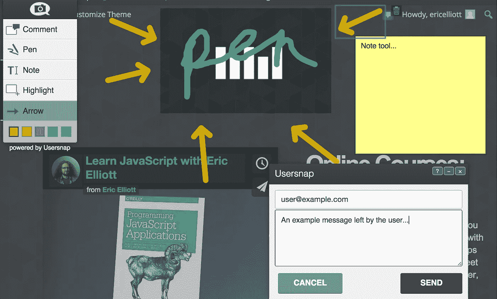

Usersnap tools unleashed!

允许用户使用各种颜色和画笔大小在屏幕上绘图的钢笔工具、箭头工具、便笺式笔记，当然还有允许用户编写消息的消息框。编写本报告时的完整清单:

*   **评论**
*   **钢笔**
*   **注**
*   **高亮显示**
*   **箭头**
*   **停电**
*   **像素标尺**

正如你所看到的，我在上面的“释放用户快照工具”示例中禁用了黑屏和像素标尺。您可以在 Usersnap 中的小部件定制屏幕上完成此操作。

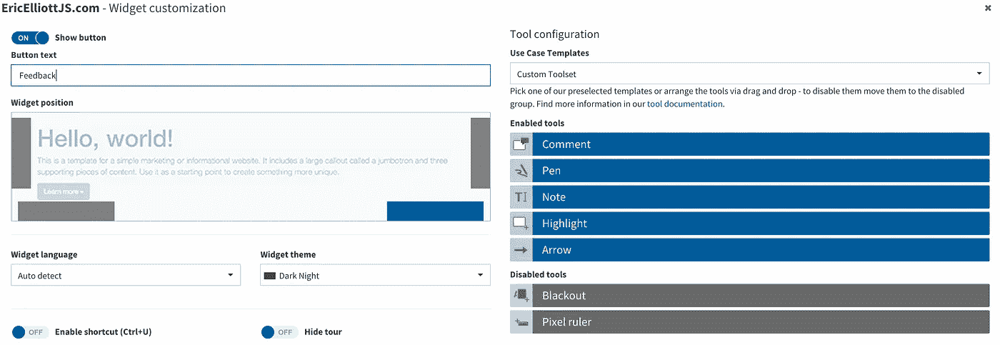

Customizing the Usersnap Widget

您还可以更改小部件的主题颜色，以匹配您的站点设计。

# 设计协作

这组特殊的图像注释功能的一个有趣的副作用是，设计团队可以使用它在您的产品设计资产上进行实时协作。Usersnap 的仪表板允许您上传和注释任何图像，并且可以轻松创建新项目供您的产品设计团队使用。项目使得将你的设计和你的错误报告保存在不同的筒仓中变得容易。

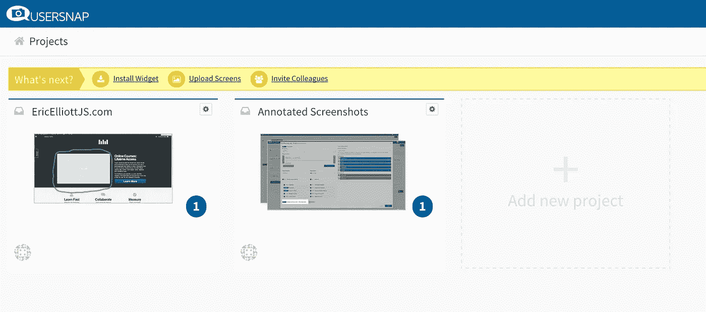

Usersnap Projects Dashboard

# 结果

将 Usersnap 添加到我的网站后，更多的客户开始留下有价值的、可操作的反馈，我们用这些反馈来修改我们的产品。我们的用户对产品有更多的参与和承诺，因为他们帮助产品变得更好。

*   **更好的错误报告**
*   **更具可操作性的用户反馈**
*   **结果是更好的产品**

我喜欢 Usersnap ，我打算在我们未来的软件产品、购物车和博客中继续使用它。如果你没有类似的东西，你可能会错过一个巨大的机会来提高你与你的用户和客户的一致性。

> [**报名参加
> 15 天免费步道**](https://usersnap.com/#signup)

***埃里克·艾略特*** *是《编程 JavaScript 应用程序》* *(O'Reilly)的作者，也是纪录片《制作中》、《编程素养》* *的主持人。他为 Adobe Systems 的******尊巴健身*******华尔街日报*******【ESPN*******BBC****等顶级录音师贡献了软件经验******

**他大部分时间都在旧金山湾区和世界上最美丽的女人在一起。**