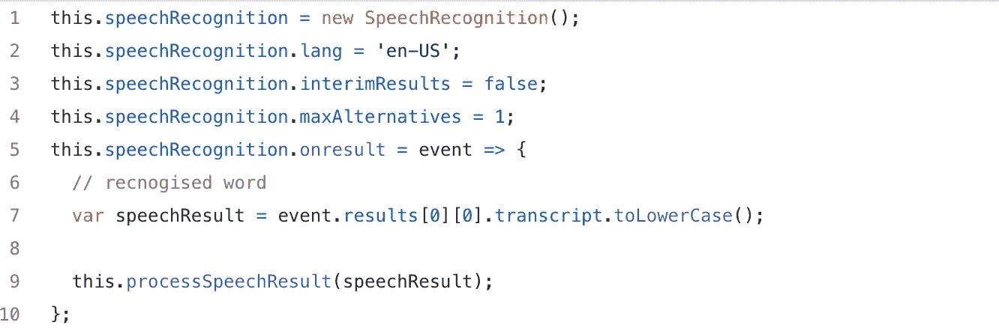
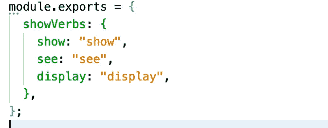
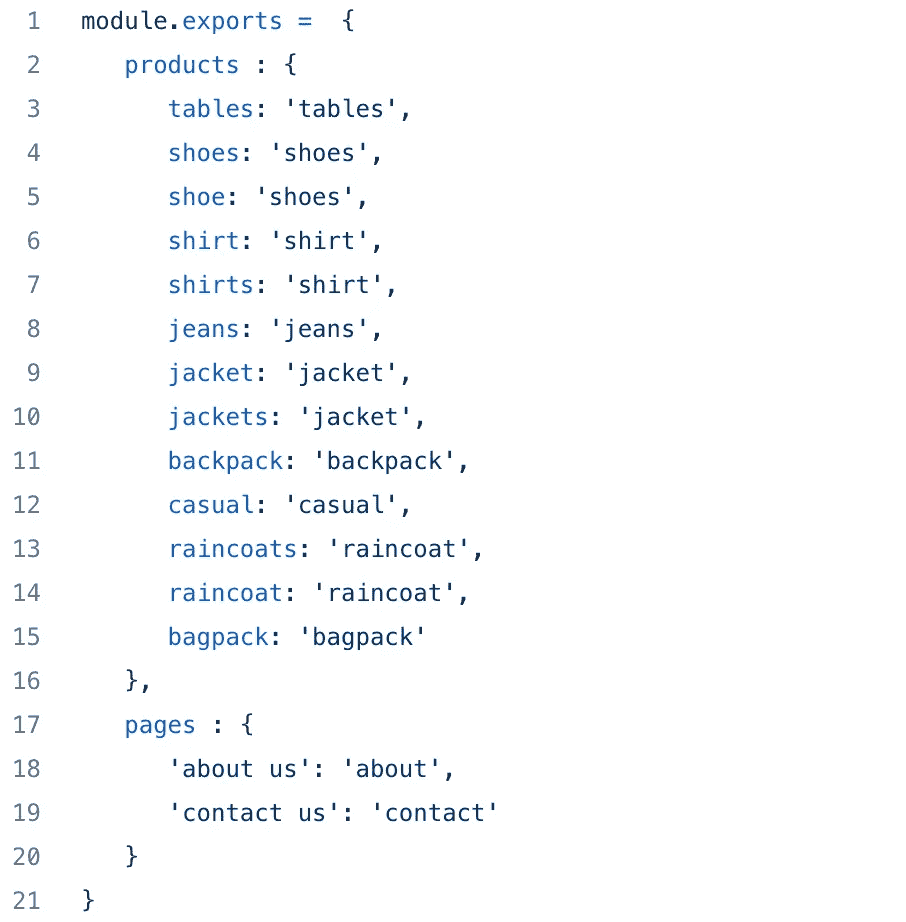
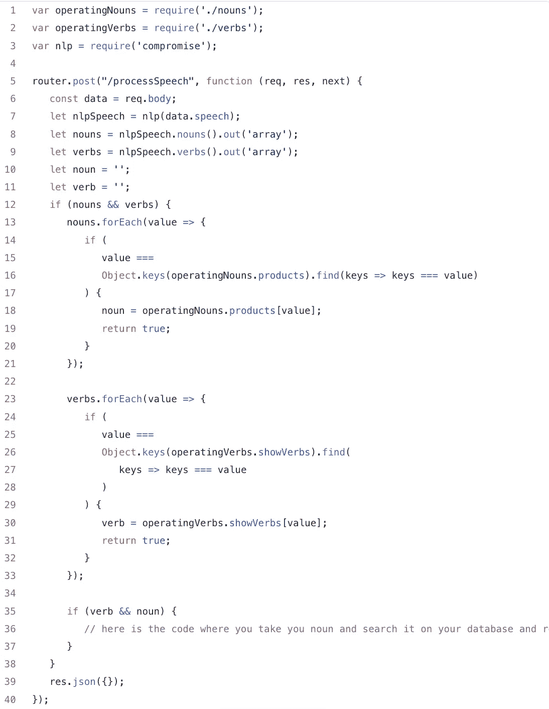

# 如何做一个语音驱动的网站

> 原文：<https://medium.com/globant/how-to-make-your-website-speech-driven-2b70664deebd?source=collection_archive---------0----------------------->

在软件工程生活中，了解软件世界中的新知识是卓有成效的。我在研究中遇到的一个这样的事情就是 NLP 妥协。它是一个 javascript 库，可以从一个句子中理解词性。不仅如此，它还能理解数字、名字等等。更多详情: [https://compromise.cool](https://compromise.cool/) 。

现在，让我们具体到我的工作。我建立了一个购物网站，用户可以使用 **web 语音 API**[https://developer . Mozilla . org/en-US/docs/Web/API/Web _ Speech _ API](https://developer.mozilla.org/en-US/docs/Web/API/Web_Speech_API)通过语音命令搜索产品，我让用户说话，并使用 **web 语音 API 将语音转换为文本。**

然后，我在后端服务器上创建了两个文件:

1: **verbs.js** 有一个动词列表，意思是展示特定的产品

2: **名词. js** 将列出我数据库中的名词(产品)。

第一个代码图中显示的 **processSpeechResult** 函数实际上是用 SpeechResult 调用 API。现在，我们的想法是实现 NLP 折衷，从演讲结果中去掉名词和动词，如果动词与“show”、“details”、“detail”匹配。然后我会得到这个名词，并用这个名词搜索数据库。举个例子，假设我说了“show jackets ”,当 NLP 妥协将解码这个句子时，它会将 **jackets** 作为名词，将 **show** 作为动词。现在‘show’与我列表中的动词匹配，所以我要做的是开始用‘jackets’(名词)搜索我的数据库，获得它的列表，并作为 JSON 响应发送给前端。

现在是我们导入 NLP 折衷的代码，并使用它从句子中获取语音标记，并将它们与动词和名词进行匹配。这是用 express 在 node js 中写的代码。

这就是我如何开始与 NLP 妥协，使我的购物网站语音驱动。请记住，这仅仅是开始，我在 NLP 妥协中看到了很多有用的功能，这些功能使演讲更容易理解。