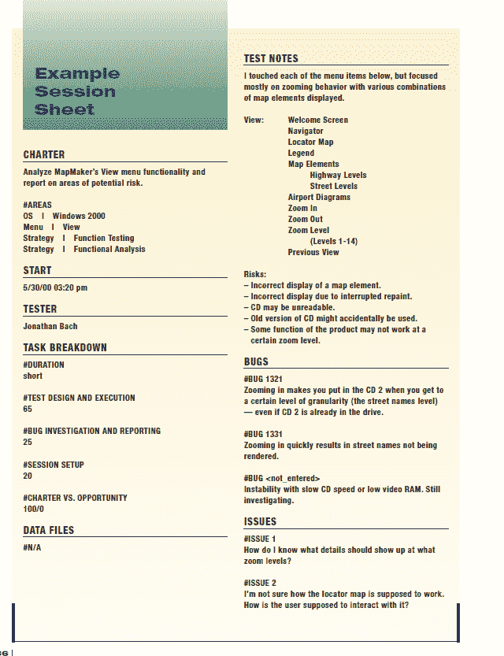

# 如何使用基于会话的测试管理来管理和度量探索性测试

> 原文：<https://medium.com/globant/how-to-manage-and-measure-exploratory-testing-using-session-based-test-management-f0f62bd8363e?source=collection_archive---------0----------------------->

各种各样的结果表明，通过在软件产品的整个测试生命周期中执行探索性测试，找到缺陷的成功率很高。事实上，有时候，与遵循一组预先定义的测试用例相比，检测出更多更好的缺陷是可能的。应该明确的是，先前定义的测试用例不是不一致的，或者测试缺乏足够的覆盖，但是，对于遵循先前定义的步骤的有限序列的简单事实，很可能软件产品的一些细节或行为可以被忽略。

与传统的脚本测试不同，探索性测试是一个特别的过程，被优化以快速发现缺陷，因此，计划被不断地调整以重新聚焦于最有希望的风险领域；遵循直觉或测试人员的直觉，花费在文档上的时间被最小化。

这些特征导致了软件开发管理中的一个问题:在测试周期中测量和管理探索性测试的执行的困难。

为了进一步理解这个问题以及如何解决它，下面回顾了什么是探索性测试，与引导测试的区别，测量和管理它的挑战，克服这些的方法，以及可以获得的度量的类型

# **探索性测试:简单定义**

探索性测试是一种非正式的测试设计技术，通常被描述为同时学习、测试设计和执行。它关注于发现，并依靠单个测试人员的指导来发现其他测试范围内不容易发现的缺陷。

探索性测试试图找出软件是如何工作的。测试的质量取决于测试人员发明测试用例并发现缺陷的能力。测试人员对产品的了解越多，他们知道的测试方法越多，测试质量结果就越好。

**探索性测试与脚本测试**

执行探索性测试时，应考虑以下事项:

*   测试人员技能
*   可用的工具和环境
*   测试的可用时间
*   客户关心什么
*   产品本身
*   测试人员对产品的了解

这些因素在整个项目中不断变化；测试生命周期。探索性测试的能力可以通过测试周期得到优化，而定义的测试往往不那么强大，因为它们不容易随着时间的推移而改变。主要原因是，一旦已经执行了定义的测试，并且没有发现缺陷，测试人员在第二轮中发现缺陷的机会在许多情况下比执行新的测试要低得多。

**探索性测试:为什么以及何时使用**

今天的团队需要采用持续集成，并满足市场对高质量数字体验的需求，以满足不断增长的客户期望。

大多数软件质量测试使用结构化的方法。基于已经定义的用户故事来定义测试用例，并且基于定义的测试用例来构造测试数据。测试覆盖率是使用软件工程度量来测量的，在大多数情况下，覆盖率在技术上是足够的。

经常被忽略的是边缘案例，它们是通过用户验收测试(UAT)发现的，并基于用户角色进行测试。另一方面，探索性测试本质上是随机的或者非结构化的，并且可以揭示在结构化测试阶段未被发现的错误。

有了探索性测试，测试人员可以按照一定的顺序玩一个用户故事。测试人员可以注释缺陷，添加断言和语音备忘录，并动态地创建文档。寻找新的测试场景来提高测试覆盖率尤其有用。

当测试任务关键型应用程序时，探索性测试确保您不会错过导致关键质量故障的边缘情况。

探索性测试适用于特定的测试场景，例如当某人需要快速了解产品或应用程序并提供快速反馈时。它有助于从用户的角度审查产品的质量。

在许多软件周期中，当团队没有太多时间来构建测试时，早期迭代是必需的。在这种情况下，探索性测试非常有用。

探索性测试:优点&缺点

**探索性测试:挑战**

如前所述，与已定义的测试不同，探索性测试是一个特别的过程，被优化以更快地发现缺陷，计划被不断地调整到最重要的风险领域，花费在文档上的时间被最小化，最重要的是，成功很大程度上取决于测试人员的技能和关于软件产品的知识。

当谈到测量和管理探索性测试时，所有这些因素都带来了以下挑战:监控测试进度和测量测试中投入的时间和精力。

跟踪每个测试人员的进度变成了一项单调乏味的任务；每天都需要知道测试了什么，发现了什么，进一步测试的重点是什么。为了能够确定测试活动进展的状态和程度，测量投入的时间和精力也是很重要的。

为了获得这些信息，团队中的每个测试人员都需要是一个训练有素的、高效的沟通者。一些测试人员会详细地报告他们的活动，而其他人会以一种更加综合的方式报告，一些人可能会关注已经完成的测试，而其他人则关注已经发现的缺陷。然后，需要对所有这些信息进行总结，以便提交给管理层和其他利益相关者。

另一个管理挑战是量化探索性测试的好处；因为收益更多的是质的而不是量的。目的是找到其他形式的测试中没有发现的缺陷。期望应该是记录未探索的测试场景并增加覆盖率，但是由于这些测试是在运行中完成的，这些信息可能会在过程中丢失。

> 所有这些挑战导致了下面的问题:**测试人员能够在不妨碍灵活性和意外发现的情况下，做出整洁的报告并组织他们的工作吗？**这个问题的答案是“是”，有一种基于工具的方法被称为“基于会话的测试管理”(SBTM)。

应该注意的是，SBTM 并不是软件行业的灵丹妙药或唯一的方法，事实上，在最近几年，已经开发并实现了几种方法，如自由式探索性测试，或基于场景的测试。但是 SBTM 的流行是基于这样一个事实，即许多实现了这种方法的软件测试项目能够在管理他们的探索性测试时获得非常好的和切实的结果，而不会失去其本质和优势。

为了理解如何通过 SBTM 度量和管理探索性测试，让我们先来看看什么是 SBTM。

# **SBTM——基于会话的测试管理**

探索性测试管理的第一步是识别测试人员在一天中执行的与测试无关的各种活动。因此，管理者需要一种方法来跟踪测试活动，然后他们需要一种方法来区分测试活动和其他测试活动，因此实现了“测试会话”

“测试会话”是执行测试所花费的一段不间断的时间。在探索性测试实践中，会话是基本的测试工作单元。每次会议都集中在一个先前定义的章程上。所谓“特许”，是指每一次会议都与一项使命相关联，从而确保每一次会议都是以使命为导向的。

此外，在会议期间，测试人员可以探索新的机会或方法来搜索缺陷。在会话期间，测试人员动态地创建运行测试场景，并记录他们的进度。

在开始会话之前定义时间盒。最佳时间集中在 60 到 120 分钟之间，这对于一个可靠的测试运行来说足够长，而对于防止测试人员失去注意力来说又足够短。

每个会话中具体发生什么取决于测试人员和那个会话的章程。例如，测试人员可能被引导去分析一个功能，或者寻找一个特定的问题，或者验证一组错误修复。

为了管理和测量探索性测试，有必要知道测试会话期间发生了什么任务，但是重要的是要避免这种报告成为测试人员的负担。收集关于测试的数据会消耗掉进行测试的精力。为什么要求测试人员非常一般地报告他们的任务。

这就是为什么 SBTM 方法允许将会话分为三类任务:

1.  测试设计和执行
2.  缺陷调查和报告
3.  会话设置

每个测试人员必须估计他们在上面提到的每种任务上花费的相对时间。

此外，测试人员被要求报告他们在“宪章”和“机会”上花费的努力部分。机会测试被认为是任何不包括在会议章程中规定的测试。

**测试章程**

测试章程是测试目标和关于如何测试的可能想法的规范。明确定义给定测试会话的测试任务。

测试章程定义:

*   测试的目的。
*   参考可用的文档，如用户故事、需求等。
*   要使用的测试技术。
*   测试风险

此外，会议章程还有其他三个主要部分:

*   缺陷:对产品质量的缺陷或担忧。
*   问题:与测试过程、产品或项目相关的问题。
*   注意:一份自由格式的记录，记录与在课程中发生的测试相关的任何事情。

专注于章程并使用各种分析技术从多个角度接近目标，它们有助于一致地确保探索性测试工作为不同的利益相关者提供有价值的信息。

**测试宪章解剖学**

虽然测试章程没有特定的格式，但它必须至少包含以下部分:

*   **会议记录:**明确的任务说明、测试区域、配置、平台、设备等。

**a .测试仪名称**

**b .开始日期和时间**

**c .任务分解**

*   **持续时间**(短:>= 60min；长> 60 min < = 120 min)
*   **试验设计及实施时间**
*   **臭虫调查报告**
*   **会话设置**

**d . Charter vs Opportunity:**%致力于测试 Charter 中定义的内容的工作和/或致力于测试 Opportunity 的工作。示例:100/0，这意味着所有的努力都致力于测试该章程。

**e .数据文件:**对测试数据或要求文件的任何引用

测试注释:不同场景、行为或数据组合的任何描述。测试感兴趣的区域，未覆盖的区域。与测试相关的风险以及任何其他与测试相关的信息。

**g . bug:**a**在会话执行过程中发现的每个缺陷的简要描述。**

**h .议题:**会议期间出现的任何问题。

下面是一个测试章程的例子:

# **探索性测试:管理和测量**

探索性测试的管理通过使用 SBTM 来简化。它的实现有助于澄清和跟踪几乎所有与探索性测试相关的活动和组件，从计划、工作分配，到每日进度可见性。提供管理和测量整个探索性测试过程的方法。评估和预测可以被优化，并提供有价值的信息，帮助管理人员理解每个测试人员在一个工作日做了什么，范围下的区域是什么，可能对测试活动或项目有影响的问题，以及被测试软件产品的质量健康状况。

此外，SBTM 的实现允许收集关于测试会话的度量。通过探索性测试过程可以获得的最具代表性的指标解释如下:

*   **TBS 指标:**任务分解指标。这种度量是关于测试人员为一个特定的章程所执行的每项任务投入了多少总的努力。此外，可以将这些指标结合起来，以确定每个 TBS 任务上花费了多少工作时间，跟进机会花费了多少会议时间，以及在非会议工作上花费了多少时间。

工作分解可以表示如下:

*   **平均探索性会话时间:**代表每次会话的平均长度(短/长)。基于这个数字，可以估计测试人员每天能够完成的会话总数。
*   **会话/特许费率:**测试人员每天完成的会话数。通过了解每个测试人员每天完成的会话的平均数量，就有可能估计直到发布日期所需的会话总数，这可以通过燃尽图绘制出来，其中“理想趋势”将是每天会话的平均数量。

*   **探索性测试与引导性测试工作:**获得 TBS 指标和每天完成的会话总数，就有可能测量测试人员执行探索性测试的总工作(以小时计)。这项工作与执行引导测试的工作相当，引导测试是通过测试用例执行所消耗的时间来计算的。
*   **每个会话发现的缺陷:**在测试会话执行期间报告的缺陷数量。该指标可分解为以下内容:

*会话期间发现的缺陷总数。*

*按严重性/优先级划分的会议期间发现的缺陷总数。*

*会议期间发现的新缺陷与已知现有缺陷的总数。*

*   **探索性测试有效性:**在探索性测试会话执行期间发现的缺陷数量(按严重性分类)与在引导性测试执行期间发现的缺陷数量。为了准确地测量这一指标，在探索性测试阶段发现的每一个缺陷都必须进行分析，以理解为什么它们在引导性测试阶段没有被检测到的根本原因。

# **结论**

SBTM 方法促进了与探索性测试相关的所有活动的跟踪，提供了测试过程、测试范围下的区域以及测试人员在哪里以及如何分配他们的工作的清晰可见性。反过来，通过测试章程的实现，有可能收集有意义的度量，这些度量有助于评估，并提供关于探索性测试的性能和被测软件产品的质量健康的有价值的信息。

因此，有可能在不丧失动态性、灵活性和轻便性的情况下对探索性测试进行有效的管理和度量，这使得这种测试技术对于任何软件测试项目都非常有用。