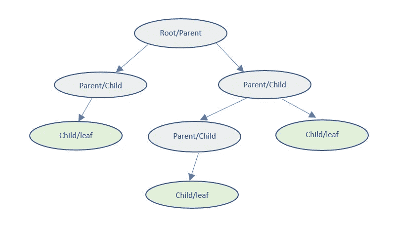

# 如何掌握 Oracle 中的 CONNECT BY 子句分析分层数据

> 原文：<https://medium.com/quick-code/how-to-master-the-connect-by-clause-in-oracle-to-analyze-hierarchical-data-e84e9009be77?source=collection_archive---------1----------------------->

## 重量级 RBMS 提供商的内置产品。

Photo by [Windows](https://unsplash.com/@windows?utm_source=medium&utm_medium=referral) on [Unsplash](https://unsplash.com?utm_source=medium&utm_medium=referral)

本文通过动手练习的方式探索了 Oracle 中 CONNECT BY 子句提供的功能和特性。

**先决条件** : Oracle 9g 或最新安装，任何 oracle SQL 客户端。我在这篇文章中使用了 Oracle 的示例模式，您也可以从这里的[下载。在您的 oracle 客户机中执行 SQL，您应该已经设置好了数据和模式。](https://download.oracle.com/oll/tutorials/DBXETutorial/html/module2/les02_load_data_sql.htm)

# **我们开始吧**

CONNECT BY 是一个 oracle 子句，用于分层放置符合条件的数据集。也就是说，该函数的用途通常是创建一个新的结果查询，该查询将在一个表中阐述层次关系。下面是基本语法:

> *【以条件开始】*
> 
> *通过【无周期】条件连接*

*   **START WITH** 是一个可选关键字，可用作层次结构的起点。
*   **CONNECT BY** 描述了层次结构中的子行和父行之间的关系。
*   **PRIOR** 关键字是这个实用程序的主干。在 connectby 条件中，至少有一个表达式必须由描述父记录的 prior 运算符限定。CONNECT BY 中的条件可以有多个表达式，并且应该至少有 1 个(但不限于 1 个)Prior 子句。Prior 是一个泌尿运算符，用于计算立即表达式，实际上与' = '运算符一起使用。

对于其他操作符，PRIOR 通常将流置于无限循环中，并使 Oracle 抛出一个 erro。prior 表达式不能引用序列，例如 NEXTVAL。这个操作符也可以在 SQL 的 SELECT 块中用来引用父记录，让我们在本文开始时安装的数据集上运行一个 SQL 语句，以理解查询的 SELECT 部分中的 PRIOR 子句用法。

# **更何况？**

**CONNECT_BY_ROOT** 是 Oracle 提供的另一个方便的操作符，它可以用来将关联的层次结构展平到根级别，并将其放在一个列单元格中。语法是这样的

**NOCYCLE** 用 CONNECT BY PRIOR 解决无限循环问题。让我们通过更新根记录中的经理 id 来研究这个操作符。

当您运行 CONNECT BY query now 时，由于创建了无限循环，Oracle 将向您显示 ORA-01436 错误。NOCYCLE 帮助我们使用 CONNECT BY 即使在带有循环的数据集中，也可以使用另一个操作符 CONNECT_BY_ISCYCLE 列出所有带有循环的行。

> 如果您想识别层次结构中的叶节点员工，该怎么办？
> 
> *在 select 中可以使用 CONNECT_BY_ISLEAF 伪列来迎合这个需求。如果列是叶节点记录，则返回 1，否则返回 0。*

Only Child/leaf nodes will have *CONNECT_BY_ISLEAF* set as 1

*层级可能很棘手，父节点可能经常被误解为叶节点*

感谢您通读，敬请关注…

访问我的博客:[https://www.storedprocs.com/](https://www.storedprocs.com/)获取更多关于数据工程的文章。

#数据# oracle # PLSQL #数据库