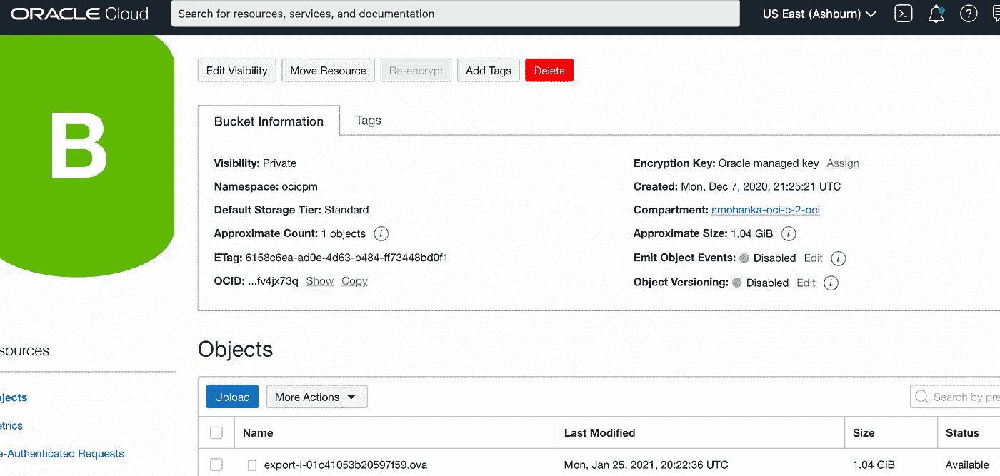

# 如何将 AWS EC2 虚拟机迁移或克隆到 Oracle OCI 云

> 原文：<https://medium.com/oracledevs/how-to-migrate-or-clone-aws-ec2-vm-into-oracle-oci-cloud-26a13d767eec?source=collection_archive---------0----------------------->

企业与多云战略保持一致，以避免停机，并利用工作负载在最佳云环境中运行。Oracle 云基础架构在最安全的模式下以更低的成本运行 Oracle 工作负载，同时实现最高的性能。对于非 Oracle 客户来说，Oracle 云基础架构提供的企业级云版本价格低廉，可带来直接的成本节约和更高的投资回报。在我之前的客户项目中，他们有许多运行 Oracle 数据库的 AWS EC2 虚拟机，并且不恰当地燃烧许可证，性能较低。

由于成本等一个或多个原因，或者出于灵活性、备选云中的灾难恢复或其他战略原因([更多阅读请点击](https://www.uscloud.com/blog/3-reasons-33-companies-ditching-aws-azure/)，我们将探讨以下选项将 AWS EC2 虚拟机迁移或克隆到 OCI。

## 云间迁移期间需要考虑的重要事项

下面是为技术流程进行迁移时要考虑的一些关键因素。明智的做法是查看官方文档，了解基于每一点可能遇到的任何限制因素。

1.  什么是源服务器操作系统及其在目标云上的可支持性？
2.  半虚拟化驱动程序的内核及其可支持性是什么？
3.  磁盘卷的大小以及对目标云大小的支持
4.  迁移方法和可用工具
5.  网络要求和带宽
6.  特定应用要求

# 移民 OCI 有哪些选择？

目前有两种方法来完成这项任务:(1)使用手动方法，这种方法可以非常方便地进行故障排除和更多的技术审查，或者(2)使用 Rackware、ZConverter 等商业迁移工具。将在此对这两个选项进行回顾。


大多数云对可以导出的磁盘数量有限制。在 AWS 中，如果虚拟机连接了磁盘，我们将无法导出虚拟机。

云供应商为导入和导出服务器提供了特定的格式。Oracle 云支持以 VMDK 或 QCOW2 格式提供服务器映像。但是，有一些简单的工具可以将这些格式从一种格式转换成另一种格式，而不会破坏可支持性。


Various cloud infrastructure providers and their supported formats based on respective documents

在我的练习中，我将以 VMDK 的身份从 AWS 导出，并以 VMDK 的身份将其导入 OCI。虚拟机映像的磁盘格式是基础原始磁盘映像的优化打包格式。虚拟设备供应商有不同的格式来展示虚拟机磁盘映像中包含的信息。

VM 容器格式:VM 容器格式指的是虚拟机映像是否是包含关于实际虚拟机的元数据的文件格式。因此，这里的容器格式是 OVA，而磁盘映像实际上位于 VMDK。

## 从 AWS EC2 迁移到 OCI 时，需要考虑哪些其他技术因素？

*   最大图像大小(压缩格式)为 400 GB。
*   必须为 BIOS 引导设置映像。
*   仅支持一个磁盘。
*   无法加密磁盘映像。
*   网络接口必须使用 DHCP 来发现网络。

阅读其他细节，确保你涵盖了所有因素——Linux——[Windows](https://docs.oracle.com/en-us/iaas/Content/Compute/Tasks/importingcustomimagewindows.htm#requirements)。

# 迁移方法


Oracle OCI Marketplace Migration tools

最直接的方法是利用在 [OCI 市场](https://cloudmarketplace.oracle.com)可以买到的工具。请记住取消“简易安装”的默认复选框下面我将重点介绍使用 Rackware 应用程序从 AWS 迁移到 OCI 的步骤。或者，可以通过手动方法完成迁移，对于大型工作负载，可以使用 terraform 和其他工具简化可重复的过程。

# 机架件/工具迁移方法

订阅市场上的任何“迁移”SaaS 工具。在我的练习中，我使用 Rackware (RMM)工具将 AWS EC2 VM 迁移到 OCI。

使用他们的 [OCI 市场](https://cloudmarketplace.oracle.com/marketplace/en_US/listing/67762747)信息在 OCI 租赁上安装 RMM。


High-level architecture of the deployment

按照 RMM 市场底部的指南成功安装它。这个 RMM 在 SSH 上工作，所以对于 Windows 虚拟机，您需要安装 RackWare SSHD 安装程序。


安装后，创建一个 wave 并添加源和目标虚拟机 IP。确保在 RMM 虚拟机与 AWS EC2 虚拟机和 OCI 虚拟机之间设置了 SSH 等同权限。

或者上传 RMM 提供的带有标准 CSV 模板的主机列表。


开始同步过程。

同步完成后，验证虚拟机中的数据。

# 手操纵进场着陆

或者，我们可以采用手动方式从 AWS 导出图像，并将其导入 OCI。


## 在 AWS 准备虚拟机

1.  使用[这些步骤](https://docs.oracle.com/en-us/iaas/Content/Compute/Tasks/enablingserialconsoleaccess.htm)启用虚拟机的串行控制台。这对于解决虚拟机启动问题非常有用，就像我们今天在数据中心所做的那样。
2.  关闭虚拟机(AWS 控制台或 AWS CLI)
3.  请注意将迁移到 OCI 的 instanceID。
4.  验证可以存储图像的 S3 存储桶详细信息
5.  此 S3 存储桶必须设置其 ACL，以允许 AWS 的“虚拟机导入导出”拥有列表、上传/删除和管理权限。
6.  如果附加了卷，请将第一个卷(/dev/sda)中的数据复制到单独的文件夹中。
7.  分离连接到虚拟机的所有卷。

在我的环境中，我创建了一个新的 VPC 和组件来执行这个过程。为了我的重复测试，我使用 terraform 制作所有组件。(假设您已经拥有 AWS EC2 VM，您可以跳过这一步)

## 导出图像

AWS CLI 创建要导出的图像。请注意，有一个唯一的帐户(vm-import-export)需要被允许对存储桶进行读/写以导出映像。

## 将映像从 AWS 传输到 Oracle OCI


任务完成后。ova 文件将放在 AWS S3 存储桶上。复制。从 AWS S3 存储桶到 Oracle 云基础架构对象存储桶的 ova 文件。我使用 rclone([https://rclone.org/](https://rclone.org/))将数据从 AWS S3 对象存储复制到 OCI 对象存储。



使用 rclone，图像文件被复制到 OCI 存储桶中。

## 在 Oracle OCI 中创建虚拟机

现在，我们准备使用`.ova`文件来创建我们的虚拟机。使用 terraform 在 Oracle 云基础架构上创建虚拟机，这将从。OCI 对象存储和创建 VM 中的 ova 文件。您可能需要根据自己的需求进行定制。

## 最后一步，同步应用数据。

创建虚拟机后，您可以在 Oracle 云基础架构中将数据块卷连接到虚拟机，并将应用程序文件系统复制回来。我使用 rsync 进行同步，您可以做类似的事情，将应用程序数据复制回单独的设备。

```
# rsync -vuar /tmp-fs /application
sending incremental file list
tmp-fs/
tmp-fs/lost+found/
tmp-fs/application-file.txt
....
```

## 参考资料:

[OCI 的 terra form](https://registry.terraform.io/providers/hashicorp/oci/latest/docs)
[OCI 虚拟机导入](https://docs.oracle.com/en-us/iaas/Content/Compute/References/bringyourownimage.htm)
[AWS 的 terra form](https://registry.terraform.io/providers/hashicorp/aws/latest/docs)
[AWS 虚拟机导出](https://docs.aws.amazon.com/vm-import/latest/userguide/vmexport_image.html)