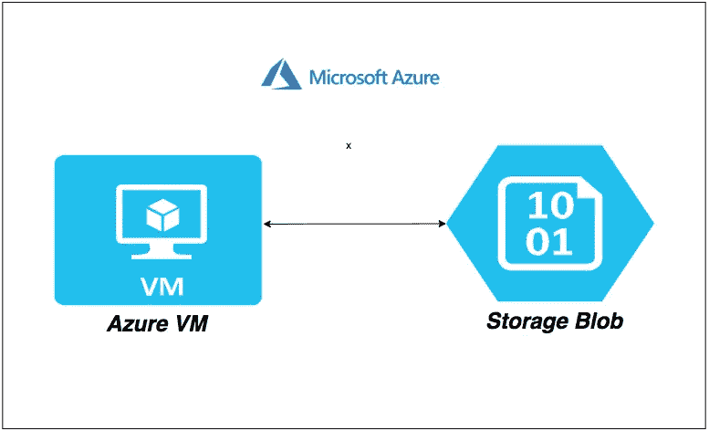

# 如何在 Azure VM 和 Azure Blob 存储之间移动数据

> 原文：<https://medium.com/bb-tutorials-and-thoughts/how-to-move-data-between-azure-vm-and-azure-blob-storage-7d9a3d8fa47e?source=collection_archive---------0----------------------->

## 包含示例项目的逐步指南

移动数据在软件工程中很常见。如今，大多数工作负载都在云中。我们可以在 Azure 的存储 blob 中存放大量数据，有时以 TB 为单位。如果你想处理数据，你必须下载、处理并再次上传。如果你没有…