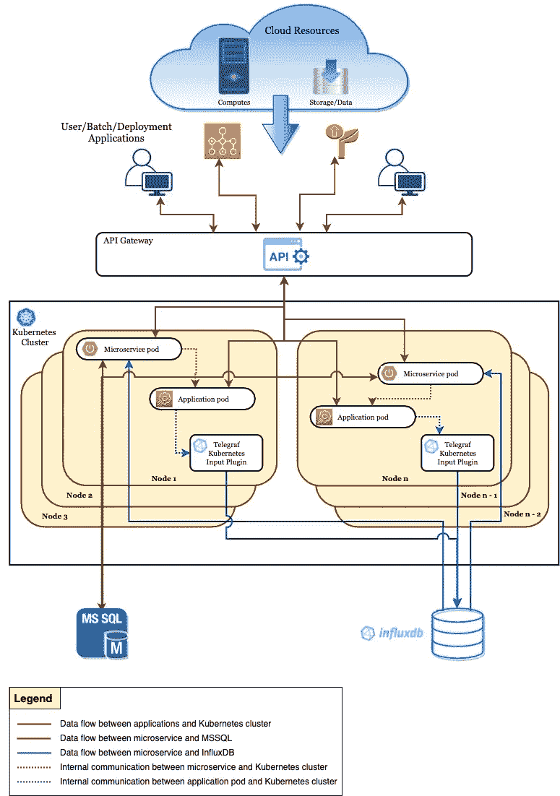
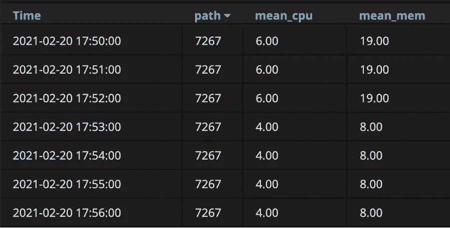
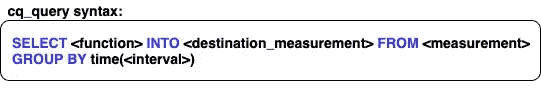
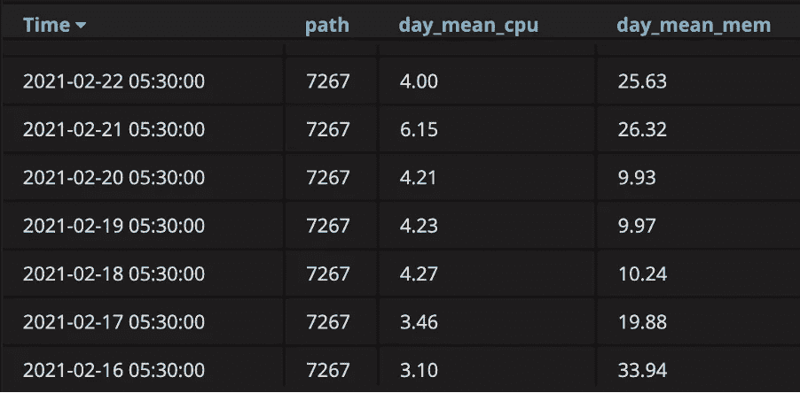
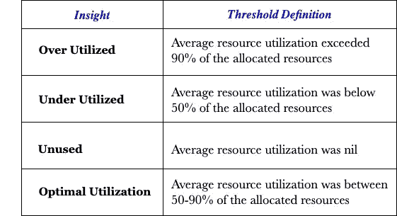

# 如何利用利用率洞察优化云资源？

> 原文：<https://medium.com/walmartglobaltech/how-to-optimise-cloud-resources-with-utilization-insights-e1e0d663b9d3?source=collection_archive---------0----------------------->

Photo by [Nejc Soklič](https://unsplash.com/@nejc_soklic?utm_source=medium&utm_medium=referral) on [Unsplash](https://unsplash.com?utm_source=medium&utm_medium=referral)

A 使用云资源的应用程序有几个好处，包括易于访问、资源池化、数据恢复和备份等等。在托管多个这样的用户应用程序的平台上工作，每个应用程序使用几个云资源，我们必须确保我们的用户充分利用他们为应用程序购买的云资源。我们的平台非常需要一种方法来检测并向用户提供信息，使他们能够直观地了解云资源的使用情况。当我们构建和管理大规模平台时，我们经常没有意识到有过多的原始数据需要我们处理。每秒钟，系统都在以日志、元数据、利用率统计数据等形式生成数据。乍一看，单个日志或元数据条目并不能给我们提供太多信息。然而，随着时间的推移，随着这个数据存储库的建立，模式出现了，这可以用来获得有意义的见解。

这篇文章解释了我们在平台中建立的框架，该框架为我们的用户提供了在其每个应用程序中使用云资源的见解。

## 工具和汇总数据

我们管理着一个多租户平台，该平台托管着跨多个云运行的众多用户应用。我们平台的底层基础设施由部署在 Kubernetes 集群上的几个*微服务*组成，MSSQL 和 InfluxDB 主要用于存储元数据信息。

**Fig.1: Pictorial representation of the platform**

当用户在我们的平台上启动他们的应用程序时，我们在 Kubernetes 集群的一个节点上生成一个 pod，其中包含用户为应用程序分配的计算资源(*内核和从所需云*获得的内存)。用户设置的分配是任意值，可能与应用程序的实际资源利用率相差很大。

当应用程序运行时，它的资源使用情况，更具体地说，在我们的例子中，Kubernetes pod 资源使用情况数据被捕获并存储在一个 timeseries 数据库——influx db 中。InfluxData 的开源、基于插件的代理— Telegraf Kubernetes 输入插件作为每个 Kubernetes 节点内的 DaemonSet 的一部分运行，它被配置并用于收集有关运行 pod 的指标，并将其存储在 InfluxDB 中。

在 InfluxDB 中，所有数据都与时间戳相关联。InfluxDB 中的时间戳可以有秒、微秒甚至纳秒的精度。数据本身以“*测量值”*的形式存储，这在概念上类似于关系表。*测量*由*字段*、*标签*和*时间*栏组成。所有的"*字段*"值总是与时间戳相关联。您可以对它们进行计算，以获得所需的指标。"*标签"*类似于通常用于筛选或分组数据的列。更多关于 InfluxDB 的关键概念可以在[这里](https://docs.influxdata.com/influxdb/v1.8/concepts/key_concepts/)找到。

Fig.2: Cloud resource utilization statistics per minute for a single application (id: 7267)

图 2 是 InfluxDB 中典型的“*测量值*的示例。为了便于可视化，数据每分钟都进行了汇总。然而，在现实中，测量捕捉应用程序每秒使用的 cpu 和内存。列“mean_cpu”和“mean_mem”代表“*字段*”，并且与时间戳相关联。列“path”被称为一个“*标记*，它代表一个应用程序的惟一标识符——在本例中是应用程序 id。

提供资源使用的每一秒细节并不能为用户提供太多的洞察力。相反，如果我们每天或每两周汇总这些数据，用户将能够更好地了解他们的资源使用情况。这是我们所做的测量。

InfluxQL 可用于查询以及对测量值执行聚合。我们不仅需要每天聚合数据，还需要一种可以像调度一样运行并存储聚合结果的机制。InfluxQL 连续查询非常适合这个用例。连续查询是对实时数据定期自动运行的 InfluxQL 查询，并以指定的度量标准存储查询结果。更多关于 InfluxQL 的信息可以在[这里](https://docs.influxdata.com/influxdb/v1.8/query_language/explore-data/)找到。

Fig. 3a: Basic Syntax of a continuous query. “cq_name” is the name given to continuous query which is created in the database “db_name”.

Fig. 3b: Basic syntax of the “cq_query” used in continuous queries. The “destination_measurement” is the name of the new measurement created. The continuous query uses the “GROUP BY” time interval to determine when to execute the query.

我们为每个用户应用程序创建了每天运行的连续查询。它计算应用程序每天的平均资源使用量，并将结果存储在一个新的度量中。

Fig 4\. New measurement capturing cloud resource usage of the application (id: 7267) aggregated on a daily basis.

## 定义基线并获得洞察力

现在，我们有了所有应用程序的资源使用情况的每日汇总，并存储在单独的度量中，我们仍然需要一种方法来从中获得对我们的用户有益的有意义的见解。

第一步是设置阈值，我们可以根据这些阈值来比较每个应用程序的资源使用情况。为此，我们需要一个基线。我们从之前设置的流入度量中检索了一些频繁使用的应用程序在两周内的平均资源使用情况。我们还在元数据数据库 MSSQL 中捕获了用户分配给每个应用程序的资源。这两个表都进行了比较，以确定数据中的模式。

我们发现的一些关键模式是:

*   许多应用程序在未充分利用的资源容量下运行。分配给应用程序的资源比它实际运行所需的多得多。
*   有些应用程序是 cpu 密集型应用程序，但不需要分配那么多内存。而另一些是内存密集型应用，不需要分配那么多 cpu 内核。
*   其他应用程序在某些日子达到了其最大资源容量，但在其他日子未得到充分利用或在某些情况下未被使用。
*   很少有应用程序被分配了未被利用的资源。

使用这些模式，我们确定了 4 个洞察类别及其相应的阈值定义。

## **有影响力的报道**

一旦设置了识别应用类别的阈值，我们必须将其扩展到运行在我们平台上的众多应用，并将这些衍生的见解传达给用户各自的应用。我们向用户展示这些见解的最突出和最有影响力的方式之一是当他们登录到他们的应用程序的用户界面时。我们通过在基于 Springboot 的微服务中创建 RESTful APIs 实现了这一点。

对于平台上运行的每个应用程序，我们使用 *influxdb-java* 客户端库从 influxdb 读取应用程序的聚合资源使用数据，并将这些数据存储在平台的元数据数据库 MSSQL 中。然后，我们将之前获得的阈值应用于用户分配的应用程序资源。这是一个基准，可以用来比较应用程序的总资源使用情况。我们将上述所有计算逻辑整合到我们的 API 中，并获得了关于每个应用程序的云资源使用情况的适当见解。最后，我们将这些 API 端点暴露给我们的前端，用户可以在那里可视化和评估他们的应用在两周内的云资源使用情况。

## **刷新和重新调整见解**

提供给用户的见解必须不断更新，这样用户就不会得到任何过时的信息。仅在每隔一周的开始提供新的见解，对于用户来说，在他们的应用程序运行时识别由于资源紧缩而导致的瓶颈，或者识别不同应用程序之间的资源可以共享或更好管理的任何区域，是没有用的。为此，我们运行了一个每日后台进程，该进程执行了过去两周应用程序资源使用情况的运行平均值，用于更新和刷新应用程序用户界面上的洞察。

提供洞察的目的是让用户能够对其所有应用程序消耗的资源有一个总体了解，从而让他们能够以更高效的方式控制和管理他们的云资源。分配给未充分利用的应用程序的未使用资源可以释放到公共资源池中，供新的或现有的应用程序使用。经常遇到资源危机的过度使用的应用程序也可能消耗公共池中的资源。作为一种预防措施，对于过度使用的应用程序，我们提供了关于应用程序峰值资源使用的额外信息，即应用程序在运行的任何时间点使用的最大资源。这给用户一个指示，即分配给应用程序的资源少于所述峰值可能导致他们的应用程序失败。通过这种方式，用户能够跨所有应用管理和优化使用云资源。

虽然对应用程序的洞察被证明对用户有益，但我们还需要一种方法，在用户重新调整和管理跨应用程序的资源后，反映适当的洞察。虽然应用程序的洞察力每天都在更新，但我们也希望我们的用户能够实时看到他们的行为所产生的影响。因此，对于应用程序分配的资源的任何更改，我们都会触发一个进程来重新计算该应用程序的阈值，并将其资源使用情况与之进行比较。基于用户所采取的行动的更新的洞察力立即在他们的应用程序的用户界面上变得可见。

考虑到我们的用户可以轻松地分析他们的云资源使用情况并跨应用程序管理它们，提供关于用户界面的见解只是我们采取的选项之一。这可以通过自动化流程轻松扩展，在该流程中，用户每周都会通过电子邮件收到对其应用程序资源的深入分析。您可以将它插入任何警报系统，以监控达到资源阈值的应用程序。它还可以插入到您现有的任何可视化工具中，以创建围绕云资源使用情况的仪表板和指标。

## **结论**

利用云资源无疑为应用程序提供了无限的可伸缩性。然而，注意这些资源在哪里以及如何被使用是至关重要的。在我们的平台上，我们通过仔细查看我们构建的系统周围的数据实现了这一点。使用简单的技术，这些数据被利用并转化为对用户有意义的见解。此外，由于对自己的应用程序有了新的认识，用户现在能够跨组织中的所有应用程序优化云资源的整体使用。