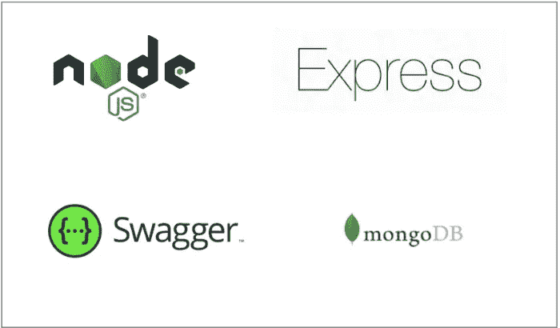

# 如何对 NodeJS REST API 端点进行分页

> 原文：<https://medium.com/bb-tutorials-and-thoughts/how-to-paginate-your-nodejs-rest-api-endpoints-e98daface04d?source=collection_archive---------0----------------------->

## 一个使用 MongoDB 作为数据库的示例项目

REST 是表述性状态转移的首字母缩写。Rest 遵循一些准则来促进系统间的通信。在这篇文章中，我们将看到如何对用 NodeJS 编写的 REST API 端点进行分页。对端点进行分页对于 web 应用程序的性能非常重要。对于…