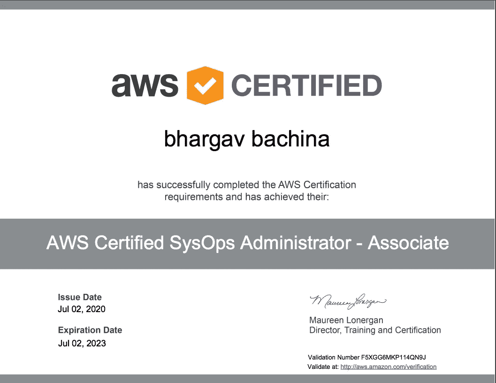

# 如何通过 AWS 认证系统管理员-助理

> 原文：<https://medium.com/bb-tutorials-and-thoughts/how-to-pass-aws-certified-sysops-administrator-associate-9c89f39f3b42?source=collection_archive---------0----------------------->

## 新 SOA-C01 考试完全指南

根据魔力象限，亚马逊网络服务(AWS)是领先的云提供商，它主导着全球云基础设施，其市场份额相当于接下来四大云提供商的总和。AWS 提供多种认证。AWS 认证系统管理员——