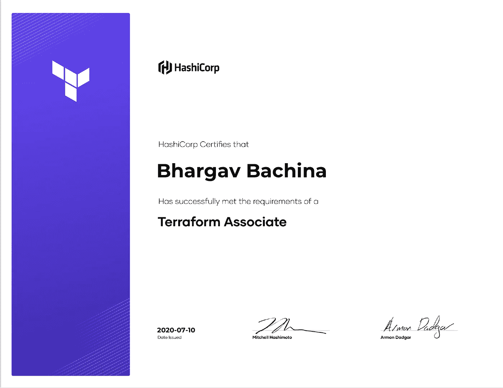

# 如何通过 HashiCorp Terraform 助理认证

> 原文：<https://medium.com/bb-tutorials-and-thoughts/how-to-pass-hashicorp-terraform-associate-certification-d3620d04523e?source=collection_archive---------0----------------------->

## 想参加 HashiCorp 基础设施自动化认证的完整指南

Terraform 是 HashiCorp 提供的基础设施代码。它是一种以安全、可重复的方式构建、更改和管理基础设施的工具。运营商和基础设施团队可以使用 Terraform 来管理…