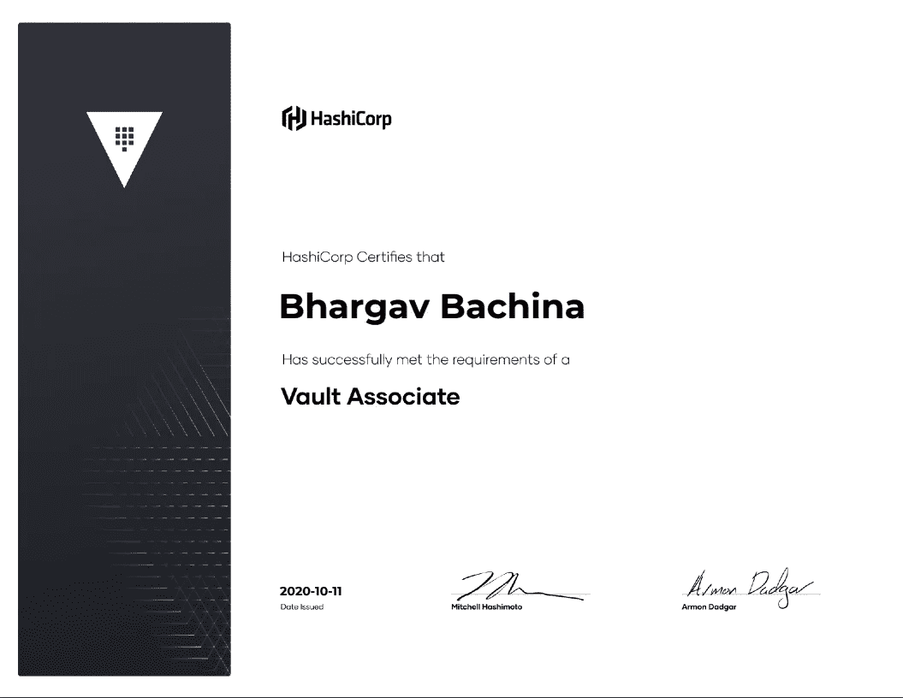

# 如何通过 HashiCorp 金库助理认证

> 原文：<https://medium.com/bb-tutorials-and-thoughts/how-to-pass-hashicorp-vault-associate-certification-c882892d2f2b?source=collection_archive---------0----------------------->

## 想考 HashiCorp 秘密管理认证的完全指南

**Certificate**

Vault 是一种机密管理工具，可以保护、存储和严格控制对令牌、密码、证书和加密密钥的访问，以便使用 UI、CLI 或 HTTP API 保护机密和其他敏感数据。