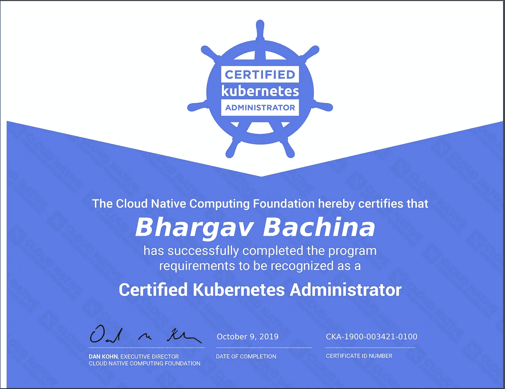

# 如何通过 Kubernetes 认证管理员(CKA)考试

> 原文：<https://medium.com/bb-tutorials-and-thoughts/how-to-pass-the-certified-kubernetes-administrator-cka-exam-9e01f1aa93b8?source=collection_archive---------3----------------------->

## 想参加这个考试的人的完整指南

Kubernetes 是一个用于自动化部署、扩展和管理容器化应用程序的开源系统。这是当今几乎每个公司都在实施或试图采用的技术之一。Linux 基金会提供了两种认证…