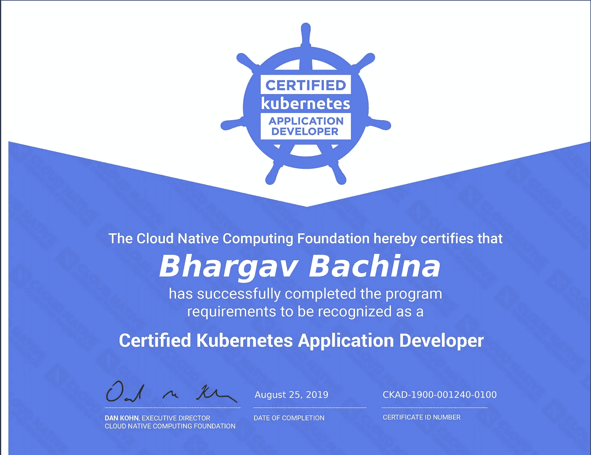

# 如何通过认证 Kubernetes 应用程序开发员(CKAD)考试

> 原文：<https://medium.com/bb-tutorials-and-thoughts/how-to-pass-the-certified-kubernetes-application-developer-ckad-exam-503e9562d022?source=collection_archive---------3----------------------->

## 想参加这个考试的人的完整指南

Kubernetes 是一个用于自动化部署、扩展和管理容器化应用程序的开源系统。这是当今几乎每个公司都在实施或试图采用的技术之一。Linux 基金会提供了两个…