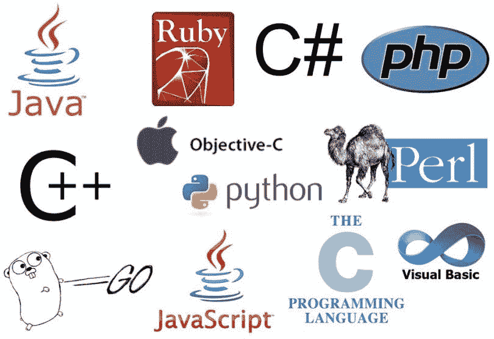
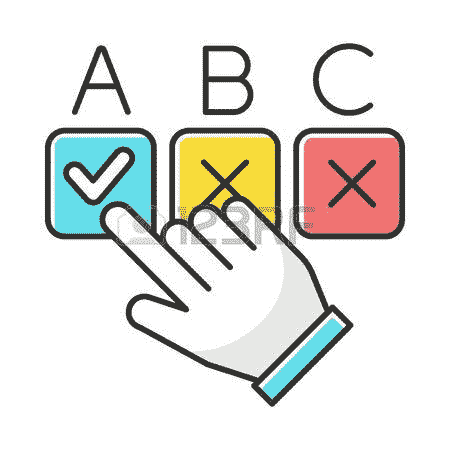
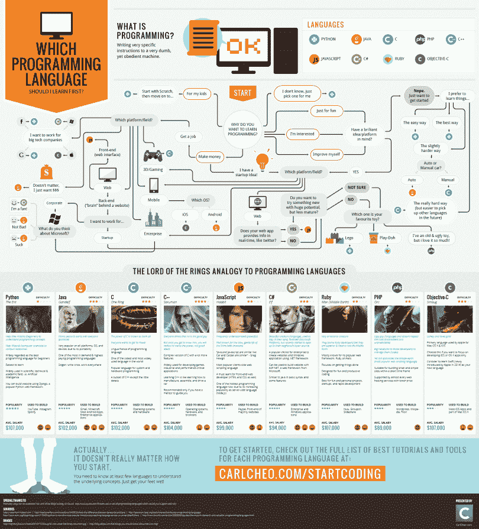

# 如何选择你的第一门编程语言

> 原文：<https://medium.com/quick-code/how-to-pick-your-first-programming-language-lets-learn-about-ee31b20ded5b?source=collection_archive---------0----------------------->

当我开始编程时，我对编程语言的数量印象深刻。

也许你和我的处境一样。

如果你是，我写了一本指南来帮助你选择你的第一门编程语言。

# 为你选择合适的语言:我的情况

6 年前，我开始学习用 C 语言编写代码，直到下个月，我(嗯，我的班级)转向了 C++。然后是 PHP。和 Javascript。全部在三个月内完成。

当我说我开始学习时，我的意思是 3 个月后我们几乎不知道如何编程。

为什么？因为当我们学习了一门语言的基础知识，我们就进入了下一门语言。只是学习用闪亮的新语言一遍又一遍地做同样的事情(变量、创建类和函数、条件)。

那是浪费时间。

但是后来，我去学习(相当于技术学院:两年)，我做了同样的事情。

我学过 Javascript、PHP 和 Java，但后来我发现一些文章/Youtube 视频建议学习一门新语言，因为我正在学习的语言正在消亡。

于是我照做了。但是后来，一种新的、华而不实的语言出现了。或者一个新的框架。

所以我忘记了过去一个月所学的一切，去学习新的东西。我坚持做了快一年:Python，Javascript，Java，Angular，Ionic，C#，Unity…

也许你正在看雇主在工作申请中寻找什么，你对要求的数量感到害怕，就像我一样。

我想学习每一种语言，以便有机会投简历。但是我大错特错了。我又做了同样的事情:一遍又一遍地学习最基本的知识，但用的是不同的语言。

我可以流利地用多种语言做一些基本的事情。

# 为什么初学者只选择一种语言

按照前面的观点，我应该做的是学习和掌握一门语言。

学习一门语言很重要，但更重要的是知道如何编程:理解学习你想要达到的目标的过程，设计应用程序的结构，等等

我没有那么做。

我被困在了所谓的教程地狱里:

*“教程地狱”是一个典型的阶段，初学程序员开始“有点”知道如何构建一些简单的东西，但没有什么真正复杂或可伸缩的。他们似乎需要一个指导来完成他们需要做的其他任务。*

(别急，我在这里写了[如何逃离教程地狱](https://letslearnabout.net/blog/how-to-escape-from-tutorial-hell-and-never-come-back/#how-to-escape))

但我不应该这么做。我应该学习如何用一种语言编程。是的，只有一种语言。

学习一门语言，掌握它，同时学习如何编程。那是两件不同的事情。

一旦你知道如何编程(计划如何解决一个问题)和一门语言(创造解决方案)，学习一门新的语言就是几周的事情。或者几天。

我还要说:一些雇主需要你解决他们的问题，不管你用什么语言。有时候，[没人在乎你使用的语言](https://letslearnabout.net/blog/no-one-cares-about-the-language-you-use/):他们只是想要一个解决他们问题的方法。

但我正在进步。首先，我们需要选择我们的第一语言。

# 视觉引导

选择一种语言取决于许多因素:你想编写移动应用程序吗？想玩玩 [IoT](https://letslearnabout.net/blog/how-is-iot-affecting-the-future-of-web-development/) ？你喜欢后端吗？你想成为 4×4 的站长吗？

为此，我找到了这个指南。点击图片并跟随路径。

*免责声明:本指南有点过时，将 Objective-C 换成苹果设备的 Swift 语言*

# 如何使用指南

随着新技术的出现和消失，这张信息图是一个指南，而不是你需要盲目相信的东西。

例如，假设您想要创建 Android 应用程序。

指南告诉你学习 Android 版 Java，不错。但是……还有别的选择吗？

快速搜索告诉我们，Kotlin 是 Java 的一个很好的替代品。还有其他框架，如 Ionic 或 [Flutter](https://letslearnabout.net/100daysofcode/im-joining-100daysofcode-again-flutter-time/) ，让你只需一段代码，就能为 Android 和 iOs 创建移动应用。

按照指南，但然后做一点研究。该语言的谷歌替代方案(有时替代方案更好和/或更令人愉快！)，在 [Reddit](https://www.reddit.com/) 或 [StackOverflow](https://stackoverflow.com/) 上询问最新动态等。

将本指南用作…嗯，作为一个向导😊。

一旦你选择了一门要学的语言，就要深入下去。学 it，做几个小项目。那么一个中等的。

然后，在有了一个更大的图景后，你会选择是否要继续学习并成为该语言的专家。或者学一门新的。[或两者都有](https://letslearnabout.net/blog/what-it-is-a-t-shaped-developer-and-why-you-should-be-one/)。

事实上，我这里有一个[免费学习资源](https://letslearnabout.net/blog/free-learning-resources-for-programmers/)的“缓存”。

现在你没有借口开始学习了🙂。

# 最后的想法

让我用一个清单来总结这篇文章。作为初学者，您必须:

*   根据你想要达到的目标，从指南中选择一种语言。
*   (可选，但推荐):谷歌该语言的替代品，并相应地选择
*   学习那种语言(使用 Youtube、文章、电子书或我的免费学习资源列表
*   一旦你觉得舒服了，想想你是否想学习一个新的或者更深入你所知道的。这取决于你的工作(如果你有工作的话)、你想要达到的目标等等。这里没有对错之分。

如果你想知道如何学习，这里我有一个更深入的帖子，我会解释更多如何去做，以及我自己挑选的一些技巧:[学习如何学习](https://letslearnabout.net/blog/learning-how-to-learn/)。

现在，关闭这篇文章(如果你喜欢的话，把它加入书签🙂)并开始学习！

[我的 Youtube 教程视频](https://www.youtube.com/channel/UC9OLm6YFRzr4yjlw4xNWYvg?sub_confirmation=1)

[在 Twitter 上联系我](https://twitter.com/DavidMM1707)

联系我:DavidMM1707@gmail.com

*最初发表于 2020 年 7 月 1 日 https://letslearnabout.net**的* [*。*](https://letslearnabout.net/blog/how-to-pick-your-first-programming-language/)