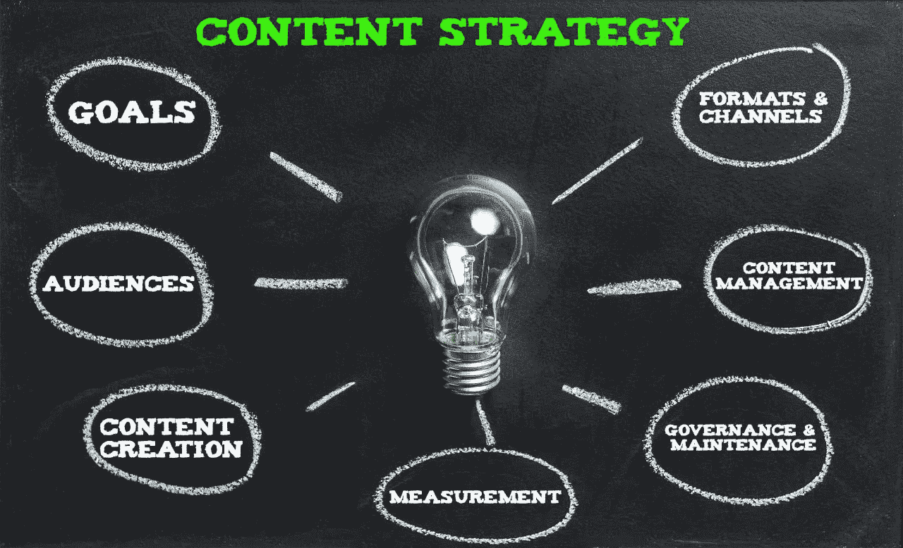

# 如何为品牌和业务增长规划内容策略？

> 原文：<https://medium.com/globant/how-to-plan-a-content-strategy-for-brand-and-business-growth-e46e9cd9b0cb?source=collection_archive---------3----------------------->

随着社交媒体的兴起，越来越多的内容被创造出来。是的，对营销人员来说，这可能是压倒性的！在激烈的竞争中，企业和品牌发现越来越难让自己的内容受到关注。

所以，你可能想知道:*你如何规划内容战略？你如何定义好的内容？接触正确受众的最佳方式是什么？它在哪些方面影响了我的业务？它有战略目的吗？*

答案很大程度上取决于你想在你的组织或品牌中实现什么。

首先，让我们了解一些基础知识。

# 内容策略:它们是什么，为什么重要？

内容是品牌和受众之间的桥梁，如果战略性地使用，它可以带来有意义的业务增长。

> [中什么是内容战略？](https://blog.marketmuse.com/what-is-content-strategy/)，Camden Gaspar 将内容战略定义为一个持续的过程**“将业务目标转化为一个计划，将内容作为实现这些目标的主要手段”。**

本质上，它是整个组织中所有内容创建、交付和治理的指南，确保使用最有效的渠道在正确的时间将正确的内容交付给正确的人。只有事先计划和研究，内容营销活动才能成功实施。

# 内容战略的要素是什么？

营销人员对这个话题有不同的看法。我们将重点关注以下核心内容策略要素，但要考虑到您可以随时调整和适应，以满足您的业务需求和期望。

*Key elements of a content strategy*

你想达到什么目标？ 设定明确的内容目标，并使其与公司的整体战略目标和用户需求保持一致，是规划任何内容战略的第一步。

问问你自己，*你的客户或公司是想增加收入，提高知名度，还是建立一个受众群体？他们在寻求更多的参与吗？公司计划扩张吗？他们需要更多的人皈依吗？他们是否试图将适当的查询转移到数字渠道，以降低呼叫中心的费用？*因此，你在内容方面的努力应该遵循这条道路，并满足这些期望。

内容策略不能脱离整体目标而独立存在。它是你的整体商业战略的一个组成部分，通过将你的内容营销努力与你公司的战略目标相结合，你可以利用内容来发展你的业务。

例如，Hubspot 就做得非常出色。该公司制作营销软件，并将其商业战略转化为内容，以帮助消费者。

A **听众:*你想吸引和抓住哪些人？做出这个决定后，你可以考虑你要创作什么类型的内容，如何写作，以及吸引观众的语气和声音。***

了解你的消费者和他们的需求将决定你的内容日历，你将使用的渠道，以及你将发布的时间和方式。如果你想更好地了解你的内容面向谁，你可以创建一个受众角色。

> 但是等等！人物角色是如何工作的？在“[创建买家角色:9 个要点](https://contentmarketinginstitute.com/2016/05/buyer-personas-essential-parts/)”中，Marcia Johnston 将买家或观众角色描述为**“一个虚构的、概括的理想客户代表，它积极地为内容策略提供信息，以推动富有成效的买家参与”。**

创建人物角色可以让你更好地理解你的客户，并定制内容来满足他们的需求、行为和关注点。人物角色通常包括基本的人口统计数据，如年龄、性别、位置、收入和职业。此外，人物角色识别客户的动机、恐惧、目标、好恶、行为、媒体偏好和痛点。

C **内容创建:*谁来创建内容？*** 另外，考虑一下你拥有的和打算使用的资源:*是内部的还是外部的？你应该外包内容创作还是把这个过程留在内部？是否有必要确保更多的人参与到内容评估过程中？*

F **格式和渠道:*你会使用什么内容格式和媒体？*** 在内容格式方面，有多种多样的选择，包括视频、模因、列表、时事通讯、博客、信息图等。

此外，内容频道提供各种发布平台，包括自有媒体(如博客、网站)和社交媒体(如 Twitter、脸书、Instagram、Tik Tok)。根据您的目标受众以及组织内的技能和资源，您可以决定使用什么内容格式和渠道。

C **内容管理:*您在管理内容创作和发布方面有什么计划？*** 使用内容战略来推动业务增长需要有效的内容管理和跨组织的整合，以及需要做什么和何时做的明确计划。

内容不局限于一个部门或团队。知道谁在创建你的内容和知道你什么时候创建和发布它一样重要。为了按时创建和发布内容，确定内容创建者和发布者以及让利益相关方参与进来至关重要。法律部门、危机沟通、版权和财务团队以及其他部门会帮助您确保遵守所有规则和法规、满足预算、遵守数据保护和隐私政策，并且内容适合您的受众和公司。

一些技术和实践可以帮助你管理你的内容、工作流程和资源，比如**内容清单&审计、内容日历、风格/编辑指南、**和**分类法。**

G **治理和维护:*您将使用什么框架和流程来管理您的内容？*** 随着您的团队和内容库的发展，开发维护您已发布内容的结构将变得越来越重要。您必须继续定期开发、发布和管理内容。

因此，治理也是管理良好的内容的关键组成部分。它帮助你提供结构，防止延迟，甚至通过定义法律问题:*谁负责维护你的内容并确保质量？完成一项内容的任务或步骤是什么？将来会如何更新或删除？内容审批流程是怎样的？应该遵循什么准则？关键角色和职责是什么？*

使用**内容工作流**或**内容治理框架**允许您分配所有权和定义程序，以防止随机的内容创建和发布。

M **衡量:*你将如何衡量你的内容表现？*** 不知道自己的行动是否成功，内容策略是不完整的。改进的唯一方法是了解您的基线是什么，以及您的活动如何执行，以开发 KPI 来跟踪、优化和迭代。

因此，您需要问自己:*我们如何衡量内容目标的成功？我们需要测量什么？与衡量转化率相比，我们在评估过程中如何衡量消费者参与度？*

**测试**和**内容分析**可以帮助您实现这一点。这些衡量标准可以帮助您改进内容，并通过提供有价值的反馈保持正轨。凯蒂·弗伦奇解释了[如何为内容选择和使用正确的营销标准。](https://www.columnfivemedia.com/how-to-use-metrics-in-your-content-strategy/)您也可以阅读[含量测定的 5w](https://stayrelevant.globant.com/en/5-w-content-testing/)。

# 探索内容的最新趋势和创新

最后但同样重要的是，您的内容策略应该随着您的业务、受众和新技术而发展。经得起未来考验的品牌和业务是行不通的，所以你必须灵活适应。

> *无论您是在创建内容还是在监督内容，新的工具和技术正在改变我们的做事方式*。***想想在任何内容上线之前都需要执行的所有任务:关键词研究、回顾数据、分析和趋势、搜索引擎优化和内容撰写——从个性化到优化。诸如此类的任务可以很快叠加，营销人员正在花费宝贵的写作时间进行研究、测试和优化”*** *[*福布斯*](https://www.forbes.com/sites/forbesagencycouncil/2020/03/20/five-ways-ai-is-changing-the-game-of-content-marketing/?sh=391abdd06559) *解释道。**

*借助人工智能( [AI](https://www.forbes.com/sites/forbesagencycouncil/2020/03/20/five-ways-ai-is-changing-the-game-of-content-marketing/?sh=391abdd06559) )、[内容智能](https://marketinginsidergroup.com/artificial-intelligence/artificial-intelligence-vs-content-intelligence/)、[机器学习](https://www.entrepreneur.com/article/420562#:~:text=Machine%20learning%20is%20playing%20a,increase%20their%20return%20on%20investment.)、数字内容管理系统或自动化工具，内容专业人士能够以前所未有的方式更好地理解受众、个性化、定制和优化内容。*

> *[为什么你的内容营销需要紧跟潮流才能成功](https://www.forbes.com/sites/shamahyder/2021/08/16/why-your-content-marketing-needs-to-be-on-trend-to-be-successful/?sh=c7e588f7c8ec)，**，*“每一个内容营销者和企业家都应该通过学习新平台和新兴技术来跟上最新的潮流，保持在最前沿。”****

*这是我们同意的！确保您保持最新，并将新的想法和技术融入到您的内容策略中。不要害怕探索新的平台和趋势，以确定什么最适合你的受众和品牌。*