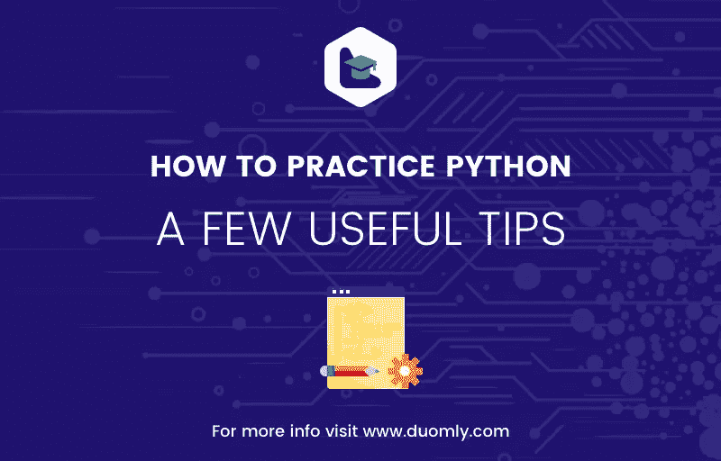

# 如何练习 Python——一些有用的技巧

> 原文：<https://medium.com/duomly-blockchain-online-courses/how-to-practice-python-a-few-useful-tips-50c28e818580?source=collection_archive---------3----------------------->



[Duomly — programming online courses](https://www.duomly.com)

本文最初发表于:[https://www.blog.duomly.com/how-to-practice-python-skills/](https://www.blog.duomly.com/how-to-practice-python-skills/)

学习 Python 和学习其他编程语言没有太大区别。精通 Python(或任何其他语言)的一条途径主要依赖于现有的编程知识和经验。这意味着有经验的程序员——已经熟悉主要的编程概念——通常使用不同于新手的策略。

然而，对所有人来说有一些共同点，其中之一就是你需要**大量练习**！

幸运的是，Python 有一个广泛、友好和专注的社区。它是开源的，提供了几个真正有利于开发的环境。

有很多关于如何练习 Python 的好建议。本文重点介绍这 10 个方面:

*   选择合适的环境
*   确保你有强大的基础
*   编写和改进代码
*   阅读文档
*   建立在基础之上
*   捕捉标准、建议、提示和技巧
*   分析源代码
*   对图书馆感兴趣
*   成为社区的一部分
*   学习第二种编程语言

[How to practice Python Programming?](https://youtu.be/_DGcjsOyntU)

# 选择合适的环境

一开始，无论您使用什么操作系统，使用常规的 Python 3 解释器和包管理器应该没问题。Windows、Mac OS 或任何 Linux 发行版都可以完成这项工作。(就算是安卓加了 QPython，虽然相比原版 Python 能力有限。)之后，您可以在 Windows、Mac OS 或 Linux 上安装 Anaconda。它包含一个 Python 解释器、Conda 包、依赖项和环境管理系统，以及许多您可能会觉得有用的第三方包。你应该选择一个合适的 IDE(集成开发环境)。许多通用 ide，如 Visual Studio、Visual Studio Code、Emacs、Vim Sublime Text 或 Atom，对 Python 有很好的支持。如果喜欢 JetBrains 的产品，可以用 PyCharm。Spyder 是 Anaconda 中包含的一个方便的 Python 专用 IDE。IPython 和 Jupyter 是很好的开始，因为它们提供了很好的交互功能。最后，还有 Python 控制台，但是您可能会发现快速检查一些短代码比编写完整的程序更有用。你可以查看[这篇文章](https://www.blog.duomly.com/the-best-python-code-editors-for-data-science-web-development-and-machine-learning/)来了解更多关于 Python IDEs 的知识。另一个好主意是考虑安装和定制 Python linters，如 Pylint 或 Pyflakes。它们是突出代码中与语法或风格相关的问题的小软件包。

# 确保你有强大的基础

如果你想练习任何编程语言，你应该学好基础知识，这样你就可以在基础知识上更进一步。这意味着您至少需要知道基本的语法，理解主要的编程概念，熟悉内置类型和数据结构，等等。

在 Python 中，要检查是否理解 if 子句、while 和 for 循环、函数、整数、浮点数、字符串、元组、集合、列表、字典等。其他一些类型，如复数、命名元组、冻结集也可能有帮助。

你应该找一本合适的 Python 书籍或者甚至教程来开始。Duomly 提供了 [Python 教程](https://www.duomly.com/register?utm_source=blog&utm_medium=post&utm_campaign=how_to_practice_python)，你可以用它来学习这些概念以及更多。还有官方的 Python 教程，简称为*Python 教程*。

# 编写和改进代码

自己编写**大量代码**是学习编程语言的重要部分。

从书籍和教程中的代码开始。然后试着修改它，让它更通用，或者适合一些其他的用途。之后，试着把学到的东西组合成小而有意义的程序。

但是，记住编程最重要的一点:不是打字的问题，是思考的问题！

你会犯错误。所有程序员都这样。那一点也不差。非常重要的是努力找出哪里出了问题，也就是从自己的错误中吸取教训。每次你得到并修复一个错误，你就会成为一个比以前稍微好一点的程序员。

有时候，回到你的旧代码并尝试改进它是有益的。希望你会注意到你比以前写原始代码的时候好多了。

想想你想解决的问题。理想情况下，这些是你感兴趣的问题。情感投入通常会改善结果。定义你的小型和中型项目，并试着经常去做。一旦你学到了新的东西，问问自己如何将它应用到你感兴趣解决的问题上。

# 阅读文档

在 Python 中，文档是至关重要的。你应该养成经常阅读的习惯。理想情况下，在应用一些现有的函数或方法之前，您应该查看相应的文档。

幸运的是，Python 内置库和最受欢迎的第三方包通常都带有全面的文档，这些文档可以在它们的网站上找到，您也可以下载。还可以通过调用属性以编程方式获取 Python 实体(类、方法、函数等)的文档。__doc__:

```
>>> print(slice.__doc__)
slice(stop)
slice(start, stop[, step])

Create a slice object.  This is used for extended slicing (e.g. a[0:10:2]).
```

在某些情况下，文档可能包含更多详细信息。

你可以从文档中学到很多东西。你可以弄清楚如何使用一个函数、方法或类，提供什么参数，期待什么返回值，等等。它通常包含相关的例子，这些例子可以提供很多信息，有时还会有启发。

# 建立在基础之上

一旦你掌握了基础知识，你就可以开始扩展你的知识面了。

别担心，你不会忘记基本原则的。你会一直需要它们。

像异常处理、打包和解包、 ***args** 和 ****kwargs** 、函数装饰器、模块和包、面向对象编程和生成器这样的主题是经常使用的，应该很好地理解和大量练习。

还有更高级的主题，比如特殊方法、协程、异步编程、多线程和多重处理、正则表达式、单元测试等等。很可能一开始你并不需要所有的东西。所以你可以从看起来有用的开始。例如，如果您需要一些核心的字符串操作，您可以处理正则表达式。如果您正在从事一些大型科学计算项目，您可能会发现多处理很有趣。

# 捕捉建议、标准、提示和技巧

这种语言有许多 Python 特有的特性，学习它们并不是一项简单的任务。幸运的是，有一些资源升华了他们中的许多人。

官方 Python 文档包含了很多信息。PEP 20，也被 T. Peters 称为*Python 的禅宗*，定义了 Python 的指导原则:

```
>>> import this
The Zen of Python, by Tim Peters

Beautiful is better than ugly.
Explicit is better than implicit.
Simple is better than complex.
Complex is better than complicated.
Flat is better than nested.
Sparse is better than dense.
Readability counts.
Special cases aren't special enough to break the rules.
Although practicality beats purity.
Errors should never pass silently.
Unless explicitly silenced.
In the face of ambiguity, refuse the temptation to guess.
There should be one-- and preferably only one --obvious way to do it.
Although that way may not be obvious at first unless you're Dutch.
Now is better than never.
Although never is often better than *right* now.
If the implementation is hard to explain, it's a bad idea.
If the implementation is easy to explain, it may be a good idea.
Namespaces are one honking great idea -- let's do more of those!
```

G. van Rossum、B. Warsaw 和 N. Coghlan 编写的 PEP 8 或*Python 代码风格指南*带来了 Python 代码风格指南。阅读它并尽可能地坚持下去往往是有益的。它可能会提高代码的可读性，方便您和其他开发人员维护代码。

类似地，PEP 257，即 D. Goodger 和 G. van Rossum 的 *Docstring Conventions* 解释了如何编写以后可以通过。__doc__ 属性。

A. Dewes 和 C. Neumann 的书*Python 反模式的小书*(免费且可在线获得)，以及 D. Bader 的 *Python 窍门:令人敬畏的 Python 特性自助餐*提供了大量关于如何编写干净、高效、可维护的 Python 代码的信息。

# 分析源代码

Python 是开源的，它的大多数流行库也是开源的。这意味着您可以访问和读取源代码。它通常可以在 GitHub 上找到，但是也可以在其他地方找到源代码。

阅读和理解感兴趣的库的代码能够更好地洞察其功能和实现细节。

此外，通过分析其他(希望是好的)程序员编写的源代码，您可以学到很多东西。你可以得到想法，看到他们的实现方式，学习新的模式和技巧，等等。

# 对图书馆感兴趣

Python 附带了许多用于不同目的的有用库:正则表达式、数学、统计、随机数生成、单元测试、迭代、函数式编程、多线程和多重处理、定义抽象类等等。有一些非常有用的第三方库，来自许多不同的科技领域。

显然，你不能学会如何使用它们，但你可以专注于其中的几个，看起来对你想专攻的领域很有意思。

如果您想成为一名数据科学家或机器学习实践者，您需要从 NumPy 开始，它是一个以高效简洁的方式处理一维或多维数组的基础库。它速度很快，无需显式编写 Python for 循环即可实现数组操作:

```
>>> import numpy as np
>>> 
>>> a = np.array([1, 2, 3, 4, 5])
>>> a
array([1, 2, 3, 4, 5])
>>> b = 2**a
>>> b
array([ 2,  4,  8, 16, 32])
>>> a + b
array([ 3,  6, 11, 20, 37])
>>> b / 2
array([ 1.,  2.,  4.,  8., 16.])
```

NumPy 提供了许多操作数组的函数。它还有有限数量的线性代数、统计、随机数生成等例程。

SciPy 是一个建立在 NumPy 之上的科学计算库，它包含用于线性代数和统计的额外例程，还用于优化、插值、积分、使用特殊函数、傅立叶变换等。

熊猫是最受欢迎的图书馆之一。它也构建在 NumPy 之上，可以很好地与 NumPy 和 SciPy 一起工作。它支持处理带标签的一维和二维数据。

Scikit-learn 是一个用于机器学习的基础库，具有许多共享一致 API(应用程序编程接口)的算法。TensorFlow、Theano、Pytoch 和 Keras 用于人工神经网络。

Matplotlib 和 Bokeh 是数据可视化的好选择。

所有这些库都有非常好的文档。你也可以在 Duomly [机器学习教程](https://www.duomly.com/register?utm_source=blog&utm_medium=post&utm_campaign=how_to_practice_python)中了解其中的一些。

如果您想从事 web 开发，您可以学习并练习使用一些 Python web 框架作为后端。最受欢迎的是 Django，它包含了大多数必需的部件。对于有常规需求的大型 web 应用程序来说，这非常方便。另一个是 Flask——一个强大、灵活、方便的微框架，有许多扩展。Django 和 Flask 都是最流行的 web 框架。

Python 还有其他 web 框架，比如金字塔、瓶子、龙卷风等等。

SQLAlchemy 是一个能够以面向对象的方式使用数据库的包。它被 web 框架大量使用，也在数据科学中使用。

# 成为社区的一部分

如前所述，Python 有一个大型的、专注的、友好的社区。你可以成为其中的一部分。阅读帖子、评论、提问、搜索解释等。

一旦你有了足够的知识水平，你就可以开始作为开源项目的开发人员或者作为写有趣的帖子和教程的人做出贡献。这种贡献受到社区和许多潜在雇主的高度重视。

# 学习第二种编程语言

Python 是一种通用编程语言，在许多情况下，它可以完全满足人们的需求。

然而，学习其他编程语言总是有益的。像这样，可以加深对通用编程范式的理解，拓宽视野。一旦你掌握了一种语言，学习另一种就更容易了。大多数优秀的程序员都知道几种编程语言。

如果你想成为一名 web 开发人员，你可能会需要 JavaScript。学习 C 有助于更好地理解基本的编程概念，但你也可以用它来开发真正快速的 Python 函数。Rust 是一种相对较新且很棒的编程语言，它已经很好地集成了 Python。

# 实践项目示例

有许多潜在的小项目可以用来练习 Python。

比如，你可以尝试将枯燥的任务自动化。了解字符串、正则表达式以及最终像 Jinja 这样的模板库可以帮助您有效地操作文本文件:搜索、匹配、替换或比较文件。

如果经常使用 Microsoft Office Excel，可以尝试使用 XLWings、NumPy、Pandas 来加快计算速度。

你可以用 Python 来创作游戏。例如，您可以随机应用该库，并尝试模拟掷骰子或使用卡片。如果你想构建一个漂亮的图形用户界面，你可以使用像 PyQt 或 Tkinter 这样的库。初学者的一些常见应用程序是创建计算器(选项越多越好)或著名的游戏“井字游戏”。

如果你喜欢跳到 web 开发，可以试试 Flask。只需要五行代码就可以得到最基本但功能强大的 web 应用。Flask 官方网站包含了优秀的文档和教程，您可以使用它们来学习这个伟大的框架。

Duomly [机器学习教程](https://www.duomly.com/register?utm_source=blog&utm_medium=post&utm_campaign=how_to_practice_python)有你可以用来实践数据科学和机器学习应用的说明。如果你想找到并分析一些很酷的数据集，可以查看文章[机器学习的 15 个最佳免费数据集](https://www.blog.duomly.com/15-best-machine-learning-datasets-for-free/)。

人工智能是 Python 广泛应用的领域。您可以尝试图像识别、自然语言处理或 web 抓取。要了解更多关于如何轻松开始执行这些高要求但有趣的任务的信息，您可以查看:

*   [Python 中的图像识别](https://www.blog.duomly.com/how-to-create-image-recognition-with-python/)
*   [如何用 Python 创建 AI 聊天机器人](https://www.blog.duomly.com/how-to-create-an-intelligent-chatbot-in-python/)

# 结论

你刚刚阅读了一些关于如何练习 Python 的建议。希望它们能帮助你成为 Python 程序员。记得继续编码，写有趣的程序，试着从错误中学习，并作为社区的一部分参与进来。最后，永远记住编程不是打字。都是思考的问题。

编码快乐！


[Duomly — programming online courses](https://www.duomly.com)

感谢您的阅读。

本文由我们的队友米尔科提供。