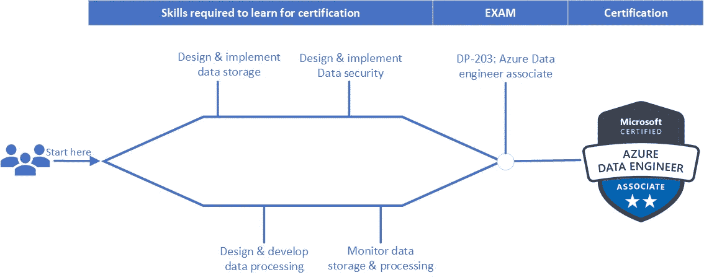

# 如何准备微软 DP-203 考试(微软 Azure 上的数据工程)

> 原文：<https://medium.com/globant/how-to-prepare-microsoft-dp-203-exam-data-engineering-on-microsoft-azure-b260b7ac2511?source=collection_archive---------0----------------------->

Azure DP-203 Exam

这个博客的目的是提供一个准备指南。帮助考生通过微软 Azure 数据工程认证考试(DP-203)。我在这个面向数据工程师的博客中讨论了不同的方面。它帮助考生增加价值，提高技能，考试技巧和考试培训材料。

**为什么是 DP-203 -**

数据工程岗位在[的](https://insights.dice.com/2019/06/04/data-engineer-remains-top-demand-job/)需求量很高。获得该科目的认证是学习、深化和证明你技能的好方法。每个云提供商都提供专门针对其数据工程服务的认证。因此，获得认证会为你的专业知识增加很多价值，并有助于你的职业发展。

如今，一切都依赖于全面的数据分析来了解客户的痛点。这样它就能发现获得市场份额新机会。在这样一个充满挑战的商业环境中，这对个人和企业都至关重要。了解如何跨平台集成、转换和连接数据。微软对 Azure 的数据工程认证(DP-203)就是这样一个认证。它帮助专业人士构建一些最佳的分析解决方案。微软提到的的一些优势[如下。](https://docs.microsoft.com/en-us/learn/certifications/certification-process-overview)

*   对数据工程师的需求增加。微软认证的简历是全球公认的。
*   获得认证后，许多候选人会获得职位提升。许多专业技术人员说获得认证会带来薪水的增长。
*   就工作前景和收入而言，证书能让两者都大幅提升。

**数据工程师技能的提高-**

在准备和通过考试(DP-203)后，下面是看到的改进。

*   并行处理和数据架构模式。
*   将数据集成、转换和整合到适合构建分析解决方案的结构中。
*   通过探索帮助利益相关者理解数据。
*   提高技能以建立和维护安全的投诉数据。正在处理。通过使用不同的工具和技术。
*   确保数据管道和数据存储高性能、高效、有序、可靠。
*   处理意外问题并最大限度地减少数据丢失。
*   设计、实施、监控、保护和优化数据平台，以满足数据管道需求。
*   像 SQL、Scala、Python 这样的数据处理语言。
*   使用 Azure 计算器和其他服务提供经济高效的解决方案。

**先决条件-**

*   对 Azure 基础知识的理解。
*   至少 6-12 个月的 Azure 云工作经验。
*   熟悉数据处理语言，如 SQL，Python，Scala。

**学习路径-**

要获得认证，第一候选人需要学习设计。他应该建立数据存储、数据处理、数据安全并对其进行监控。请参考下图中 DP 203 认证考试的 4 个主要题目。

*   设计并实施数据存储(40–45%)
*   设计和开发数据处理(25-30%)
*   设计并实施数据安全性(10–15%)
*   观察并优化数据存储和数据处理(10–15%)

**学习方法-**

对于职场人士来说，每天学习 2 小时应该有助于计划准备。总持续时间约为 2 个月。推荐的制备顺序如下-

1.  浏览[微软文档](https://docs.microsoft.com/en-us/learn/certifications/exams/dp-203)。与此同时，使用沙盒虚拟机进行动手实验。这需要的总时间约为 58 小时。
2.  参加由 Eshant Garg 准备的 Udemy 课程。总共需要大约 26 小时。
3.  通过 [Udemy 练习测试](https://www.udemy.com/course/practice-exams-microsoft-azure-dp-203-data-engineering/?ranMID=39197&ranEAID=vg5g08qPHOY&ranSiteID=vg5g08qPHOY-vodTpBPb6Um4EEQCG4wxtw&LSNPUBID=vg5g08qPHOY&utm_source=aff-campaign&utm_medium=udemyads)和 [Github 练习测试](https://github.com/grabcert/DP203)检查问题类型。同时用概念理解答案。
4.  根据你的练习分数，你可以列出你认为需要再复习一遍的题目。
5.  以高速(1.5 倍)再次浏览 Udemy 课程(Eshant Garg)(以及改进主题)。

# 考试提示-

**1】时间够用——**时间在考试中并不是一个紧迫的问题。你将有足够的时间来完成所有的问题。你可以思考并选择正确的答案，而不用担心超时。

评分系统- 你应该得到 1000 分中的 700 分。但这并不意味着答对了 70%的问题。为什么？因为不同的题根据难度的高低，带的分也不一样。在选择题答题中，每答对一题都会给你加分。

**3】没有否定标记-** 尝试考试中的所有问题。这次考试没有负分。

**4】排除的过程-** 我在每次考试的每道题中都用这个。我先看问题，然后看看哪些不是正确答案。我通常可以立即放弃 50%的答案，这很有帮助。然后我重读了这个问题，确保我理解了所有的要求。然后我算出哪个是正确的答案。在某些情况下，我找到了答案，因为我知道所有其他的答案都是不正确的。(知识面广有帮助。)

**5】复习题-** 参加微软考试时，每一部分都有选项。在某些情况下，您可以在左上角的复选框中选择复习问题。稍后在你完成那部分之前回到那个问题。我使用它的原因如下。跳过或回到你不知道的问题，把它们留到该部分的结尾。通过回答尽可能多的问题，这可以帮助你建立自信。这有助于减少你可能有的任何紧张。不能回来-但是考试中会有一些你必须回答一次的问题。那将是最终决定，你不能回来改变答案。给我看答案——有时你可能会在其他问题中找到你的问题的答案。

时间管理- 你不会想在一个你正在纠结的问题上花太多时间。所以勾选复习，以后再来。

**7]评论-** 您可以为问题标记评论框。对于这个问题，你有机会在考试结束时留下评论。如果你被问到一个令人困惑的问题。如果你认为这可能会导致你回答错误的问题。使用注释将其标记为已审阅。如果这是一个有效的意见，你可能会收到问题的信用。这在某些情况下意味着你可能会从一次不成功的尝试变成一个及格分数。

有些考试有案例分析，通读需要一些时间。我的方法对他们也有效。我一开始没有看案例分析。我看着问题，然后回头阅读案例研究的相关部分。我的理由是读它需要很长时间。我可能会阅读与问题或答案无关的信息。

**结论——**就是这样！这就完成了 DP-203 微软 Azure 认证准备指南的数据工程。祝你好运！！！